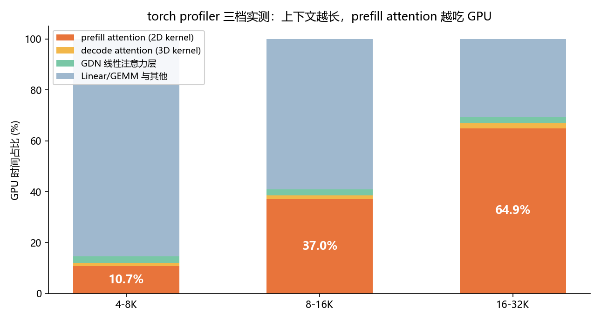
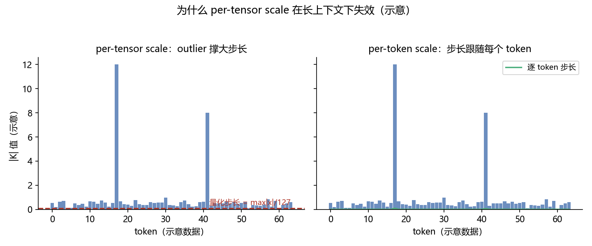
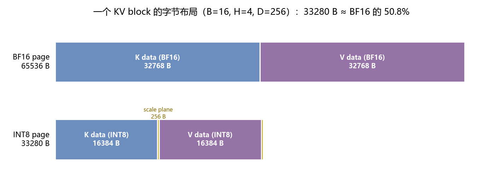
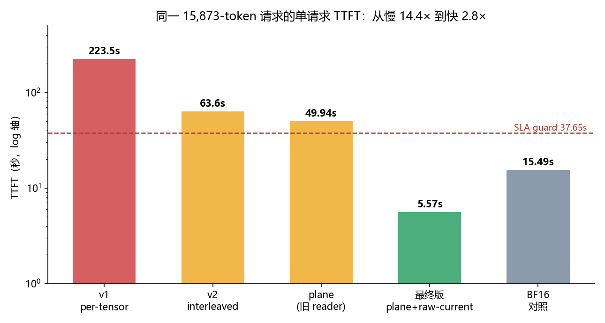
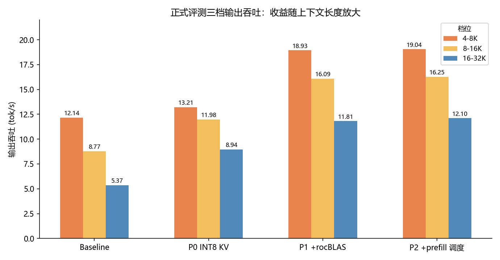

# 在国产 DCU 上把 KV Cache 压成 INT8：一次精度归零、一次慢 14 倍之后的完整复盘

**先说结论**：在不支持 FP8 的海光 BW1000 DCU 上，我们给 vLLM 的 Triton attention 后端实现了一套**逐 token、逐 KV head、K/V 独立 scale** 的 INT8 KV Cache。最终三档长上下文吞吐相对 BF16 baseline 提升 **+8.8% / +36.6% / +66.5%**（INT8 阶段单独贡献），组合其他优化后正式得分 82.5627，SLA 零扣分，精度系数 0.985。

但说实话，比结果更有价值的是过程——我们先后把精度干到归零、把 prefill 干慢 14.4 倍，又一步步爬回来。这篇文章完整复盘整个链路：**瓶颈怎么定位、量化格式怎么设计、坑怎么踩的、又是怎么填的**。所有数字都来自真机实测和正式评测。

## 0. 背景

先导杯 / CSCC 推理优化赛，题目内容：**统一模型权重、统一容器、统一 vLLM 0.18.1，在 DCU 单卡上把 Qwen3.5-27B 的在线推理吞吐做得越高越好**。

几个决定技术路线的硬约束：

- **评分只计输出 token 吞吐**，按输入长度分三档：4-8K（权重 20%）、8-16K（50%）、16-32K（30%），初赛并发固定为 1；
- **SLA 硬熔断**：各档 TTFT P99 ≤ baseline ×1.5，全局 TPOT P99 ≤ baseline ×1.5，**任一超标该档直接清零**；
- **精度系数**：OpenCompass 四类任务（问答 / 摘要 / 检索 / 聚合），精度掉超 10% 归零，最终分 = 吞吐分 × 精度系数；
- **量化边界**：禁止持久化权重量化，但**明确允许 KV Cache 量化**、activation 动态量化、kernel 内临时类型转换。

官方 BF16 baseline 实测：三档吞吐 12.14 / 8.77 / 5.37 tok/s，TTFT P99 4.80 / 25.10 / 28.82 秒，TPOT P99 约 69-72ms。

硬件是海光 BW1000（gfx936，ROCm/DTK 平台，80 CU，warp size 64，64 GiB HBM）。两个关键事实：

1. **不支持 FP8**——KV 量化只剩 INT8 一条路；
2. gfx936 不在 vLLM 的 `on_gfx9()` 白名单里，wvSplitK、AITER GEMM 等 ROCm 优化路径默认都不命中，很多"标准答案"用不了。

模型是 Qwen3.5-27B，**hybrid 架构**：64 层里每 4 层夹 1 层 full-attention（共 16 层），其余 48 层是 GatedDeltaNet 线性注意力。full-attention 层是 GQA，4 个 KV head，head_dim=256。也就是说——**KV Cache 只存在于那 16 层 full-attention 里**，GDN 用自己的循环状态，不碰 KV page。这个结构决定了我们优化的靶子有多小、多准。

## 1. 先 profiling，再谈优化

优化圈有句老话：没有 profile 数据的调参都是占卜。我们先用 torch profiler 把三个长度档各打了一遍 trace：



*图 1：torch profiler 三档实测。橙色是 prefill attention（`kernel_unified_attention_2d`）的 GPU 时间占比——4-8K 只有 10.7%，8-16K 涨到 37%，16-32K 直接吃掉 **64.9%**。decode attention 全程只有 1.4-1.9%，GDN 层 2-3%（不值得碰）。*

结论一目了然：**长上下文档的第一瓶颈是 prefill attention，而它读的正是 KV Cache**。KV 读取量随上下文长度线性增长——每个 full-attention 层、每个历史 token 占 `2(K/V) × 4 heads × 256 dims × 2B = 4096 B`，单序列 32K 上下文的 resident KV 就是 `4096 × 32768 × 16 ≈ 2 GiB` 的访存量。

顺带说一句，这里有个后来救了我们好几次的坑：这套配置下 Qwen3.5 实际走的是 `TRITON_ATTN → triton_unified_attention.py`（prefill 用 2D kernel、decode 用 3D kernel），而 `rocm_attn.py`、`chunked_prefill_paged_decode.py`、stock `prefix_prefill.py` 是**死代码**——改它们不会有任何效果。动手之前先确认真路径，不然优化全打在空气上。

**于是方案：把 KV Cache 从 BF16 压成 INT8。** KV 读带宽减半，正面命中 prefill 瓶颈；KV 显存近减半，同显存下 block 数接近翻倍（实测服务日志里 GPU KV cache size 从 27,440 tokens 涨到 5.4 万+）；规则允许；FP8 不可用，INT8 是唯一选项。论证闭环。

## 2. 量化格式：一个 scale 引发的血案

### 2.1 为什么不能一个 tensor 共用一个 scale

最朴素的 INT8 KV 是每层 K/V 各一个 per-tensor scale（`max|K|/127`）。我们的第一版就是这么做的——然后长上下文精度直接归零（第 3 节细说）。

根因用一张示意图就能讲清：



*图 2（示意）：长上下文里 KV 的绝对值分布跨度很大，总有少数 outlier。per-tensor scale 被 outlier 撑大后，量化步长跟着变大，大量小值 token 的 K/V 量化后几乎归零——attention 在长序列上的累积就这样失效了。per-token scale 让步长跟着每个 token 自己的幅值走，互不拖累。*

最终采用的量化公式，对**每个物理 cache token、每个 KV head**，K 和 V 分别独立计算（设向量为 `x ∈ R^256`）：

```text
s    = max(max_d |x[d]| / 127, 1e-12)
q[d] = clamp(round_half_away_from_zero(x[d] / s), -127, 127)
x̂[d] = q[d] · s
```

几个设计决策都值得说道：

- **逐物理 token**：新 token 的分布不受历史 token 影响，天然适配 KV cache 的增量写入；
- **逐 KV head**：一个 head 的 outlier 不浪费其他 head 的动态范围；
- **K/V 独立**：K 决定 logits、V 决定加权和，值域本来就不一样；
- **对称 [-127, 127]**：刻意不用 -128，正负对称；
- **`1e-12` 全零保护**：防除零，全零向量量化后还是零；
- **误差界**：`|x̂ - x| ≤ s/2`（绝对误差界）。

还有个 Triton 专属细节：写入时 `tl.store` 把 FP32 存进 INT8 的隐式 cast 是**向零截断**（`2.7 → 2`），会引入系统性负偏。必须显式 round：

```python
key_q = key / k_scale
key_q = tl.where(key_q >= 0, key_q + 0.5, key_q - 0.5)
key_q = tl.minimum(tl.maximum(key_q, -127.0), 127.0)
```

### 2.2 page 布局：scale 必须和数据住在同一个 page

选好了 scale 粒度，下一个问题是：**scale 存哪？**

PagedAttention 的 block copy、prefix cache 复用、块回收、slot remap，全部以**物理 page** 为单位。如果 scale 放另一套存储，就得维护第二套 block table 并保证两套索引永远同步——复杂且危险。我们的选择：**scale 和数据放同一个物理 page**，它们共享物理身份和生命周期，block table 重映射之后每个 K/V token 依然严格对应自己的 scale。

backend 暴露的 cache shape 是 `[num_blocks, 2(K/V), block_size B, num_kv_heads H, head_size D+4]`、dtype int8。注意这个 `D+4` **不能**理解成每个 head 按 `[256 data][4 scale]` 交错存——我们中间的 interleaved 版本就是这么做的，260B 的 stride 让相邻 head 的起点相对 256B 对齐边界不断漂移，离散非对齐读取成了 prefill 的性能杀手。

最终版把每个 K/V page 当 opaque bytes，内部两段连续 plane：



*图 3：一个 KV block 的字节布局对比（以 B=16、H=4、D=256 为例）。BF16 每 block 65536 B；INT8 版是 `K data | K scales | V data | V scales` 四段，共 33280 B ≈ 50.8%。data plane 保持 256B 对齐连续，scale plane 紧凑排列。真实比赛配置中 block_size 由 vLLM 选定（验证中为 1552），公式不变。*

地址计算（对单个 K 或 V page，令 `PD = B·H·D`，`S = cache.stride(0)`，int8 下元素单位即字节）：

```text
data_addr(b,o,h,d) = base + b·S + (o·H + h)·D + d
scale_addr(b,o,h)  = base + b·S + PD + 4·(o·H + h)
```

存储收益也算得精确：单个 256 维向量从 512B 降到 260B（**-49.22%**，不是整 50%，scale 有开销）；每层每 token 的 K+V 从 4096B 降到 2080B，容量倍率约 **1.97×**。这也是为什么实测 KV cache tokens 数接近翻倍而不是严格翻倍。

## 3. 踩坑实录：两版失败方案

### 3.1 v1：per-tensor scale——吞吐大涨，精度归零

第一版的吞吐成绩单其实非常漂亮：

| 档位 | INT8 | baseline | 提升 | 结局 |
|---|---:|---:|---:|---|
| 4-8K | 13.89 | 12.14 | +14% | ✓ |
| 8-16K | 11.85 | 8.77 | +35% | ✗ TTFT P99 144.8s 超 SLA，清零 |
| 16-32K | 10.92 | 5.37 | +103% | ✓ |

然后全量精度出来：`hotpotqa 0.09 / gov_report 9.63 / retrieval 0 / aggregation 0`。**总分归零。**

抽查生成内容：16K token 输入问一个事实性问题，输出是答非所问的空泛胡话，还有 `</think>` 泄漏和 `"1. 2. 1. 1."` 式退化重复。短输入完全正常，只有长上下文崩——正好印证 per-tensor scale 在长序列下失效的机制。教训一：**"per-tensor 应该够稳"是想当然，量化粒度必须匹配数据分布**。

### 3.2 v1 的另一宗罪：一行代码让 prefill 慢 14.4 倍

8-16K 档那个 144.8s 的 TTFT 是哪来的？定位过程很教科书：

固定数据集里一条 15,873-token 的请求做单请求 A/B：**INT8 版 TTFT 223.5 秒，BF16 同条 15.49 秒——慢 14.4 倍**。而 decode 的 TPOT 完全正常。

问题出在当时反量化的写法：

```python
K = (K_load.to(tl.float32) * tl.load(k_scale)).to(Q.dtype)
```

这行代码在 2D prefill kernel 的 **tile 循环内部**，对每个 `(256, 32) = 8192` 元素的 tile 强制物化一块 FP32 临时张量，还多跑两趟 elementwise。gfx936 每线程最多 256 个 VGPR，额外的大块 FP32 tile 直接把寄存器撑爆——**VGPR 溢出，occupancy 崩溃**。

证据链也很干净：短输入正常、回归随序列变长而加剧（不是一次性开销）；只有 prefill 慢、decode 正常（不是写入路径的问题）。教训二：**在 attention kernel 里，寄存器压力比多读的带宽致命得多**。

### 3.3 v2：interleaved per-token scale——精度救回来了，性能还不行

把 scale 改成逐 token/head 之后（260B interleaved 布局），精度立刻恢复：hotpotqa 与历史对照**逐条一致**，gov_report 相对 -0.17%，检索和聚合 100 分。灾难性退化消失。

但同一条 15,873-token 样本的 TTFT 还有 **63.6 秒**（BF16 15.49s），卡在 SLA guard（37.65s）外面。矛头指向 interleaved 布局的非对齐离散读取。



*图 4：同一条 15,873-token 请求，四个 INT8 版本 + BF16 对照的单请求 TTFT（log 轴）。223.5s（per-tensor + FP32 物化）→ 63.6s（per-token interleaved）→ 49.94s（plane 布局配旧 reader）→ **5.57s**（plane + 新 reader + raw-current），比 BF16 的 15.49s 还快 2.8 倍——INT8 读带宽减半的收益终于兑现。虚线是我们自设的 SLA guard 37.65s。*

### 3.4 v3：plane layout + raw-current prefix——收敛

第三版同时做了三件事，把性能缺口一次性补上：

**① data plane + scale plane 布局**（第 2.2 节），消灭非对齐离散读取。

**② reader 不再物化反量化结果，把 scale 折进已有的乘法**。2D/3D kernel 里，int8 整数值（≤127，BF16 下精确表示）直接进 `tl.dot`，逐 token 的 scale 乘到 dot 的输出侧：

```python
# K：scale 折进 QK logits
S += (scale * k_token_scale[None, :]) * tl.dot(Q, K)
# V：先缩放 softmax 概率，再 P @ V
P_scaled = P * v_token_scale[None, :]
acc += tl.dot(P_scaled.to(V.dtype), V)
```

数学上和"先反量化再点积"完全等价，但全程没有大块 FP32 临时张量——正是 v1 根因二的正解。

**③ raw-current prefix prefill**。prefill 期间，当前 chunk 的 K/V 本来就是本轮 forward 刚算出来的 BF16 激活，先写 INT8 cache 再立刻读回纯属浪费——既多一次量化/反量化开销，又白丢精度。专用 prefix 路径把 attention 拆两段：**历史 prefix 从 INT8 cache 读（带宽收益在这），当前 chunk 直接用原始 BF16 K/V**。后续还把这条路径从单序列扩展到了任意含 prefill 的 mixed batch（accuracy 评测 `batch_size=2` 的场景也吃到了收益，gov_report +0.44%、hotpotqa +0.48%）。

三件事落地后，同样本 warm TTFT **5.57 秒**。精度、性能同时收敛。

## 4. 成绩：正式评测见真章



*图 5：正式评测三档输出吞吐。P0（INT8 KV + raw-current prefix）相对 baseline +8.8% / +36.6% / +66.5%；P1 是队友的 rocBLAS decode GEMV override（固定四个 `N=1, K=5120` BF16 形状的 Tensile solution），P2 是 prefill kernel 调度优化（4096-token chunk 设 `waves_per_eu=4`、启动预热、GDN 加 `num_stages=1` 候选），后两者不改量化公式和 cache 布局。*

| 版本 | 4-8K | 8-16K | 16-32K | 正式得分 |
|---|---:|---:|---:|---:|
| Baseline（BF16） | 12.14 | 8.77 | 5.37 | — |
| P0：INT8 KV + raw-current | 13.21 | 11.98 | 8.94 | 70.2350 |
| P1：+ rocBLAS decode override | 18.93 | 16.09 | 11.81 | 82.1389 |
| P2：+ prefill 调度 | **19.04** | **16.25** | **12.10** | **82.5627** |

最终成绩 **82.5627 分，SLA 扣分 0，精度系数 0.985**。从 baseline 到最终版，三档累计提升 **+56.8% / +85.3% / +125.3%**——收益随上下文长度单调放大，和"减少 KV 访存"的设计目标完全吻合，说明优化打在了正确的位置上。

精度侧也做了完整的归因：P1 开关 A/B 的 hotpotqa 20 条 prediction 逐字节相同；mixed-batch raw-current 修复把两项任务各拉回了约 0.45%；剩余 ~1.5% 的精度系数损失集中在问答和摘要任务，量化格式本身（地址、scale 对应关系）检查无误，"继续调细 scale 粒度"这条老路已被明确排除。

## 5. 经验总结：八条拿脚换来的教训

1. **量化粒度要匹配数据分布**。长上下文 KV 的 outlier 让 per-tensor scale 直接失效；先小样本冒烟 + 抽查生成内容，再跑全量。
2. **attention kernel 里，寄存器比带宽贵**。反量化不要物化 FP32 大 tile；把 scale 折进 dot 输入/输出侧已有的乘法，数学等价、开销近似免费。
3. **数据布局的对齐是性能问题，不是美观问题**。260B interleaved 的非对齐读取让 prefill 慢 4 倍；plane 布局总字节数不变，只换排布就解决。
4. **元数据跟数据同物理 page**。PagedAttention 以 page 为复制/复用/回收单位，scale 与数据同生命周期，省掉第二套索引和同步负担。
5. **先确认优化真的生效，再谈数字**。INT8 是否生效看服务日志的 `GPU KV cache size`（接近翻倍），而不是 3 请求快测——小样本被固定开销主导，曾经骗我们以为"没收益"。
6. **只改真命中的代码路径**。先 profiler + 读代码确认真路径，死代码改了纯属自我感动。
7. **没有 occupancy/寄存器数据的调参是盲试**。num_warps=8 实测 -7% 负优化；而知道"FP32 物化撑爆 VGPR"这个机制之后，修复一击即中。
8. **新旧布局语义不兼容时，整体切换 + 清 cache + 重启**，别指望热迁移；回退的正确姿势是显式 `kv_cache_dtype=bfloat16`。

## 6. 写在最后：局限与后续

这套方案目前是指纹式窄启用（ROCm + Qwen3.5 精确 shape + BF16 + TP1 + TRITON_ATTN 才自动开 INT8），不等于对所有模型通用；FP16 路径、KV connector 的后处理在 INT8 下还没有审计。RULER 聚合任务的官方评分口径（严格顺序 vs 无序）也有残余风险。下一步候选是抓真实 K/Q/V 统计、离线评估复用现有 4B 元数据的 K-only affine INT8；拆 dot 的 group-128 scale 和盲 clipping 都不优先。

回头看整个项目，最大的感触是：**性能工程里，失败实验的信息密度远高于成功实验**。per-tensor 精度归零告诉我们 scale 粒度要看数据分布，FP32 物化慢 14 倍告诉我们寄存器压力是硬约束——这两条教训在任何 GPU 量化项目里都成立，比 82 分本身值钱得多。

---

*附：核心改动位于 vLLM 0.18.1 的 `triton_reshape_and_cache_flash.py`（INT8 writer）、`triton_unified_attention.py`（2D/3D reader）、`prefix_prefill.py`（raw-current prefix）、`triton_attn.py`（路由与 page 容量）、`kv_cache_interface.py`（page 字节计算）、`arg_utils.py`（自动启用指纹），测试在 `tests/v1/attention/test_int8_kv_cache.py`。主要提交线：`f915546`（per-token INT8 写入）→ `5aea8e6`（自动启用）→ `3331982`（raw-current prefix）→ `8c06f5a`（合入主线）→ `5bab9b7`（mixed batch 精度修复）。文中 v1/v2 失败数据来自被淘汰方案的归档，仅用于复盘；性能数字均为正式评测或真机 A/B 结果。*
