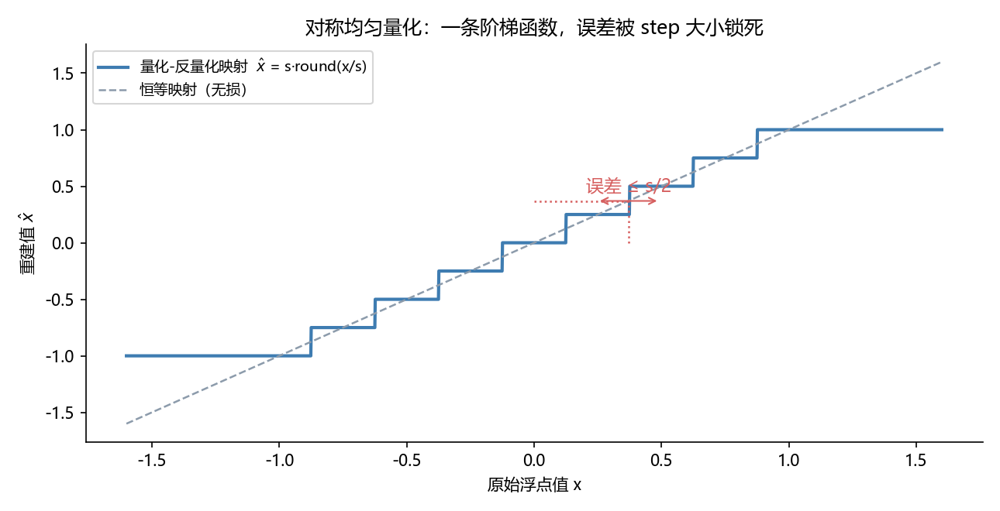
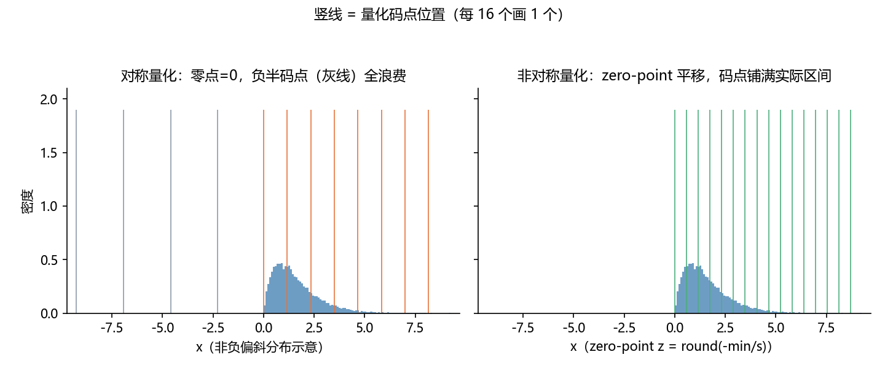
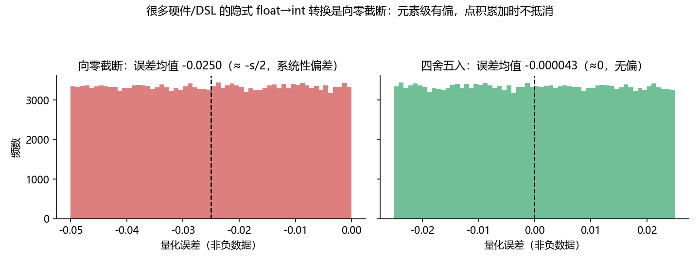
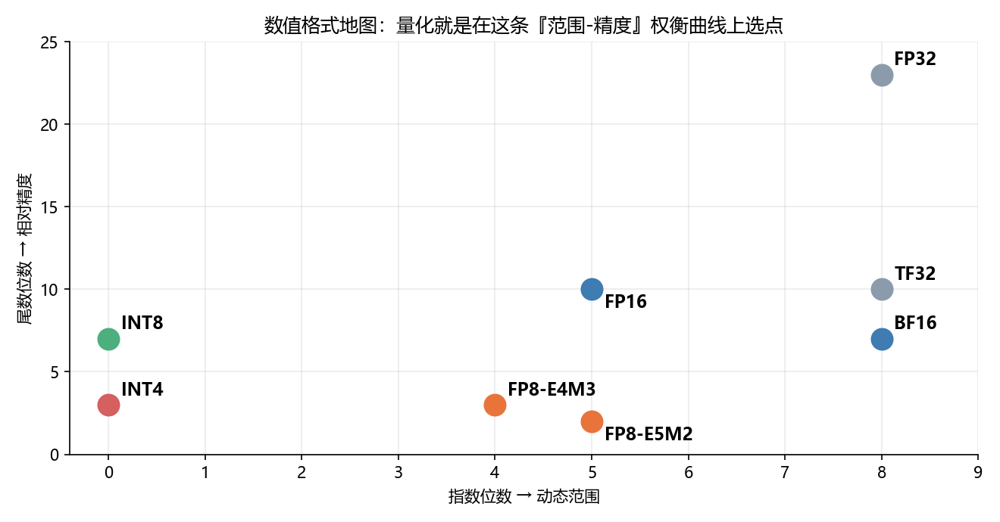
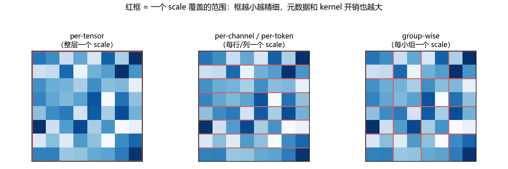
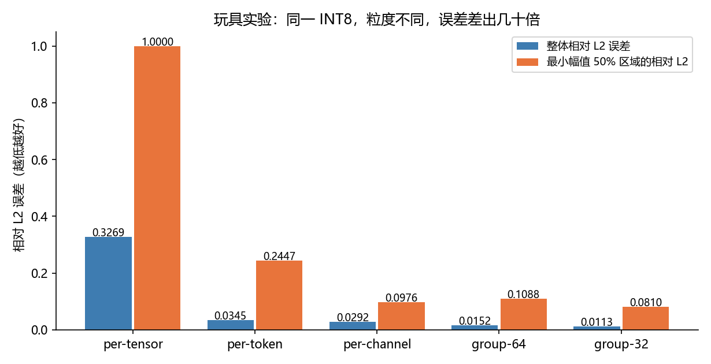

# INT8 量化实战指南：从数学原理到工程落地的完整思路

写这篇文章的起因是：市面上讲量化的文章大多停在"什么是 scale、什么是 zero-point"的科普层面，而真正把量化落地到推理系统里时，踩的坑全在别处——**粒度选错精度归零、反量化写错位置慢十倍、隐式 cast 偷偷截断、布局没对齐带宽白省**。

所以这篇不讲教科书定义，讲**工程决策**。读完你应该能回答四个问题：

1. 量化到底在数学上做了什么，误差从哪来？
2. 面对一个真实模型，怎么选格式（INT8/FP8/INT4）、选粒度、选量化对象？
3. 写进 kernel 之后，性能收益由什么决定，为什么有人量化完反而更慢？
4. 怎么验证"量化生效了"和"量化没把模型搞坏"？

文中所有公式都配了图，第 5 节有一个 40 行 numpy 玩具实验，数字是真实跑出来的，建议动手复现。

## 1. 为什么量化是推理优化的第一性手段

先建立一个心智模型：**大模型推理（尤其是 decode 阶段）本质上是一个"搬数据"的游戏，而不是"算数据"的游戏**。

用一个极其简化的 roofline 视角看：decode 时每生成一个 token，都要把全部权重从 HBM 读一遍。一个 27B 模型 BF16 权重约 54GB，假设 HBM 带宽 3TB/s，理论上下限就是每 token 十几毫秒——**瓶颈是字节数，不是 FLOPs**。长上下文的 attention 同理：prefill 要读完全部历史 KV，KV 字节数随上下文线性增长。

这个视角下，量化的收益逻辑就非常朴素了：

> **把每个元素的字节数砍半，瓶颈环节的耗时理论上就砍半。**

BF16→INT8 是 2 字节变 1 字节，→INT4 是变 0.5 字节。这就是为什么量化几乎是所有推理优化的第一站：它直接攻击"字节数"这个分母。同理，量化方案的好坏，也要用"实际省了多少字节流量、引入了多少额外开销"来衡量——这是后文所有讨论的评判标准。

## 2. 量化在数学上做了什么

### 2.1 核心就三个操作：缩放、取整、截断

最广泛使用的**均匀仿射量化**，对向量 `x` 的每个元素：

```text
q = clamp(round(x / s) + z, q_min, q_max)     # 量化：float -> int
x̂ = (q - z) * s                                # 反量化：int -> float
```

- `s` 是 scale（步长）：一个量化码对应多少浮点单位；
- `z` 是 zero-point：整数零点对应浮点 0 的偏移；
- INT8 对称量化的经典取法：`s = max|x| / 127`，`z = 0`，码点范围 `[-127, 127]`（刻意不用 -128，保持正负对称）。

把映射画出来就是一条阶梯函数：



*图 1：对称均匀量化的映射。阶梯宽度就是 scale `s`——**s 是唯一同时决定精度和码点利用率的旋钮**。所有落在同一台阶上的值重建后变成同一个数，单个元素的绝对误差上界是 `s/2`。*

记住这个误差界：**`|x̂ - x| ≤ s/2`**。它是绝对误差不是相对误差——这意味着对大幅值元素，量化几乎无感（相对误差小）；对小幅值元素，当 `|x| < s/2` 时直接归零。这一个不等式，就是后面"粒度之争"的全部根源。

### 2.2 对称 vs 非对称：零点要不要跟着数据走

数据关于 0 对称（如权重、attention 的 K/V），用对称量化最省：不需要存 zero-point，kernel 里少一次减法。数据明显偏移（如 ReLU/GELU 之后的激活，非负且偏斜），非对称量化能把码点铺满实际区间：



*图 2：非负偏斜分布下，对称量化（左）把一半码点浪费在永远不出现的负值上；非对称量化（右）用 zero-point 平移，码点全部落在数据实际覆盖的区间。注意竖线密度：同样的 8 bit，有效分辨率差了近一倍。*

工程上还有个折中：**对称量化 + 非对称区间**（zero-point 恒为 0，但 scale 按实际分布定）——激活非负时等于白扔一半码点，通常不这么干；权重和 KV 天然零中心，对称方案永远是首选。

### 2.3 一个隐蔽的坑：隐式 cast 是截断不是四舍五入

公式里的 `round` 是数学定义，但你写到 GPU 代码里时，很多硬件/DSL（包括部分 Triton/PTX 路径）的隐式 float→int 转换是**向零截断**：`2.7 → 2`。区别有多大？跑个统计：



*图 3：对非负数据，向零截断的误差均匀分布在 [-s, 0]，均值 ≈ -s/2——**每个元素都被系统性地往小压**；四舍五入的误差关于 0 对称、均值≈0。逐元素的有偏误差在 dot product 累加时不抵消，而是线性累积：输出幅值被整体缩小。*

工程对策很简单，但必须**显式**写：

```python
# Triton 里实现 round-half-away-from-zero
q = x / s
q = tl.where(q >= 0, q + 0.5, q - 0.5)   # 显式 round
q = tl.minimum(tl.maximum(q, -127.0), 127.0)  # 显式 clamp
# 然后再 store/cast 成 int8
```

这条教训的普适版本是：**量化公式里的每一步都要核实工具链的默认行为**，round 模式、clamp 边界、溢出处理，默认实现和你的假设不一致时不会报任何错。

## 3. 数值格式地图：量化是在"范围-精度"曲线上选点

INT8 不是唯一选项。把所有格式放到"指数位数（动态范围）× 尾数位数（相对精度）"的坐标系里：



*图 4：常见数值格式。浮点家族（FP32/TF32/FP16/BF16/FP8）靠指数换动态范围；整数家族（INT8/INT4）没有指数，是绝对均匀的网格——**范围内分辨率恒定，范围外直接 clamp**。*

这张地图直接给出选型逻辑：

- **INT8**：7 位等效尾数，分辨率均匀，没有动态范围。适合**值域可控、需要高精度**的场景——权重、激活、KV 都行，工业界最成熟（各代 GPU/NPU 的 INT8 tensor core 支持最普遍）。
- **FP8（E4M3/E5M2）**：尾数只有 2-3 位，但有指数兜底，outlier 不会毁掉整个 tensor。适合**值域跨度大、精度要求可放宽**的场景（如训练中的激活）。硬伤是**需要硬件支持**（H100、MI300 这一代才有），老卡/部分国产卡没有 FP8 单元，只能退回 INT8。
- **INT4**：分辨率再砍半，几乎只用于**纯权重量化**（W4A16），靠 group-wise scale + 各种补偿算法（GPTQ/AWQ）压误差，激活基本不敢碰。
- **BF16/FP16**：不是量化，但永远是你的**对照组和回退路径**。

一句话：**先看硬件支持什么，再看数据分布扛得住什么**。硬件没有对应计算单元时，低精度格式只能当压缩存储用（读进来再转回 FP16 算），省带宽不省算力——这其实正是推理场景最常见的用法，第 6 节细说。

## 4. 粒度：量化里最重要的工程决策

### 4.1 粒度谱系

同一个 INT8，"一个 scale 管多大范围"可以是：



*图 5：粒度谱系。per-tensor 整层一个 scale；per-channel/per-token 每行/列一个；group-wise 每 32/64/128 个元素一个。红框越小，scale 越贴合局部分布，但元数据更多、kernel 里要做的归约和广播也越多。*

回忆误差界 `s/2`：`s = max|x| / 127` 由覆盖范围内的**最大值**决定。一个 outlier 落进你的红框，整个框的分辨率都被它拉低。**粒度选择的本质，就是让 scale 的覆盖范围匹配数据的 outlier 结构**。

### 4.2 玩具实验：粒度对误差的影响是几十倍

用 numpy 构造一份"像 LLM 激活"的数据：4096×512 的重尾分布（t 分布，df=4），再随机挑 8 个 channel 乘 15 模拟 outlier channel：

```python
import numpy as np

def quant_sym(x, s):
    s = np.maximum(s, 1e-12)                      # 防除零
    return np.clip(np.round(x / s), -127, 127) * s

def per_tensor(x):  return quant_sym(x, np.abs(x).max() / 127)
def per_token(x):   return quant_sym(x, np.abs(x).max(1, keepdims=True) / 127)
def per_channel(x): return quant_sym(x, np.abs(x).max(0, keepdims=True) / 127)
def group_wise(x, g=64):
    t, c = x.shape; xg = x.reshape(t, c // g, g)
    s = np.abs(xg).max(2, keepdims=True) / 127
    return quant_sym(xg, s).reshape(t, c)

rel = lambda ref, q: np.linalg.norm(ref - q) / np.linalg.norm(ref)
```

真实跑出来的结果：

| 粒度 | 整体相对 L2 误差 | 最小幅值 50% 区域的相对 L2 |
|---|---:|---:|
| per-tensor | 0.3269 | **1.0000（小值全部归零）** |
| per-token | 0.0345 | 0.2447 |
| per-channel | 0.0292 | 0.0976 |
| group-64 | 0.0152 | 0.1088 |
| group-32 | 0.0113 | 0.0810 |



*图 6：同一 INT8、同一数据，只换粒度。per-tensor 的小值区误差是 100%——幅值最小的那一半元素全部被量化成 0，信息彻底丢失；细化到 group-32，整体误差降了近 30 倍。*

三个值得记住的细节：

1. **per-tensor 的灾难不在平均值，在小值区**。整体 L2 才 0.33 看着不吓人，但小值区 100% 归零——attention 里大量小 logit、小 V 值就是这么丢的，而且丢得无声无息。
2. **per-token 也会被 outlier channel 拖累**。数据里有 8 个 outlier channel 时，每一行的 scale 都被它们撑大，行内其他 channel 跟着遭殃（0.2447 vs per-channel 的 0.0976）。这正对应 LLM 激活的著名现象：激活的 outlier 是按 channel 分布的，所以 SmoothQuant 要把量化难度从激活侧"迁移"到权重侧，KIVI 做 KV cache 量化时对 K 用 per-channel、对 V 用 per-token——**粒度方向要对着 outlier 的方向**。
3. **收益递减**：per-tensor→per-token 降 10 倍，per-channel→group-32 只降 2.6 倍。粒度不是越细越好，细粒度意味着更多 scale 元数据（FP32 scale 4B，group-32 时相当于每 32 个 int8 加 4B，存储从 1B/元素涨到 1.125B/元素）和更复杂的 kernel。

### 4.3 粒度的可行性约束：在线还是离线

还有个教科书不讲的约束：**粒度再美好，也得算得出来**。

- 权重的 per-channel scale：权重是静态的，随便你怎么沿输入维归约，**离线算好就行**；
- 激活的 per-token scale：推理时 token 一个一个来，只能沿特征维（当前 token 内部）归约——**在线可算**；
- 激活的 per-channel scale：要等一整批 token 到齐才有意义，推理时根本不存在这个信息——**在线不可行**，除非离线校准（静态量化），而校准集和真实分布不一致时就是精度炸弹。

所以工程上的默认组合才长成这样：**权重 per-channel（或 group-wise）+ 激活 per-token 动态量化**。不是理论最优，是"在线可行 + outlier 结构"两个约束的交点。

## 5. 量化什么：权重、激活、KV Cache 是三种不同的生物

| 对象 | 数据性质 | 量化方式 | 主要难点 |
|---|---|---|---|
| **权重** | 静态、零中心、分布平稳 | 离线 PTQ，per-channel/group，W8A16 或 W4A16 | 极低比特（INT4）误差补偿：GPTQ/AWQ |
| **激活** | 动态、有 outlier channel | 在线 per-token 动态量化，或离线校准 | outlier；校准集代表性；quant-dequant 开销 |
| **KV Cache** | 动态增长、增量写入、长生命周期 | 在线 per-token/head 量化，scale 跟数据一起存 | scale 元数据的生命周期管理；读写两侧 kernel 都要改 |

三者里 KV Cache 最特殊，值得单独说：

- **它既是"权重"又是"激活"**：像激活一样动态产生，又像权重一样被反复读取（decode 每步都读全部历史）。
- **它的规模随上下文线性增长**，恰恰是长上下文场景的访存瓶颈所在——量化 KV 的收益随序列变长而放大，这点和权重量化（收益恒定）很不一样。
- **scale 元数据有生命周期问题**：PagedAttention 体系下 block 会被 copy、复用（prefix cache）、回收、重映射。scale 必须和数据住在同一个物理 page 里，共享物理身份——否则你要维护第二套索引，并保证两套索引在所有管理操作下永远同步。
- **冷热路径要分开**：prefill 当前 chunk 的 K/V 是本轮刚算出来的浮点激活，先写 INT8 再立刻读回纯属浪费（多一次量化/反量化开销 + 白丢精度）。正确的做法是历史部分读 INT8 cache、当前 chunk 直接用原始浮点 K/V——这个思路（ raw-current / fused-prefix ）在多个推理框架的 KV 量化实现里都能看到。

## 6. 落地之后：为什么有人量化完反而更慢

量化公式对了、粒度选对了，写进系统还有六道关。这也是"量化完没加速甚至变慢"的常见根因清单：

**① 先查硬件路径。** 低精度格式只有在两种情况下有收益：硬件有对应计算单元（INT8 tensor core），或者你能把"读低精度数据"的字节节省真正吃到（存储压缩 + kernel 内转换）。两者都没有，就是纯亏 dequant 开销。开工前先确认目标芯片支持什么、框架实际走哪条 kernel 路径——很多后端有多个候选实现，你以为在跑 A，实际在跑 B，改错了地方一切免谈。

**② 量化/反量化本身不是免费的。** 归约求 max、除法、round/clamp、scale 的存取，都是额外指令。量化收益 = 省下的字节时间 − 额外计算时间。矩阵小时可能倒挂。

**③ 反量化的位置决定 kernel 生死。** 最差的写法是在循环里物化一块 FP32 临时张量再做运算——寄存器压力爆炸，occupancy 崩盘，慢几倍很正常。正确的姿势是**把 scale 折进已有的乘法里**：以 attention 为例，`QK^T` 的点积可以直接对整数量做（int8 值 ≤127，在 BF16 里精确），把逐 token 的 scale 乘到 logits 上；`P·V` 同理，先缩放概率再乘 V。数学完全等价，FP32 临时张量消失了。这个"延迟反量化、融入乘积累加"的技巧（scale folding / dequant fusion）在 GEMM 里同样适用：int8×int8 累加成 int32，最后一次性乘 scale 转 float。

**④ 布局和对齐是性能问题，不是美观问题。** scale 元数据怎么放？和主数据交错（interleaved）会让向量起点相对缓存行边界漂移，产生非对齐离散访问；分离成独立 plane（data plane + scale plane）保持主数据连续对齐。总字节数一样，性能差好几倍。同理，向量长度、tile 尺寸、page 大小的对齐约束，最好在 host 侧用 assert 快速失败，别让 kernel 静默踩坑。

**⑤ 小心隐式行为。** cast 的 round 模式（第 2.3 节）、clamp 边界、denormal 处理、累加器精度（int8 累加必须用 int32/FP32 累加器）——默认值和你的假设不一致时，不会报错，只会慢慢烂掉精度。

**⑥ 验证要分层，且先证明"生效"再谈"收益"。** 一套可靠的路径是：

1. **生效验证**：看可观测的物理证据（显存占用是否下降、cache 容量是否翻倍、正确 dtype 的 kernel 是否被调用），而不是看性能数字；
2. **单元验证**：构造已知输入，直接解包量化后的 raw bytes，对照参考实现——别用"读写一致"自证（读写共享同一个 bug 时照样一致）；
3. **误差验证**：小样本冒烟 + **抽查生成内容**（量化失效的典型症状是长输入下输出胡话、退化重复、特殊 token 泄漏，短输入完全正常）；
4. **端到端 A/B**：足够大的样本量（性能数字在小样本下被固定开销主导，3 条请求的快测说明不了任何问题）、相同环境、逐档核对延迟尾部（P99，不是均值）；
5. **归因验证**：如果掉了精度，用 ON/OFF A/B 确认是量化本身而不是同时上线的其他改动。

## 7. 决策速查表

面对一个真实任务，按这个顺序问：

1. **瓶颈是什么？** profile 先打一遍。带宽瓶颈（decode、长上下文 attention）量化收益大；计算瓶颈（大 batch GEMM）要看硬件有没有低精度计算单元；launch/调度瓶颈量化帮不上忙。
2. **硬件支持什么？** 有 FP8 单元优先 FP8（实现成本最低、误差最小）；没有就 INT8；都不要想 INT4 激活。
3. **量化哪个对象？** 权重大→W8/W4；激活/KV 是访存瓶颈→动态量化；KV 随上下文变长才成为瓶颈→长上下文场景优先 KV。
4. **粒度怎么选？** 权重 per-channel 起步，INT4 上 group-64/128；激活 per-token 动态；KV per-token/head。发现精度问题先画出数据的 outlier 结构再调粒度方向，别无脑加密。
5. **误差预算多少？** 有精度系数/回归门槛时，先跑小样本冒烟再全量；掉超阈值时按第 6 节的归因流程走。
6. **回退路径是什么？** 保留显式开关（dtype/flag 切换），新旧数据布局不兼容时整体切换 + 清缓存 + 重启，不做热迁移。

**常见失败模式清单**（按踩坑频率排序）：

- per-tensor scale 用在有 outlier 的长序列数据上 → 小值归零，精度崩
- tile 循环内物化 FP32 反量化临时张量 → 寄存器溢出，慢好几倍
- 信任隐式 cast 的 round 行为 → 系统性偏差
- scale 元数据和数据分家 → 管理操作（copy/复用/回收）后错位
- 交错布局的非对齐访问 → 带宽收益被访问模式吃光
- 3 条请求快测下结论 → 被固定开销骗
- 改了不在执行路径上的代码 → 优化了个寂寞

## 8. 总结

把全文压缩成五句话：

1. 推理的瓶颈常常是字节数，量化的本质是按比例缩小分母——**收益要用字节流量衡量**。
2. 量化误差的核心不等式是 `|x̂-x| ≤ s/2`，**粒度决定 s 被谁撑大**，粒度方向要对着 outlier 的方向。
3. 权重、激活、KV Cache 是三种对象：**离线/在线可行性**和**元数据生命周期**比公式本身更决定方案形态。
4. 落地时性能死在**反量化的位置和布局对齐**，精度死在**隐式 cast 和粒度选错**——都有确定性的工程对策。
5. 验证分层：先生效、再单元、再误差、再 A/B、再归因，**每一步都要有物理证据**。

## 9. 延伸阅读

想继续深入的话，这几篇是各方向的入口（按上文提到的顺序）：

- **LLM.int8()**（Dettmers et al., 2022）：首次系统揭示 LLM 激活的 outlier feature 现象，混合精度分解处理；
- **SmoothQuant**（Xiao et al., 2022）：按 channel 在激活和权重间迁移量化难度，W8A8 的经典方案；
- **GPTQ**（Frantar et al., 2022）：基于二阶信息逐层补偿的权重量化，W4 的事实标准之一；
- **AWQ**（Lin et al., 2023）：activation-aware，保护 1% 显著权重通道；
- **KIVI**（Liu et al., 2024）：KV Cache 量化的代表性工作，K per-channel、V per-token 的非对称粒度设计；
- **FP8 相关**：NVIDIA Transformer Engine 与 MS-AMP 的 E4M3/E5M2 实践，理解 FP8 的动态范围优势与硬件依赖。

---

*文中的玩具实验代码可直接运行（仅依赖 numpy），粒度-误差表格为真实运行结果；图 2/3/5 为示意图，图 6 为实验数据。硬件支持矩阵随代际变化，落地前请以目标平台的最新文档为准。*
