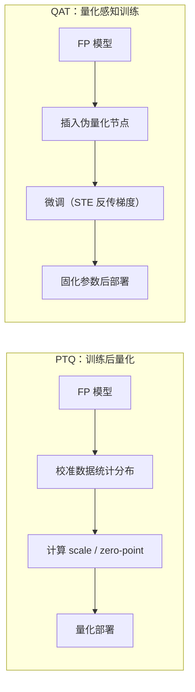
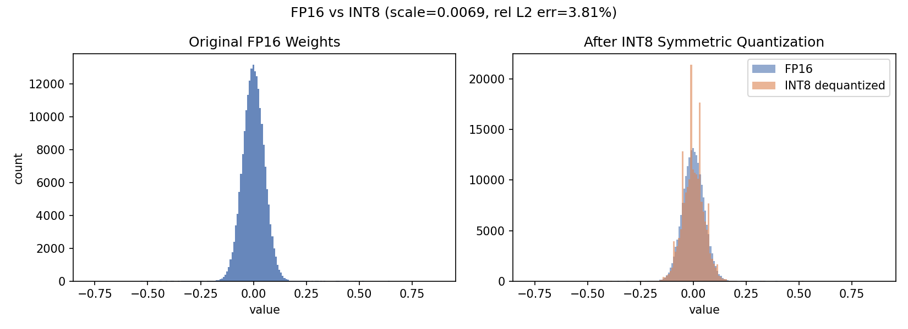

# 4.1 量化基础：从 FP32 到 INT4 的压缩艺术

> **系列导航｜《AIInfraGuide》模块四·第 4 章：量化**
> 1. **4.1 量化基础：从 FP32 到 INT4 的压缩艺术（本篇）**
> 2. [4.2 W8A8 量化：SmoothQuant 与 Activation Outlier 问题](../quant-42-smoothquant-w8a8/)
> 3. [4.3 Weight-only INT4：GPTQ、AWQ 与 Marlin Kernel](../quant-43-gptq-awq-marlin/)
> 4. [4.4 KV Cache 量化：KIVI 2-bit 与 FP8 KV Cache](../quant-44-kv-cache-kivi-fp8/)
> 5. [4.5 FP8 与 NVFP4/MXFP4：Hopper 与 Blackwell 的低比特浮点](../quant-45-fp8-nvfp4-mxfp4/)
> 6. [4.6 量化选型与 vLLM 实战：从决策树到生产部署](../quant-46-vllm-deployment/)

## 本章简介

本篇是《AIInfraGuide》模块四"推理优化"第 4 章"量化"的第 1 篇（全章共 6 篇），负责打地基。

大模型推理的瓶颈往往不是算力而是访存：decode 阶段每生成一个 token 都要把全部权重从显存读一遍，**把每个参数的字节数砍半，理论耗时就能砍半**。量化（Quantization，量化）正是直接攻击"字节数"这个分母的第一手段。但"INT8 是什么、为什么能压缩、代价是什么"这类问题，很多工程师并没有从数学上讲清楚过。

本篇要解决四个问题：

1. FP32/FP16/BF16/FP8/INT8/INT4 这些格式，在位宽、动态范围、精度上到底差在哪？
2. 量化映射的数学本质是什么？scale、zero-point、clamp 三个要素如何决定误差上界？
3. Per-tensor / Per-channel / Per-group / Per-token 四种粒度怎么选？PTQ 和 QAT 两条路线怎么选？
4. 能不能手写一个量化器，亲眼看一看误差长什么样？

读完后，你应该能看懂任何一份量化方案文档里的术语与参数，并为后续 4.2～4.6 篇（激活 outlier 与 SmoothQuant、GPTQ、AWQ、KV Cache 量化、FP8 实践）打好数学基础。

## 1. 数值表示基础：位宽、范围与精度的三角约束

### 1.1 浮点家族：指数位换范围，尾数位换精度

浮点数的通用结构是"符号位 + 指数位 + 尾数位"：

```text
值 = (-1)^sign × 2^(exponent - bias) × (1 + mantissa / 2^m)
```

- **指数位越多，动态范围越大**：能表示的最大/最小值跨度越大，不容易溢出；
- **尾数位越多，相对精度越高**：相邻两个可表示数之间的间隔越小。

FP32（1+8+23）是深度学习的基准格式。后来的低精度浮点格式，本质上都是在"指数位 × 尾数位"的预算里做不同权衡：

- **FP16**（1+5+10）：指数只剩 5 位，最大只能表示到 65504，训练时梯度容易溢出，因此需要 loss scaling；
- **BF16**（Brain Floating Point 16，1+8+7）：保留与 FP32 相同的 8 位指数，动态范围不受影响，代价是尾数只有 7 位、精度变粗。Google 为 TPU 设计，现已成为 LLM 训练与推理的主流格式；
- **TF32**（TensorFloat-32，1+8+10）：NVIDIA 在 Ampere 架构（A100，2020）引入的内部格式——对外仍是 FP32 存储，tensor core 内部截断成 19 位计算，用精度换速度；
- **FP8**（1+4+3 或 1+5+2）：Hopper 架构（H100，2022）引入，E4M3 最大约 448，通常配合 Transformer Engine 的逐层缩放使用。

### 1.2 整数家族：均匀网格上的定点数

INT8/INT4 是另一套逻辑：**没有指数，所有可表示值构成一个绝对均匀的网格**。范围内分辨率恒定，范围外的值直接被 clamp（截断）。这意味着整数格式的"动态范围"不是指数给的，而是靠一个外部浮点缩放系数（scale）撑出来的——这正是第 2 节量化映射要解决的问题。

### 1.3 七种格式横向对比

| 数据类型 | 位宽 | 指数位/尾数位 | 动态范围 | 典型应用场景 |
|---|---|---|---|---|
| FP32 | 32 | 8 / 23 | ±3.4×10³⁸ | 训练基准、master weights、高精度累加 |
| TF32 | 19（存 32） | 8 / 10 | ±3.4×10³⁸ | Ampere+ 训练矩阵乘内部加速 |
| FP16 | 16 | 5 / 10 | ±65504 | 混合精度训练、推理存储与计算 |
| BF16 | 16 | 8 / 7 | ±3.4×10³⁸ | LLM 训练与推理主流格式 |
| FP8-E4M3 | 8 | 4 / 3 | ±448 | Hopper+ 训练前向、推理 GEMM、KV Cache |
| INT8 | 8 | —（定点） | [-128, 127] 均匀网格 | 推理权重/激活/KV 量化，工业界最成熟 |
| INT4 | 4 | —（定点） | [-8, 7] 均匀网格 | 极致权重量化（W4A16，GPTQ/AWQ） |

硬件侧的对照（NVIDIA 官方公开规格）：H100 SXM 的 FP16/BF16 tensor core 峰值约 989.5 TFLOPS（稠密），FP8 翻倍到约 1979 TFLOPS；显存带宽 3.35 TB/s（80GB HBM3）。到 Blackwell 一代，B200 进一步支持 FP4，显存带宽提升到 8 TB/s（192GB HBM3e）。**格式位宽每砍半，同样带宽下单位时间能搬运的元素数就翻倍**——这就是量化加速的全部物理基础。

> **一句话总结**：浮点格式用指数位换动态范围、用尾数位换精度；整数格式没有指数，靠外部 scale 定范围。量化选型的第一步，是看清你的数据分布落在"范围-精度"地图的哪个位置。

## 2. 量化映射原理：scale、zero-point 与 clamp

### 2.1 从连续到离散：仿射映射

量化的数学本质，是把连续浮点值映射到有限的整数网格上。最常用的是**均匀仿射量化**（uniform affine quantization），对浮点张量 x 的每个元素：

```text
量化（float → int）：  q = clamp(round(x / s) + z, q_min, q_max)
反量化（int → float）：x̂ = (q - z) · s
```

三个要素：

- **scale s**：步长，一个量化码对应多少浮点单位。s 是唯一同时决定精度与码点利用率的旋钮；
- **zero-point z**：整数零点，保证浮点 0 能被精确表示（对 padding、ReLU 后的零值很重要）；
- **clamp**：把超出码点范围的值截断到 [q_min, q_max]，由此引入裁剪误差（第 5 节详述）。

### 2.2 对称量化：零点固定在 0

对称量化（Symmetric Quantization，对称量化）令 z = 0，码点关于 0 对称：

```text
s = max|x| / q_max        （INT8 时 q_max = 127）
q = clamp(round(x / s), -127, 127)
```

注意 INT8 刻意只用 [-127, 127] 而不用 -128：保持正负对称，避免 -(-128) 这类符号翻转在定点运算中溢出。权重分布天然零中心，对称量化不需要存 zero-point，kernel 里少一次减法，是权重量化的默认选择。

### 2.3 非对称量化：让码点铺满实际区间

非对称量化（Asymmetric Quantization，非对称量化）允许 z ≠ 0，用实际的最小/最大值定标：

```text
s = (x_max - x_min) / (q_max - q_min)
z = clamp(round(q_min - x_min / s), q_min, q_max)
```

当数据明显偏离零中心时（比如 GELU 之后的激活，非负且偏斜），对称量化会把一半码点浪费在永远不出现的负值上；非对称量化通过平移 zero-point，把 256 个码点全部铺到数据实际覆盖的区间，有效分辨率接近翻倍。代价是要多存一个 z，kernel 里多一步偏移处理。

### 2.4 误差界推导：|x̂ − x| ≤ s/2

以对称量化为例。当元素没有触发 clamp 时，round 的舍入误差至多为半个步长：

```text
|round(x/s) − x/s| ≤ 1/2
⟹  |x̂ − x| = s · |round(x/s) − x/s| ≤ s/2
```

记住这个不等式：**单点绝对误差 |x̂ − x| ≤ s/2**。它是绝对误差而非相对误差——对大幅值元素，量化几乎无感；对小幅值元素，当 |x| < s/2 时会被直接归零。而 s = max|x| / 127 由覆盖范围内的最大值决定：**一个 outlier 落进来，范围内所有元素的分辨率都被拉低**。这一个不等式，就是第 3 节"粒度之争"和第 4.2 篇 SmoothQuant 的全部根源。

## 3. 量化粒度：一个 scale 管多少元素

同一个 INT8，"一个 scale 覆盖多大范围"有四种典型选择。以形状为 [M, K] 的权重矩阵（M 输入维、K 输出通道）为例：

| 粒度 | scale 数量 | 精度 | 元数据开销 | 典型场景 |
|---|---|---|---|---|
| Per-tensor | 1 | 最低 | 最小 | 静态激活量化、早期部署方案 |
| Per-channel | K（每输出通道 1 个） | 高 | 小 | 权重量化默认配置（W8/W4） |
| Per-group | K × M/g（g 常取 64/128） | 更高 | 中（存储略涨） | INT4 权重，GPTQ/AWQ 标配 |
| Per-token | 每 token 1 个 | 高 | 小 | 激活 / KV Cache 动态量化 |

粒度选择的本质，是让 scale 的覆盖范围匹配数据的 outlier 结构：

- 权重是静态的，可以离线沿任意维度归约，per-channel 几乎零成本；INT4 再上 group-wise 进一步压误差；
- 激活逐 token 到达，只能沿特征维在线归约，per-token 动态量化是唯一在线可行的细粒度方案；
- LLM 激活的 outlier 按 channel 聚集，per-tensor / per-token 都会被它撑大 s——这正是 SmoothQuant 要把量化难度从激活侧迁移到权重侧的原因（本系列第 4.2 篇展开）。

粒度也不是越细越好：group=64 时，每 64 个 INT8 要额外存一个 FP16 scale，存储从 1 B/元素涨到约 1.03 B/元素，kernel 里还要多一次归约与广播。**精度收益递减、开销线性递增，工程上取两者的交点**。

## 4. 量化范式：PTQ vs QAT

按量化参数在何时确定，分为两条路线：

- **PTQ**（Post-Training Quantization，训练后量化）：模型训练完成后，用少量校准数据（通常几百到几千条）统计各张量分布，离线算出 scale/zero-point 后直接部署。成本低、无需重训练，是 INT8/INT4 权重量化的主流；
- **QAT**（Quantization-Aware Training，量化感知训练）：在训练图中插入伪量化（fake quant）节点，前向模拟量化误差，反向用 STE（Straight-Through Estimator，直通估计器）把梯度绕过不可导的 round 传回去，让模型在微调中"学会适应"量化。成本接近一次微调，但能换回更低比特下的精度。



| 维度 | PTQ | QAT |
|---|---|---|
| 额外成本 | 几百条校准数据、分钟级 | 完整微调流水线、小时到天级 |
| 精度表现 | INT8 基本无损，INT4 需 GPTQ/AWQ 补偿 | 更低比特下仍较稳 |
| 工程门槛 | 低，工具链成熟 | 高，需训练框架支持 |
| 何时选 | 默认首选 | PTQ 精度不达标时的后手 |

对推理工程师来说，日常绝大多数场景是 PTQ；QAT 更多出现在模型发布方的生产流水线上（例如厂商直接放出官方量化 checkpoint）。

## 5. 量化误差的三个来源

量化不是免费的。误差按来源分三类，工程对策各不相同：

**① 舍入误差（Rounding Error）**。round 操作引入，落在 ±s/2 以内，近似均匀分布、均值约为 0。只要 round 实现正确（警惕部分硬件的隐式 float→int cast 是向零截断而非四舍五入，会引入均值 ≈ −s/2 的系统性偏差），舍入误差在点积累加时会部分抵消，是三类误差里最"温和"的。

**② 裁剪误差（Clipping Error）**。当 |x| 超出量化范围时被 clamp 到边界，误差可以远大于 s/2，且集中在 outlier 上——而 outlier 往往恰是模型里最重要的值。减小 s（例如按 99.9 分位而非最大值定标）能缩小整体舍入误差，代价是放大裁剪误差，两者存在最优权衡；校准算法（percentile、MSE 最优截断）找的就是这个点。

**③ 累积误差（Accumulation Error）**。单元素误差很小，但 GEMM（General Matrix Multiply，通用矩阵乘）是成千上万次乘加：无偏误差部分抵消，有偏误差线性累积。两个工程含义：一是 round 模式必须核实（见①）；二是累加器精度必须够——INT8×INT8 必须用 INT32 累加器，反量化放在累加完成后一次性做，而不是逐元素先转浮点再乘。

## 6. 实战：手写一个 FP16→INT8 量化器

理论讲完，动手验证。目标：手写对称 INT8 量化的 quantize() / dequantize()，在一份"像 LLM 权重"的合成数据（正态主体 + 少量重尾）上做量化—反量化，统计误差并与第 2.4 节的理论界对照。

### 6.1 numpy 版（已实际运行）

```python
# 测试环境：Windows 11, Python 3.12, numpy 1.26.4
import numpy as np

rng = np.random.default_rng(42)

def quantize(x, qmax=127):
    """对称均匀量化：float -> int8 + scale"""
    s = np.abs(x).max() / qmax          # scale：一个量化码对应多少浮点单位
    q = np.clip(np.round(x / s), -qmax, qmax)
    return q.astype(np.int8), s

def dequantize(q, s):
    """反量化：int8 -> float"""
    return q.astype(np.float64) * s

# 合成一份"像 LLM 权重"的数据：正态主体 + 少量重尾
w = rng.standard_normal(200_000) * 0.05
w[:500] *= 6.0
w16 = w.astype(np.float16).astype(np.float64)   # 模拟 FP16 存储

q, s = quantize(w16)
w_hat = dequantize(q, s)
err = w_hat - w16

print(f"scale s = {s:.6f}")
print(f"理论单点误差上界 s/2 = {s/2:.6f}")
print(f"实际最大绝对误差      = {np.abs(err).max():.6f}")
print(f"平均绝对误差 (MAE)    = {np.abs(err).mean():.6f}")
print(f"相对误差 (L2 范数比)  = {np.linalg.norm(err) / np.linalg.norm(w16):.6%}")
print(f"INT8 码点利用率       = {len(np.unique(q))} / 255")
```

真实运行输出：

```text
scale s = 0.006882
理论单点误差上界 s/2 = 0.003441
实际最大绝对误差      = 0.003441
平均绝对误差 (MAE)    = 0.001720
相对误差 (L2 范数比)  = 3.813329%
INT8 码点利用率       = 160 / 255
```

三个值得注意的点：

1. **实际最大误差 0.003441 恰好等于理论界 s/2**——第 2.4 节的不等式被严格验证，边界上确实有元素"踩线"；
2. **MAE ≈ 0.00172 ≈ s/4**，与"舍入误差在 ±s/2 上均匀分布"的理论期望一致；
3. **码点只用了 160/255**——重尾 outlier 把 max|x| 撑到约 0.87，s 随之变大，大量中间码点空置。这正是 per-tensor 粒度在真实 LLM 数据上的典型病症，也是第 3 节粒度细化与第 4.2 篇 SmoothQuant 的动机。

（Windows GBK 控制台若中文输出乱码，改用 `PYTHONIOENCODING=utf-8 python fig_4_1.py` 运行即可。）

### 6.2 PyTorch 版：贴进真实推理流程

把同样的逻辑翻译成 torch，并加上 per-channel 粒度——这才是工程里真正使用的形态：

```python
# 测试环境：torch 2.5.1, CUDA 12.4（CPU 亦可运行）
import torch

def quantize_int8(x: torch.Tensor, per_channel: bool = False):
    """对称 INT8 量化：FP16 -> INT8 + scale。

    per_channel=True 时沿输出通道（dim 0）逐通道定标，是权重量化的工程默认。
    """
    q_max = 127
    if per_channel:
        s = x.abs().amax(dim=1, keepdim=True) / q_max   # 形状 [out, 1]，可广播
    else:
        s = x.abs().max() / q_max                       # 标量
    q = torch.clamp(torch.round(x / s), -q_max, q_max).to(torch.int8)
    return q, s

def dequantize_int8(q: torch.Tensor, s: torch.Tensor) -> torch.Tensor:
    """反量化：INT8 -> FP16，逐元素乘回 scale。"""
    return q.to(torch.float16) * s.to(torch.float16)

if __name__ == "__main__":
    torch.manual_seed(42)
    w = (torch.randn(4096, 512) * 0.05).to(torch.float16)  # 模拟一层权重 [out, in]
    w[:8, :] *= 6.0                                        # 制造几个 outlier 输出通道

    q_t, s_t = quantize_int8(w, per_channel=False)
    q_c, s_c = quantize_int8(w, per_channel=True)

    err_t = (dequantize_int8(q_t, s_t) - w).abs().max().item()
    err_c = (dequantize_int8(q_c, s_c) - w).abs().max().item()
    print(f"per-tensor  max|err| = {err_t:.6f} (s/2 = {(s_t / 2).item():.6f})")
    print(f"per-channel max|err| = {err_c:.6f}")
```

自查要点：`amax(dim=1, keepdim=True)` 保持广播形状；`torch.round` 为四舍五入（half-to-even）；INT8 张量参与运算前先显式转回 FP16，避免整型溢出语义。注意真实 kernel 里并不会真的先反量化再做 GEMM（那等于白量化），而是 int8×int8 累加成 int32、最后一次性乘 scale——kernel 级优化属于后续篇章的话题。

### 6.3 可视化：量化前后分布对比



*图 1：左图为原始 FP16 权重分布（正态主体 + 重尾）；右图叠加 INT8 量化—反量化后的分布。量化后整体轮廓保持，但直方图呈离散阶梯状（码点有限），outlier 附近的码点密度明显变稀——s 被重尾撑大的代价清晰可见。完整绘图代码如下，可直接复现：*

```python
# 测试环境：Windows 11, Python 3.12, numpy 1.26.4, matplotlib 3.9.2
# 运行：python scripts/quant-ch4/fig_4_1.py
import numpy as np
import matplotlib

matplotlib.use("Agg")
import matplotlib.pyplot as plt

rng = np.random.default_rng(42)

# ---------- 1. 手写对称量化 / 反量化 ----------
def quantize(x, qmax=127):
    """对称均匀量化：float -> int8 + scale"""
    s = np.abs(x).max() / qmax          # scale：一个量化码对应多少浮点单位
    q = np.clip(np.round(x / s), -qmax, qmax)
    return q.astype(np.int8), s

def dequantize(q, s):
    """反量化：int8 -> float"""
    return q.astype(np.float64) * s

# 合成一份"像 LLM 权重"的数据：正态主体 + 少量重尾
w = rng.standard_normal(200_000) * 0.05
w[:500] *= 6.0
w16 = w.astype(np.float16).astype(np.float64)   # 模拟 FP16 存储

q, s = quantize(w16)
w_hat = dequantize(q, s)
err = w_hat - w16

print(f"scale s = {s:.6f}")
print(f"理论单点误差上界 s/2 = {s/2:.6f}")
print(f"实际最大绝对误差      = {np.abs(err).max():.6f}")
print(f"平均绝对误差 (MAE)    = {np.abs(err).mean():.6f}")
print(f"相对误差 (L2 范数比)  = {np.linalg.norm(err) / np.linalg.norm(w16):.6%}")
print(f"INT8 码点利用率       = {len(np.unique(q))} / 255")

# ---------- 2. 绘图 ----------
fig, axes = plt.subplots(1, 2, figsize=(11, 4))

axes[0].hist(w16, bins=200, color="#4C72B0", alpha=0.85)
axes[0].set_title("Original FP16 Weights")
axes[0].set_xlabel("value")
axes[0].set_ylabel("count")

axes[1].hist(w16, bins=200, color="#4C72B0", alpha=0.6, label="FP16")
axes[1].hist(w_hat, bins=200, color="#DD8452", alpha=0.6, label="INT8 dequantized")
axes[1].set_title("After INT8 Symmetric Quantization")
axes[1].set_xlabel("value")
axes[1].legend()

fig.suptitle(f"FP16 vs INT8 (scale={s:.4f}, rel L2 err={np.linalg.norm(err)/np.linalg.norm(w16):.2%})")
fig.tight_layout()
fig.savefig("4.1-fp16-vs-int8-dist.png", dpi=150)   # 保存到当前目录，与文章配图一致
```

想快速体验工业级量化推理，vLLM 一条命令即可（FP8 动态量化 + FP8 KV Cache，KV Cache 即 Key-Value Cache，键值缓存）：

```bash
# 测试环境：H100 80GB, CUDA 12.4, vLLM 0.10.0, torch 2.5.1
vllm serve meta-llama/Llama-3.1-8B-Instruct \
    --quantization fp8 --kv-cache-dtype fp8
```

## 7. 常见问题（FAQ）

**Q1：为什么对称 INT8 量化用 [-127, 127] 而不用完整的 [-128, 127]？**
保持正负对称：-128 没有对应的正值，定点乘加里的符号翻转 -(-128) 会溢出；且 z=0 时映射关系最简单。TensorRT 等主流推理框架默认都用 ±127，损失一个码点的代价可以忽略。

**Q2：量化后精度明显下降，第一步查什么？**
画出每个 channel 的 max|x|，先找 outlier channel；然后把粒度从 per-tensor 细化到 per-channel 或 group-wise；再检查校准集是否覆盖真实数据分布；最后核实 round/clamp 的实现行为（不少 DSL 的隐式 float→int 转换是向零截断而非四舍五入，会引入系统性偏差）。按这个顺序排查，绝大多数精度问题都能定位。

**Q3：推理部署选 FP16 还是 BF16？**
算力上两者一致（H100 上 FP16/BF16 tensor core 峰值相同）。BF16 动态范围与 FP32 相同，激活与梯度不易溢出，是 LLM 主流；FP16 尾数多 3 位、相对精度略高，但最大值只有 65504，长序列 logits 存在溢出风险。新部署的模型默认选 BF16，除非有明确理由。

**Q4：INT4 能同时量化激活吗（W4A4）？**
目前基本不能。4 bit 只有 16 个码点，激活的 outlier channel 会把 per-token 的 s 撑大到让绝大多数小值直接归零。工业界 INT4 几乎只用于纯权重量化 W4A16（权重 4 bit、激活 16 bit），配合 group-wise scale 与 GPTQ/AWQ 补偿算法；激活侧 INT4 仍停留在研究阶段。

**Q5：为什么 INT4 量化后模型文件不是正好缩到 FP16 的 1/4？**
三部分"额外"体积：group-wise 的 scale/zero-point 元数据（group=64 时约增加 6%）；embedding 与 lm_head 通常保持 FP16 不量化；部分敏感层（首末层、MoE 路由）常被跳过。实际体积约为 FP16 版的 30%，属正常现象。

## 本章小结

- 数值格式的本质是"范围-精度"权衡：浮点用指数位换范围、尾数位换精度；整数是均匀网格，范围靠外部 scale 撑出。
- 量化映射三要素：scale 定步长、zero-point 定零点、clamp 截边界；核心不等式 **|x̂ − x| ≤ s/2**，且 s 由覆盖范围内的最大值决定。
- 粒度是量化最重要的工程决策：权重 per-channel 起步、INT4 上 group-wise；激活与 KV Cache 用 per-token 动态量化；粒度方向要对着 outlier 的方向。
- PTQ 是默认路线（校准数据 + 离线定标），QAT 是 PTQ 精度不达标时的后手（伪量化 + STE 微调）。
- 误差三来源：舍入（±s/2 内、近似无偏）、裁剪（outlier 上、可超界）、累积（有偏误差随点积线性增长，累加器要用 INT32）。
- 动手实验验证了理论：最大误差恰好踩到 s/2，MAE ≈ s/4，重尾 outlier 导致码点利用率只有 160/255——下一篇 SmoothQuant 就从这个问题讲起。

## 延伸阅读

- **Mixed Precision Training**（Micikevicius et al., 2017）：FP16 混合精度训练的奠基之作，理解 FP16/BF16 取舍的起点；
- **A White Paper on Neural Network Quantization**（Nagel et al., 2021）：量化领域最系统的综述，PTQ/QAT、粒度、校准策略均有覆盖；
- **LLM.int8()**（Dettmers et al., 2022）：首次系统揭示 LLM 激活的 outlier feature 现象——本系列第 4.2 篇 SmoothQuant 的问题源头；
- **GPTQ**（Frantar et al., 2022）与 **AWQ**（Lin et al., 2023）：INT4 权重量化的两个事实标准，分别对应本系列第 4.3、4.4 篇；
- **NVIDIA Transformer Engine 文档**：FP8 在真实训练/推理中的工程形态，对应本系列第 4.6 篇。

## 参考文献

- Mixed Precision Training：https://arxiv.org/abs/1710.03740
- A White Paper on Neural Network Quantization：https://arxiv.org/abs/2106.08295
- LLM.int8(): 8-bit Matrix Multiplication for Transformers at Scale：https://arxiv.org/abs/2208.07339
- GPTQ: Accurate Post-Training Quantization for Generative Pre-trained Transformers：https://arxiv.org/abs/2210.17323
- SmoothQuant: Accurate and Efficient Post-Training Quantization for Large Language Models：https://arxiv.org/abs/2211.10438
- AWQ: Activation-aware Weight Quantization for LLM Compression and Acceleration：https://arxiv.org/abs/2306.00978
- PyTorch Quantization 官方文档：https://pytorch.org/docs/stable/quantization.html
- NVIDIA H100 Tensor Core GPU：https://www.nvidia.com/en-us/data-center/h100/
- NVIDIA Blackwell Architecture：https://www.nvidia.com/en-us/data-center/technologies/blackwell-architecture/
