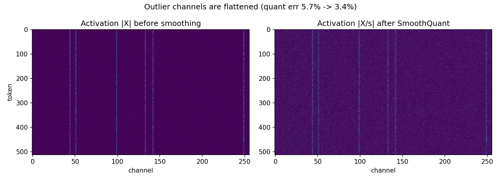
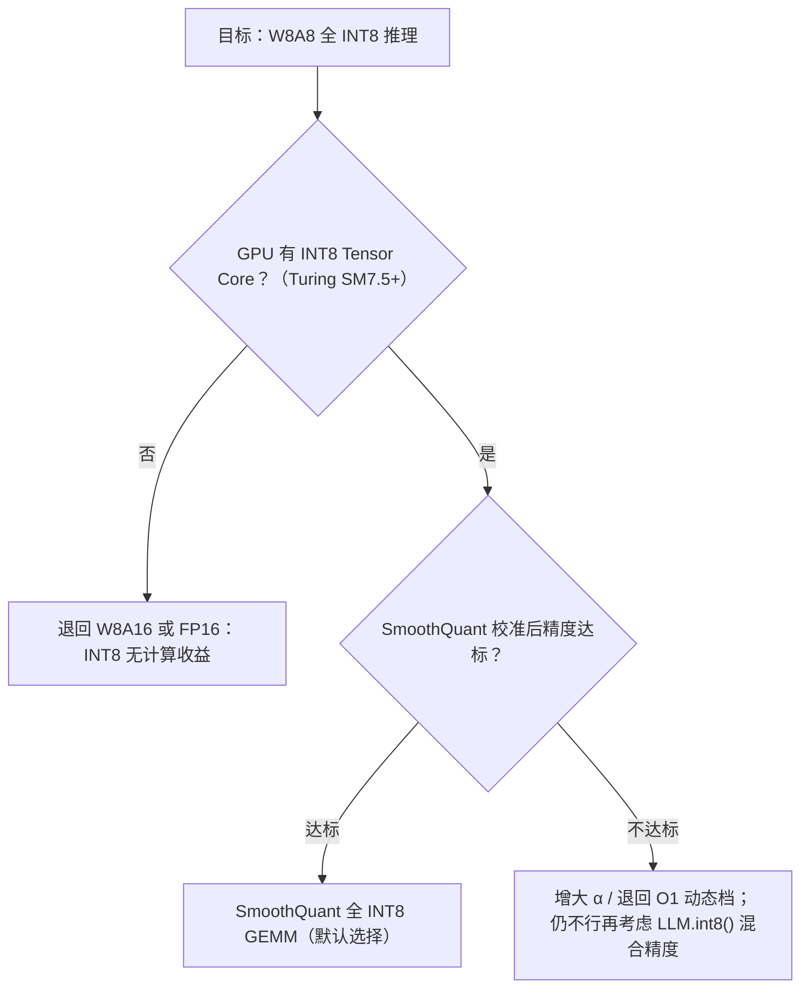

# 4.2 W8A8 量化：SmoothQuant 与 Activation Outlier 问题

> **系列导航｜《AIInfraGuide》模块四·第 4 章：量化**
> 1. [4.1 量化基础：从 FP32 到 INT4 的压缩艺术](../quant-41-fp32-to-int4/)
> 2. **4.2 W8A8 量化：SmoothQuant 与 Activation Outlier 问题（本篇）**
> 3. [4.3 Weight-only INT4：GPTQ、AWQ 与 Marlin Kernel](../quant-43-gptq-awq-marlin/)
> 4. [4.4 KV Cache 量化：KIVI 2-bit 与 FP8 KV Cache](../quant-44-kv-cache-kivi-fp8/)
> 5. [4.5 FP8 与 NVFP4/MXFP4：Hopper 与 Blackwell 的低比特浮点](../quant-45-fp8-nvfp4-mxfp4/)
> 6. [4.6 量化选型与 vLLM 实战：从决策树到生产部署](../quant-46-vllm-deployment/)

## 本章简介

本篇是《AIInfraGuide》模块四（推理优化）第 4 章"量化"的第 2 篇，全章共 6 篇。第 4.1 篇《INT8 量化实战指南》讲了量化的基本映射、误差界与粒度选择，结尾留了一个伏笔：权重、激活、KV Cache 是三种不同的量化对象，其中激活最难——难在 Activation Outlier（激活离群点）。本篇就集中解决这一个问题：

- 为什么直接对激活做 INT8 量化会把模型打崩？（现象与机理）
- SmoothQuant 如何用一次数学上严格等价的变换，把量化难度从激活迁移到权重？（原理与公式）
- 迁移之后工程上怎么落地，和 LLM.int8() 的混合精度路线怎么选？（实现与对比）
- 用 LLM Compressor 把 Llama-3-8B 量化成 W8A8 并用 vLLM 部署，预期收益是多少？（实战）

读完你应该能独立推导平滑因子公式、用 numpy 复现核心实验，并对真实模型完成一次 W8A8 量化。

## 1. 问题：激活为什么难量化

先对齐术语。W8A8 指权重（Weight）和激活（Activation）都量化到 8 bit。上一篇说过，只量化权重（W8A16）省的是显存和带宽；要让 GEMM（General Matrix Multiplication，通用矩阵乘）本身跑在整数 Tensor Core 上获得算力级加速，必须乘法的两侧都是 INT8——这就是 W8A8 的意义，也是它的难点：权重好量化，激活不好量化。

SmoothQuant 论文（Xiao et al., 2022）系统总结了 LLM 激活中 outlier 的三个特征（该现象由 LLM.int8() 的作者 Dettmers et al., 2022 首次报道）：

1. **幅值可达百倍**：少数 channel 的激活幅值比绝大多数值大约 100 倍；
2. **按 channel 固定分布**：一个 channel 一旦是 outlier，它对所有 token 都是 outlier——outlier 是模型的结构性属性，不是输入的随机噪声；
3. **channel 内方差小**：同一个 channel 跨 token 的幅值很稳定，这意味着它的统计量可以离线校准。

这三条加在一起，恰好杀死了所有"朴素"的激活量化方案。回顾上一篇的误差界 `|x̂ − x| ≤ s/2` 和 scale 公式 `s = max|x| / 127`：只要 outlier 落在 scale 的覆盖范围内，整个范围的分辨率都被它拉低。论文给了一个很直观的量化——per-tensor 量化下，channel i 的**有效量化级别**只有：

```text
effective_levels_i = 2^8 × m_i / m
m_i：channel i 的最大幅值；m：整个激活矩阵的最大幅值
```

非 outlier 通道的 m_i/m 可能只有 1%，有效量化级别只剩 2~3 级——等于用两三个台阶去拟合一条连续曲线，量化误差自然爆炸。论文在 OPT 上的实验（Table 1，WinoGrande/HellaSwag/PIQA/LAMBADA 平均精度）把这件事量化了：

| OPT-175B 激活量化方案 | 平均精度 |
|---|---:|
| FP16（基线） | 71.6% |
| INT8 per-tensor | 32.3% |
| INT8 per-token | 31.7% |
| INT8 per-channel | 71.4% |

（数据引自 SmoothQuant 论文 Table 1。）

两个关键读数：per-token 只比 per-tensor 好一点（31.7% vs 32.3%），因为 outlier 固定出现在相同 channel，每个 token 的 scale 都被同一批 outlier 撑大——按 token 分 scale 躲不开它们；唯一保住精度的是 per-channel（71.4%），因为 scale 的方向正好对着 outlier 的方向。

但 per-channel 激活量化有一个致命问题：**硬件不可行**。INT8 GEMM kernel（如 CUTLASS INT8 GEMM）把矩阵乘实现成一条高吞吐的 Tensor Core MMA 流水线，scale 只能在整条归约结束后、沿 GEMM 的两个外维（token 维 T 和输出通道维 Co）乘回去：

```text
Y = diag(Δx) · (X̄_int8 · W̄_int8) · diag(Δw)
```

沿归约维 Ci（输入 channel 维）逐通道的 scale 无法插进这条流水线。于是局面变成死结：**精度要求 per-channel，硬件只给 per-token**。SmoothQuant 要解的就是这个结。

## 2. 原理：把量化难度从激活"搬"到权重

SmoothQuant 的关键观察是：激活难量化、权重好量化（权重分布平坦均匀，INT8 甚至 INT4 都扛得住）；而 outlier 按 channel 固定、channel 内方差小，意味着激活每个 channel 的幅值水平是一个可以离线统计的"常数"。既然如此，可以在不动计算结果的前提下，把激活各 channel 的幅值差异转移到权重上。

### 2.1 数学等价变换

对线性层 Y = X·W（X ∈ R^{T×Ci}，W ∈ R^{Ci×Co}），引入逐通道平滑因子向量 s ∈ R^{Ci}：

```text
Y = X·W = (X·diag(s)⁻¹)·(diag(s)·W) ≜ X̂·Ŵ
```

等价性一行就能证完：diag(s)⁻¹·diag(s) = I，单位阵插在中间不改变乘积。展开到逐元素看更清楚——输出 Y 的每个元素：

```text
Y_ik = Σ_j X_ij · W_jk = Σ_j (X_ij / s_j) · (s_j · W_jk)
```

对求和指标 j 来说，/s_j 和 ×s_j 严格相消。这不是近似，是恒等式——第 3 节的 numpy 实验会验证其数值误差在 1e-15（float64 机器精度）量级。

变换之后：X̂ = X·diag(s)⁻¹ 的 outlier channel 被 s_j 除小，各 channel 幅值被"压平"；Ŵ = diag(s)·W 的对应行被乘大，但权重原本平坦均匀，吸收这点缩放毫无压力。**量化难度完成了一次跨矩阵的搬家。**

### 2.2 平滑因子怎么算：α 是搬家比例

s 取多少？两个极端都不好：

- s_j = max|X_j|（难度全推给权重）：激活侧彻底压平，但权重直接继承全部 outlier，轮到权重难量化；
- s_j = 1/max|W_j|（难度全留给激活）：权重极平滑，激活侧原封不动，回到原点。

SmoothQuant 用迁移强度（migration strength）α ∈ [0, 1] 在两者之间分配难度：

```text
s_j = max(|X_j|)^α / max(|W_j|)^(1−α) ,  j = 1, 2, …, Ci
```

α=0.5 时，激活和权重在每个 channel 上的最大幅值被拉到同一量级，难度均摊——论文在 OPT、BLOOM 全家族上验证 0.5 是甜点位（消融实验显示甜区约为 0.4~0.6，超出两侧都会因某一侧误差过大而掉精度）。outlier 更极端的模型要往权重多搬一点：GLM-130B（约 30% 激活值是 outlier）用 α=0.75；LLaMA 家族论文用 α≈0.8。

max(|X_j|) 用预训练语料校准样本前向统计一次即可——论文用 512 条 Pile 句子，同一套平滑因子对所有下游任务通用。



*图 1：合成激活矩阵（512 token × 256 channel，含 6 个 outlier channel，α=0.5）。左：平滑前，outlier channel 呈纵向亮条纹——它们对每个 token 都大，把 per-tensor/per-token 的 scale 全部撑大，其余 channel 的有效量化级别被压到个位数；右：逐通道除以平滑因子后，条纹被压平、分布趋于均匀，INT8 per-tensor 量化相对误差从 5.69% 降到 3.39%（第 3 节代码的真实运行结果）。*

> **一句话总结**：SmoothQuant 的本质是一次数学上严格等价的"难度搬家"——把激活的 outlier 逐通道除下来、乘进权重，矩阵乘结果分毫不差；原本硬件不可行的 per-channel 效果，被折算成了一次离线的权重缩放。

## 3. 实验：numpy 复现等价性与误差变化

下面两段代码都不依赖 GPU 和 torch，可直接运行。第一段是配图与核心实验脚本（仓库 `scripts/quant-ch4/fig_4_2.py`，在仓库根目录运行）：

```python
# 4.2 配图与 SmoothQuant 等价性/误差实验
import numpy as np
import matplotlib

matplotlib.use("Agg")
import matplotlib.pyplot as plt

rng = np.random.default_rng(0)

# ---------- 1. 合成带 outlier channel 的激活 ----------
tokens, channels = 512, 256
X = rng.standard_normal((tokens, channels)) * 0.5
outlier_idx = rng.choice(channels, size=6, replace=False)
X[:, outlier_idx] *= 20.0                      # 6 个 outlier channel，幅值 ~20 倍
W = rng.standard_normal((channels, channels)) * 0.05

def quant_per_tensor(x, qmax=127):
    s = np.abs(x).max() / qmax
    return np.clip(np.round(x / s), -qmax, qmax) * s

# ---------- 2. SmoothQuant 平滑变换 ----------
alpha = 0.5
s = (np.abs(X).max(axis=0) ** alpha) / (np.abs(W).max(axis=1) ** (1 - alpha))
s = np.maximum(s, 1e-5)

X_smooth = X / s          # 激活被压平
W_smooth = W * s[:, None] # 量化难度迁移到权重

# 数学等价性验证
y_ref = X @ W
y_sm  = X_smooth @ W_smooth
print(f"等价性: max |(X/s)@(sW) - X@W| = {np.abs(y_sm - y_ref).max():.2e}")

# 量化误差对比（激活 per-tensor INT8，权重保持浮点，仅看激活侧难度）
Xq  = quant_per_tensor(X)
Xqs = quant_per_tensor(X_smooth)
err_before = np.linalg.norm(Xq - X) / np.linalg.norm(X)
err_after  = np.linalg.norm(Xqs - X_smooth) / np.linalg.norm(X_smooth)
print(f"激活量化相对误差: 平滑前 {err_before:.2%}  ->  平滑后 {err_after:.2%}")

# ---------- 3. 绘图 ----------
fig, axes = plt.subplots(1, 2, figsize=(11, 4), sharey=False)
axes[0].imshow(np.abs(X), aspect="auto", cmap="viridis")
axes[0].set_title("Activation |X| before smoothing")
axes[0].set_xlabel("channel")
axes[0].set_ylabel("token")

axes[1].imshow(np.abs(X_smooth), aspect="auto", cmap="viridis")
axes[1].set_title("Activation |X/s| after SmoothQuant")
axes[1].set_xlabel("channel")

fig.suptitle(f"Outlier channels are flattened (quant err {err_before:.1%} -> {err_after:.1%})")
fig.tight_layout()
fig.savefig("4.2-smoothquant-outlier.png", dpi=150)   # 保存到当前目录，与文章配图一致
print("saved: 4.2-smoothquant-outlier.png")
```

真实运行输出：

```text
等价性: max |(X/s)@(sW) - X@W| = 1.78e-15
激活量化相对误差: 平滑前 5.69%  ->  平滑后 3.39%
saved: 4.2-smoothquant-outlier.png
```

第二段把实验推到端到端：激活 per-token 动态量化 + 权重 per-output-channel 量化（工程上的默认组合），对整个 GEMM 结果比较直接 W8A8 与 SmoothQuant W8A8 的相对误差：

```python
import numpy as np

rng = np.random.default_rng(0)
tokens, channels = 512, 256
X = rng.standard_normal((tokens, channels)) * 0.5
X[:, rng.choice(channels, size=6, replace=False)] *= 20.0
W = rng.standard_normal((channels, channels)) * 0.05

def quant_per_token(x, qmax=127):
    s = np.maximum(np.abs(x).max(axis=1, keepdims=True) / qmax, 1e-12)
    return np.clip(np.round(x / s), -qmax, qmax) * s

def quant_per_out_channel(w, qmax=127):
    s = np.maximum(np.abs(w).max(axis=0, keepdims=True) / qmax, 1e-12)
    return np.clip(np.round(w / s), -qmax, qmax) * s

alpha = 0.5
s = (np.abs(X).max(axis=0) ** alpha) / (np.abs(W).max(axis=1) ** (1 - alpha))
s = np.maximum(s, 1e-5)
Xs, Ws = X / s, W * s[:, None]

Y_ref = X @ W
print(f"equivalence: max |(X/s)@(sW) - X@W| = {np.abs(Xs @ Ws - Y_ref).max():.2e}")

rel = lambda Y: np.linalg.norm(Y - Y_ref) / np.linalg.norm(Y_ref)
Y_direct = quant_per_token(X) @ quant_per_out_channel(W)
Y_sq = quant_per_token(Xs) @ quant_per_out_channel(Ws)
print(f"W8A8 direct      GEMM rel L2 err = {rel(Y_direct):.2%}")
print(f"W8A8 SmoothQuant GEMM rel L2 err = {rel(Y_sq):.2%}")
```

真实运行输出：

```text
equivalence: max |(X/s)@(sW) - X@W| = 1.78e-15
W8A8 direct      GEMM rel L2 err = 2.65%
W8A8 SmoothQuant GEMM rel L2 err = 0.94%
```

两个读数：等价性误差 1.78e-15 是 float64 机器精度级别，变换严格成立；端到端 GEMM 量化误差从 2.65% 降到 0.94%（约 2.8 倍）。注意这份合成数据只模拟了约 20 倍的 outlier，真实 LLM 中 outlier 可达百倍且误差逐层累积，差距只会更大——这正是论文 Table 3 里 naive W8A8 把 OPT-175B 的 WikiText PPL 从 10.99 打到 93080（彻底崩溃）、而 SmoothQuant-O3 只漂移到 11.17 的原因。

## 4. 工程实现细节

原理干净，落地还有四个要点。

**① 平滑是离线操作，运行时零开销。** 激活通常由前序算子（LayerNorm、上一层 Linear）产生，diag(s)⁻¹ 可以离线折叠（scale folding）进前序算子的参数：LayerNorm 的 γ、β 逐通道除以 s，或上一层 Linear 的 W、b 逐输出通道除以 s。平滑后的模型结构完全不变，推理时没有任何额外 kernel。少数激活直接来自残差相加的位置，论文的做法是在残差分支补一个逐通道 scaling。

**② 量化映射：计算密集算子全 INT8，轻量算子保持 FP16。** Transformer block 内，所有 Linear 的 GEMM 和 attention 里的 BMM（Batch Matrix Multiplication，批量矩阵乘）走 INT8；LayerNorm、Softmax、GELU 这类逐元素轻量算子保持 FP16——它们占计算量的比例很小，但对精度敏感。

**③ 三档效率级别，按精度预算选。** SmoothQuant 与具体量化方案正交，论文给出从 O1 到 O3 逐渐激进的组合：

| 档位 | 权重 | 激活 | 特点 |
|---|---|---|---|
| O1 | per-tensor | per-token 动态 | 最保守，精度最稳 |
| O2 | per-tensor | per-tensor 动态 | 折中 |
| O3 | per-tensor | per-tensor 静态 | 最快，scale 也离线校准死 |

（方案定义引自论文 Table 2；实际实现常搭配权重 per-channel，论文的 LLaMA 实验即如此。）静态量化（O3）省掉了运行时求 scale 的开销，延迟最低，但最怕校准集与真实流量分布不一致。

**④ α 是唯一的调参旋钮。** 实践经验：在预训练分布的验证子集上做 grid search；α 偏小（<0.4）时激活侧量化误差大，症状接近 naive 量化；偏大（>0.6）时权重侧开始出现 outlier，权重误差上升。0.5 起步，outlier 极端的模型往 0.75~0.85 试。

## 5. 与 LLM.int8() 的对比：两条路线的取舍

处理 Activation Outlier 还有另一条知名路线：LLM.int8()（Dettmers et al., 2022）的**混合精度分解**（Mixed-precision Decomposition）——把含 outlier 的 channel 维度拆出来保持 FP16，其余维度走 INT8，两个 GEMM 的结果相加。它和 SmoothQuant 的分歧是哲学级的：一个**绕开** outlier（不碰它，单独用高精度算），一个**抹平** outlier（让它不再存在）。

| 维度 | LLM.int8() | SmoothQuant |
|---|---|---|
| 核心思路 | outlier 维度 FP16，其余 INT8 | 等价变换把难度迁到权重 |
| OPT-175B 平均精度 | 66.7%（PPL 11.10） | 66.8%（O3，PPL 11.17） |
| GEMM kernel | 两套（INT8+FP16）加分解/合并 | 一套标准 INT8 GEMM |
| 延迟 vs FP16 | 多数配置更慢 | 全部配置更快 |
| 超参 | 无（outlier 阈值内置） | α 需校准调参 |

（精度数据引自论文 Table 3，延迟结论引自 Table 11，均为 OPT-175B 上的论文数据。）

LLM.int8() 的精度同样几乎无损，但分解在硬件上很难高效实现：一次 GEMM 被拆成两次计算加一套按 channel 拆/拼的额外开销，论文的实测里它在多数配置下比 FP16 基线还慢——精度保住了，加速没了。SmoothQuant 用零运行时成本的离线变换换来全 INT8 流水线，代价是引入 α 这个需要校准的超参，且对 outlier 极端的模型要在权重侧付出一点精度预算。选型决策如下：



## 6. 实战：Llama-3-8B 的 W8A8 量化流程

把以上落成一次真实操作。工具链用 vLLM 官方的 LLM Compressor（SmoothQuant 官方库 mit-han-lab/smoothquant 亦可，接口更研究向），流程四步：准备校准数据 → oneshot 应用 SmoothQuant+INT8 → 保存 compressed-tensors 格式 → vLLM 部署。

```bash
# 测试环境：H100 80GB, CUDA 12.4, vLLM 0.10.0, torch 2.5.1
pip install llmcompressor datasets transformers accelerate
```

```python
# 基于 llm-compressor 官方 examples/quantization_w8a8_int8/llama3_example.py
from datasets import load_dataset
from transformers import AutoModelForCausalLM, AutoTokenizer

from llmcompressor import oneshot
from llmcompressor.modifiers.gptq import GPTQModifier
from llmcompressor.modifiers.transform.smoothquant import SmoothQuantModifier

MODEL_ID = "meta-llama/Meta-Llama-3-8B-Instruct"
model = AutoModelForCausalLM.from_pretrained(MODEL_ID)
tokenizer = AutoTokenizer.from_pretrained(MODEL_ID)

# 校准数据：512 条、最长 2048，与论文校准规模一致
NUM_CALIBRATION_SAMPLES = 512
MAX_SEQUENCE_LENGTH = 2048
ds = load_dataset(
    "HuggingFaceH4/ultrachat_200k",
    split=f"train_sft[:{NUM_CALIBRATION_SAMPLES}]",
)
ds = ds.shuffle(seed=42)
ds = ds.map(lambda ex: {"text": tokenizer.apply_chat_template(ex["messages"], tokenize=False)})
ds = ds.map(
    lambda s: tokenizer(s["text"], padding=False, max_length=MAX_SEQUENCE_LENGTH,
                        truncation=True, add_special_tokens=False),
    remove_columns=ds.column_names,
)

# recipe：先 SmoothQuant 平滑（LLaMA 家族取 ~0.8），再 INT8 量化全部 Linear
recipe = [
    SmoothQuantModifier(smoothing_strength=0.8),
    GPTQModifier(targets="Linear", scheme="W8A8", ignore=["lm_head"]),
]

oneshot(
    model=model,
    dataset=ds,
    recipe=recipe,
    max_seq_length=MAX_SEQUENCE_LENGTH,
    num_calibration_samples=NUM_CALIBRATION_SAMPLES,
)

SAVE_DIR = MODEL_ID.split("/")[-1] + "-W8A8-Dynamic-Per-Token"
model.save_pretrained(SAVE_DIR, save_compressed=True)   # compressed-tensors 格式
tokenizer.save_pretrained(SAVE_DIR)
```

部署与基准测试：

```bash
# 测试环境：H100 80GB, CUDA 12.4, vLLM 0.10.0, torch 2.5.1
vllm serve ./Meta-Llama-3-8B-Instruct-W8A8-Dynamic-Per-Token --max-model-len 8192

# 吞吐基准（vLLM 仓库自带脚本，在 vLLM 仓库根目录运行）
python benchmarks/benchmark_throughput.py \
  --model ./Meta-Llama-3-8B-Instruct-W8A8-Dynamic-Per-Token \
  --dataset-name sharegpt \
  --dataset-path ./ShareGPT_V3_unfiltered_cleaned_split.json
```

compressed-tensors 格式会被 vLLM 自动识别为 `compressed-tensors` 量化，无需显式指定 `--quantization`。

### 预期收益：论文数据参考

Llama-3-8B 没有论文官方 W8A8 数字，以下用论文在 OPT/LLaMA 上的公开数据做参照（**论文数据，非本站实测**）。精度方面，SmoothQuant 在 7B~175B 各尺度上 PPL 漂移都在 0.1 量级：

| 模型 | FP16 PPL | W8A8 naive | SmoothQuant W8A8 | 出处 |
|---|---|---|---|---|
| OPT-175B | 10.99 | 93080（崩溃） | 11.17（O3） | 论文 Table 3 |
| LLaMA-65B | 6.17 | — | 6.20（α=0.8） | 论文 Table 6 |
| Llama-2-7B | 5.474 | — | 5.515（α=0.85） | 论文 Table 7 |

（均为 WikiText-2 PPL，越低越好；LLaMA 表用 per-token 激活量化，Llama-2 表序列长 2048。）

推理性能方面，论文在 NVIDIA A100-80GB 上的 FasterTransformer 实测（decode 阶段）：

| 配置 | FP16 | SmoothQuant-O3 | 提升 |
|---|---|---|---|
| OPT-30B，1×A100，BS=1，seq=512 | 422 ms / 57 GB | 314 ms / 30 GB | 1.35× / 1.91× |
| OPT-175B，8×A100，BS=1，seq=512 | 426 ms / 44 GB | 359 ms / 23 GB | 1.19× / 1.87× |

（数据引自论文 Table 8；论文整体报告最高 1.56× 加速、显存减半，大模型可用一半数量的 GPU 达到相近甚至更低的延迟。）

对 Llama-3-8B 的预期（**参考值，实测随硬件与版本变化**）：权重显存约 16 GB → 8 GB，decode 的带宽瓶颈环节理论近 2× 提速；batch=1 decode 实测加速通常落在 1.2~1.4× 区间，与论文 Table 8 的档位一致。

## 7. 常见问题（FAQ）

**Q1：为什么激活 per-token 量化不够，非要 SmoothQuant？**
因为 outlier 固定出现在相同 channel、对所有 token 都大——每个 token 的 scale 都被同一批 outlier 撑大，按 token 分 scale 躲不开它们。论文 Table 1 里 per-token（31.7%）几乎和 per-tensor（32.3%）一样崩，本文第 3 节的实验（2.65% vs 0.94%）是同一个道理。

**Q2：α 调坏了有什么症状？怎么调？**
α 太小：激活侧误差大，精度表现接近 naive W8A8；α 太大：权重被拉出 outlier，权重侧误差主导。在预训练分布子集上 grid search，0.5 起步，甜区 0.4~0.6，LLaMA 家族 0.8 左右。注意 α 和量化档位要一起验：O3 静态档对 α 和校准集都更敏感。

**Q3：量化完精度掉了，按什么顺序排查？**
① 校准集是否代表真实分布（O3 静态量化最常见的死因）；② α 是否合适；③ 退回 O1（per-token 动态）做对照实验，隔离"静态 scale"与"平滑"两个变量；④ 确认所有 Linear 都参与了平滑（self_attn 的 q/k/v/o_proj 与 mlp 的 gate/up/down_proj），lm_head 保持 FP16；⑤ 抽查生成内容——量化失效的典型症状是长输入下输出胡话、退化重复，短输入往往完全正常。

**Q4：部署后没有 1.5× 加速，哪里不对？**
先确认 GPU 有 INT8 Tensor Core（Turing SM 7.5 及以后）；再用 profile 工具确认实际走了 INT8 GEMM kernel 而不是 FP16 fallback；最后对齐预期——batch=1 decode 的收益主要来自显存带宽，论文同配置也只有 1.19~1.35×，大 batch 场景才接近算力翻倍的理论值；矩阵太小时量化/反量化的额外开销甚至可能倒挂。

**Q5：SmoothQuant 能和 GPTQ、KV Cache 量化叠加吗？**
和权重量化（GPTQ/AWQ）正交，可以叠加——上面的官方示例就是 SmoothQuantModifier + GPTQModifier 的组合：先平滑再压权重。KV Cache（Key-Value Cache，键值缓存）量化是另一个对象（动态产生、生命周期长），不适用平滑变换，本系列第 4.4 篇会专门讲。

## 本章小结

1. 激活难量化的根源是 Activation Outlier：幅值可达百倍、按 channel 固定、channel 内方差小；它让 per-tensor/per-token 量化的有效量化级别只剩个位数，模型精度直接崩溃。
2. per-channel 激活量化精度无损但硬件不可行——INT8 GEMM kernel 的 scale 只能沿外维应用。这个死结是 SmoothQuant 的出发点。
3. SmoothQuant 用 Y = (X·diag(s)⁻¹)·(diag(s)·W) 的恒等变换把难度迁到权重，平滑因子 s_j = max(|X_j|)^α / max(|W_j|)^{1−α}，α 控制迁移比例（常用 0.5，LLaMA 约 0.8）；变换严格等价（实测误差 1.78e-15），numpy 实验中 GEMM 量化误差从 2.65% 降到 0.94%。
4. 工程上平滑因子用 512 条语料离线校准、折叠进前序算子，运行时零开销；O1→O3 三档按精度预算选，静态档最快但最怕校准集失真。
5. 与 LLM.int8() 相比，SmoothQuant 用一个可校准的 α 换全 INT8 流水线；论文报告 OPT-175B W8A8 精度几乎无损（PPL 10.99→11.17）、显存减半、最高 1.56× 加速。

下一篇（4.3）转向纯权重路线：GPTQ 如何用二阶信息把权重压到 4 bit。

## 延伸阅读

- **SmoothQuant 论文**（Xiao et al., 2022）：本文全部公式、OPT/BLOOM/GLM/LLaMA 实验数据与 FasterTransformer 集成都出自这里，Table 3/8/11 值得细读；
- **LLM.int8()**（Dettmers et al., 2022）：Activation Outlier 现象的首次系统报道，混合精度路线的原点；
- **Outlier Suppression**（Wei et al., 2022）：另一条"压制 outlier"路线（non-scaling LayerNorm + token-wise clipping），在小模型上有效、在 175B 上失败，其失败原因本身很有启发；
- **ZeroQuant**（Yao et al., 2022）：per-token + group-wise 的早期方案，有助于理解 SmoothQuant 对比基线的上下文；
- **本系列**：第 4.1 篇《INT8 量化实战指南：从数学原理到工程落地的完整思路》（量化基础与粒度选择），第 4.3 篇（GPTQ 与低比特权重量化，预告）。

## 参考文献

- SmoothQuant: Accurate and Efficient Post-Training Quantization for Large Language Models（Xiao et al., 2022）：https://arxiv.org/abs/2211.10438
- LLM.int8(): 8-bit Matrix Multiplication for Transformers at Scale（Dettmers et al., 2022）：https://arxiv.org/abs/2208.07339
- SmoothQuant 官方实现（mit-han-lab）：https://github.com/mit-han-lab/smoothquant
- LLM Compressor（vllm-project）：https://github.com/vllm-project/llm-compressor
- LLM Compressor W8A8 官方示例（llama3_example.py）：https://github.com/vllm-project/llm-compressor/blob/main/examples/quantization_w8a8_int8/llama3_example.py
- vLLM 推理框架：https://github.com/vllm-project/vllm
