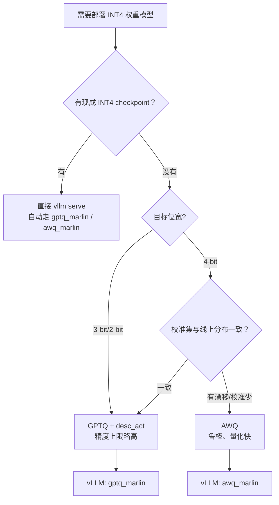

# 4.3 Weight-only INT4：GPTQ、AWQ 与 Marlin Kernel

> **系列导航｜《AIInfraGuide》模块四·第 4 章：量化**
> 1. [4.1 量化基础：从 FP32 到 INT4 的压缩艺术](../quant-41-fp32-to-int4/)
> 2. [4.2 W8A8 量化：SmoothQuant 与 Activation Outlier 问题](../quant-42-smoothquant-w8a8/)
> 3. **4.3 Weight-only INT4：GPTQ、AWQ 与 Marlin Kernel（本篇）**
> 4. [4.4 KV Cache 量化：KIVI 2-bit 与 FP8 KV Cache](../quant-44-kv-cache-kivi-fp8/)
> 5. [4.5 FP8 与 NVFP4/MXFP4：Hopper 与 Blackwell 的低比特浮点](../quant-45-fp8-nvfp4-mxfp4/)
> 6. [4.6 量化选型与 vLLM 实战：从决策树到生产部署](../quant-46-vllm-deployment/)

## 本章简介

本篇是《AIInfraGuide》模块四"推理优化"第 4 章"量化"的第 3 篇（共 6 篇）。第 4.1 篇讲了量化的数学基础与 INT8 工程落地，第 4.2 篇讨论了 KV Cache 量化；本篇聚焦目前线上部署最主流的组合——**Weight-only INT4（W4A16）**：权重压到 4 bit，激活保持 FP16/BF16。

要解决的问题有三个：

1. 为什么 INT4 几乎只用于"纯权重量化"？收益到底来自哪里？
2. GPTQ 和 AWQ 这两个事实标准各自在数学上做了什么，差异在哪？
3. 量化出的 checkpoint 怎样跑满带宽——Marlin Kernel 为什么比朴素反量化路径快，vLLM 里怎么用？

读完你应该能：手推 GPTQ 的误差补偿公式和 AWQ 的等价缩放公式；用 AutoGPTQ/AutoAWQ 量化一个 7B 模型；在 vLLM 里选对 kernel 并做出有依据的 GPTQ/AWQ 选型。

## 1. 为什么是 Weight-only：先把带宽账算清楚

LLM 推理分两个阶段：prefill 一次性吃下全部输入 token，矩阵大、是 compute-bound（计算瓶颈）；decode 每步只生成一个 token，GEMM 退化成 GEMV，每生成一个 token 都要把**全部权重**从 HBM 读一遍，是 memory-bound（带宽瓶颈）。

算一笔具体的账（示例性估算，实测随硬件与版本变化）：Qwen2.5-7B 约 76 亿参数，FP16 权重约 15.2 GB。H100 SXM 的 HBM3 带宽为 3.35 TB/s（NVIDIA 官方规格），batch 较小时 decode 的理论时间下限约为 15.2 GB ÷ 3.35 TB/s ≈ 4.5 ms/token；压到 INT4-g128 后权重约 4.3 GB，下限降到约 1.3 ms/token。同一张卡，瓶颈环节理论加速约 3.5 倍——**这就是 Weight-only 的全部动机：decode 阶段的字节数几乎全在权重上，只压权重就能吃到带宽收益**。

为什么不同样压激活？这是"静态 vs 动态"的不对称决定的：

- **权重是静态的**：模型发布那一刻数值就固定了，可以离线慢慢算——GPTQ 要在每层上求 Hessian 逆、逐列补偿，AWQ 要做网格搜索，这些开销推理时一分钱都不用付；
- **激活是动态的**：每个 token、每次前向都不一样，要么在线量化（每步多付一次 quant/dequant 开销），要么离线校准备静态 scale（校准集和真实分布不一致就是精度炸弹）。且激活存在按 channel 分布的 outlier，压到 4 bit 基本保不住精度（见第 4.1 篇的粒度实验）。

所以工业界的默认答案收敛到 **W4A16**：权重 INT4 离线 PTQ（Post-Training Quantization，训练后量化），激活保持 16 bit。代价是 GEMM 时要在 kernel 里把 INT4 权重反量化回 FP16 再算——这笔开销怎么处理，决定了你能不能真的吃到带宽收益，第 5 节细说。

> **一句话总结**：decode 是搬权重的游戏，权重 INT4 把每 token 要搬的字节数缩到约 1/4，而权重静态、可离线量化，激活动态、在线量化又贵又险——这就是 Weight-only 的第一性原理。

## 2. GPTQ：用二阶信息给量化误差"找补"

### 2.1 问题：朴素 RTN 丢掉了什么

最简单的权重量化是 RTN（Round-to-Nearest，四舍五入到最近码点）：每个权重独立取整，误差互不相关。INT8 时没问题，INT4 时码点只剩 16 个，独立取整引入的扰动足以让 perplexity 明显劣化——上表 AWQ 论文的数据里，Llama-2-7B INT4-g128 下 RTN 把 WikiText-2 PPL 从 5.47 打到 5.73，INT3 下更是劣化到 6.66。

GPTQ 的出发点：**量化一个权重时，可以用剩余未量化的权重去补偿它造成的输出误差**。形式化地，对每一层求

```text
min_Q  || W·X - Q·X ||_F²        # W: FP16 权重, Q: 量化后权重, X: 校准数据激活
≈ min  (1/2) · δᵀ H δ            # 二阶展开, δ = Q - W, H = 2·X·Xᵀ 为该层 Hessian 代理
```

注意目标函数：**最小化的是输出误差，不是权重误差**——这是 GPTQ 与 RTN 的本质区别，第 2.3 节的实验会直观展示这一点。

### 2.2 从 OBS 到 OBQ 到 GPTQ

这条技术谱系值得理清：

- **OBS（Optimal Brain Surgeon，最优脑外科）**，Hassibi & Stork 1993：剪掉（或扰动）权重 w_p 引起的损失增量为 L_p = δ_p² / (2·[H⁻¹]_pp)，同时存在唯一最优补偿，用 H⁻¹ 更新其余权重，可使一阶项为零、损失增量最小；
- **OBQ（Optimal Brain Quantization）**，Frantar & Alistarh 2022（OBC 框架）：把 OBS 从剪枝搬到量化——每量化一列，立刻按 OBS 公式补偿剩余列；但 OBQ 每步都要贪心挑选"当前损失增量最小"的列并重算逆，复杂度接近 O(d⁴)，对 LLM 的万维矩阵不可行；
- **GPTQ**，Frantar et al. 2022（ICLR 2023 发表）：三个工程化改造把它变成 LLM 可用：

```text
设已量化第 j 列, 误差 δ_j = w_j - quant(w_j), Hinv = (H + λI)⁻¹
① 最优补偿:  W[:, j+1:] ← W[:, j+1:] - (δ_j / Hinv[j,j]) · Hinv[j, j+1:]
② 该列损失增量:  L_j = δ_j² / (2 · Hinv[j,j])
```

1. **固定量化顺序**：GPTQ 发现对 LLM 而言，按任意固定顺序逐列量化与 OBQ 的贪心顺序精度几乎一致。于是所有行共享同一个顺序，H⁻¹ 只需用 Cholesky 分解算一次，复杂度降到 O(d³)；
2. **懒惰批量更新（lazy batch update）**：每量化 128 列才把补偿一次性应用回权重矩阵，把逐列 rank-1 更新攒成矩阵乘，GPU 利用率拉满；
3. **两个实用 trick**：act-order（按 H 对角线降序量化，先量化"最重要"的列，即 AutoGPTQ 的 `desc_act`）进一步压误差；dampening（H 加 λI，λ 取对角线均值的 1%）保证数值稳定。

收益是数量级的：GPTQ 论文报告，175B 参数的模型约 4 个 GPU 小时即可完成量化，3/4 bit 下相对 FP16 基线精度损失可忽略，并给出端到端推理加速——A100 上约 3.25×、A6000 上约 4.5×（GPTQ 论文报告值）。

### 2.3 40 行 numpy 复现误差补偿

纸上得来终觉浅。下面这段代码在合成数据上对比 RTN 与"GPTQ 式逐列量化 + 误差补偿"。校准数据刻意做成通道强相关 + 少数 outlier 通道——这正是真实 LLM 激活的结构，也是 Hessian 补偿能发挥作用的结构：

```python
import numpy as np

rng = np.random.default_rng(0)
d_in, d_out, n_calib = 128, 64, 256
W = rng.standard_normal((d_out, d_in)) * 0.05

# 模拟真实 LLM 激活：通道间强相关（低秩结构）+ 少数 outlier 通道
A = rng.standard_normal((d_in, 8)) / np.sqrt(8)
X = A @ rng.standard_normal((8, n_calib))
X[rng.choice(d_in, 6, replace=False)] *= 8.0
H = X @ X.T / n_calib                     # Hessian 代理

def rtn_quant(W, bits=4):
    qmax = 2 ** (bits - 1) - 1
    s = np.abs(W).max() / qmax
    return np.clip(np.round(W / s), -qmax, qmax) * s

def gptq_quant(W, H, bits=4):
    qmax = 2 ** (bits - 1) - 1
    s = np.abs(W).max() / qmax
    W = W.copy(); Q = np.zeros_like(W)
    damp = 0.01 * np.trace(H) / H.shape[0]  # dampening: λ = 对角均值的 1%
    Hinv = np.linalg.inv(H + damp * np.eye(H.shape[0]))
    for j in range(W.shape[1]):
        q = np.clip(np.round(W[:, j] / s), -qmax, qmax)
        Q[:, j] = q * s
        err = (W[:, j] - Q[:, j]) / Hinv[j, j]      # δ_j / Hinv[j,j]
        W[:, j + 1:] -= np.outer(err, Hinv[j, j + 1:])  # 补偿剩余列
    return Q

ref = np.linalg.norm(W @ X)
for name, Q in [("RTN", rtn_quant(W)), ("GPTQ", gptq_quant(W, H))]:
    werr = np.linalg.norm(W - Q) / np.linalg.norm(W)
    oerr = np.linalg.norm((W - Q) @ X) / ref
    print(f"{name}: weight err = {werr:.4f}, output err = {oerr:.4f}")
```

本机真实输出：

```text
RTN : weight err = 0.1615, output err = 0.1508
GPTQ: weight err = 0.1659, output err = 0.1003
```

结果里藏着 GPTQ 最反直觉也最深刻的一点：**GPTQ 的权重空间误差反而比 RTN 略大（0.1659 > 0.1615），但输出误差小了 33%**。它优化的是 `||δᵀHδ||` 而非 `||δ||`——量化误差被有意识地"甩"到了激活分布不在乎的方向上。真实实现还多了 act-order、group-wise scale、Cholesky 批量更新，但误差补偿的核心就是循环里那三行。

## 3. AWQ：保护 1% 的显著权重

### 3.1 显著权重看激活，不看权重

AWQ（Activation-aware Weight Quantization，激活感知权重量化，Lin et al. 2023，MLSys 2024）从一个观察出发：**LLM 的权重并非生而平等，保护约 1% 的显著权重（Salient Weights）就能大幅降低量化误差**。真正的洞见在于怎么找这 1%：按权重幅值找并不比随机强——应该看**激活分布**。被大激活反复乘到的权重通道，量化误差会被激活幅值等比放大，这些通道才是要害。这与第 4.1 篇"激活 outlier 按 channel 分布"的现象互为表里：outlier 激活通道对应的权重通道，就是显著通道。

### 3.2 等价缩放，而不是保留 FP16

找到显著通道后，最直观的保护方式是这 1% 保留 FP16（混合精度），AWQ 论文明确指出这条路**硬件不友好**：kernel 要处理两种位宽的存储与索引。AWQ 的做法是一次数学上的等价变换——把显著通道的权重放大 s 倍、对应输入通道除以 s：

```text
对显著通道 k:  w'_k = w_k · s,  x'_k = x_k / s  (s > 1)
输出不变:      Σ w'_k · x'_k = Σ w_k · x_k
量化后误差项:  quant(w_k·s)·(x_k/s) - w_k·x_k = Δ'(w_k·s) · x_k / s
```

关键在于：显著权重只占约 1%，把它们放大 s 倍通常**不会显著改变所在 group 的 max**，于是量化步长 Δ' ≈ Δ 不变，而显著通道自身的值被放大 s 倍后，round 产生的相对误差缩小了 s 倍——等效输出误差随之缩小约 s 倍。s 不是拍脑袋定的：AWQ 用激活平均幅值 s_x 构造 s = s_x^α，在 α ∈ [0,1] 上做快速网格搜索，并配合 weight clipping 最小化量化 MSE。

与 GPTQ 相比，AWQ 不需要任何回归或反向传播，只用一次前向统计激活幅值，因此有两个工程上的附带优势（均为 AWQ 论文报告）：**量化快得多**；**对校准集规模和分布更鲁棒**——论文报告用比 GPTQ 小 10 倍的校准集仍能拿到更好的 perplexity，而 GPTQ 的逐层重构在校准分布与目标域不一致时存在过拟合风险（对指令模型、多模态模型尤其明显）。加速方面，AWQ 配套的 TinyChat 引擎在桌面、笔记本、移动 GPU 上相对 HuggingFace FP16 实现取得了 3.2-3.3× 的平均加速（AWQ 论文报告值）。

## 4. GPTQ vs AWQ：精度、数据、速度、易用性

### 4.1 精度对比（论文数据）

下表为 AWQ 论文 Table 4 的原始数据，WikiText-2 perplexity（越低越好），group_size=128，GPTQ-R 为开启 act-order 的 GPTQ：

| 模型 | FP16 | 配置 | GPTQ | GPTQ-R | AWQ |
|---|---:|---|---:|---:|---:|
| Llama-2-7B | 5.47 | INT4-g128 | 5.69 | 5.63 | 5.60 |
| Llama-2-13B | 4.88 | INT4-g128 | 4.98 | 4.99 | 4.97 |
| Llama-2-70B | 3.32 | INT4-g128 | 3.42 | 3.43 | 3.41 |
| Llama-2-7B | 5.47 | INT3-g128 | 6.43 | 6.42 | 6.24 |
| Llama-2-13B | 4.88 | INT3-g128 | 5.48 | 5.41 | 5.32 |
| Llama-2-70B | 3.32 | INT3-g128 | 3.88 | 3.86 | 3.74 |

三点读法：4-bit 下 AWQ 与 GPTQ（含 act-order 变体）相当或略优，差距在小数点后两位量级，实战中可以视为同一档；**3-bit 下差距拉开**，码点更粗时缩放保护的价值更大；act-order 对 GPTQ 是实打实的修复（7B INT4 从 5.69 到 5.63），量化 GPTQ 时值得开。另外注意 INT3-g128 的 GPTQ 在 LLaMA-7B 上出现 8.81 的异常值（见原文完整表格），说明 GPTQ 对部分模型需要 reordering 才能正常工作。

### 4.2 工程维度对比

| 维度 | GPTQ | AWQ |
|---|---|---|
| 4-bit 精度 | 与 AWQ 同档（需 act-order） | 与 GPTQ 同档或略优 |
| 3-bit/2-bit 极限位宽 | 唯一可行路径（Hessian 补偿） | 3-bit 尚可，2-bit 基本不可用 |
| 校准数据需求 | 典型 128 段×2048 token，对分布敏感 | 小一个数量级仍稳健，抗分布漂移 |
| 量化耗时 | 逐层 Hessian + 补偿，7B 约数十分钟 | 无前向重构，显著更快 |
| 推理 kernel | Marlin / ExLlamaV2 | Marlin / TinyChat |
| 生态工具 | GPTQModel（AutoGPTQ 已停维护） | AutoAWQ |

### 4.3 对 Group Size 的敏感度

Group size（g128/g64/g32）决定多少个权重共享一组 scale/zero：g 越小 scale 越贴合局部分布、精度越好，但元数据越多、kernel 里反量化越频繁。经验上：g128 是精度与速度的甜点，4-bit 下 PPL 与 FP16 差通常 < 0.1；g64/g32 能把 3-bit 的精度再往回拉一截，代价是模型体积增大、推理吞吐下降（g32 时 scale 元数据开销相当于每 32 个 4-bit 权重多存一个 FP16 scale，等效位宽从 4.125 bit 涨到 4.5 bit）。两种算法对该参数同向敏感——**先用 g128，精度不达标再收紧 g，比换算法便宜得多**。另外注意兼容性：Marlin 原生实现针对 g128 + 对称量化优化，vLLM 的 gptq_marlin 后续版本扩展到更多配置，具体以所用 vLLM 版本的量化支持矩阵为准。

## 5. Marlin Kernel：把反量化融进 GEMM

### 5.1 朴素反量化路径为什么慢

量化出 INT4 checkpoint 只是上半场。推理时激活是 FP16，最朴素的实现是"先反量化出整块 FP16 权重，再调 cuBLAS"——**每个 token 都重新物化一遍 FP16 权重，读写字节数退回 FP16 时代，带宽收益直接归零**。GPTQ/AWQ 各自的 fused kernel（如 ExLlama、AWQ GEMV）把反量化融进了 GEMV，batch=1 时能做到 3 倍以上加速，但 batch 升到 16-32 时加速比迅速跌向 1×：这些 kernel 的分块与调度是为 GEMV 设计的，batch 稍大就转为 compute-bound，而反量化的整数指令又挤占了 tensor core 的流水。

### 5.2 Marlin 的设计与实测数字

Marlin（Mixed-precision Auto-Regressive LINear kernels，Frantar et al. 2024）正面解决了"batch 16-32 区间如何保持 memory-bound"的问题，核心手段有四：

- **全程 packed，寄存器内反量化**：INT4 权重从全局内存到共享内存到寄存器始终保持 4-bit 打包形态，只在喂给 tensor core 前一刻才在寄存器里展开成 FP16，循环内永不物化 FP16 权重块；
- **定制布局**：权重按 tensor core 消费顺序预先重排（striped/permuted layout），反量化输出的每个线程片段恰好对上 MMA 指令的寄存器排布，零 shuffle 开销；
- **异步流水线**：cp.async 全局→共享内存拷贝与计算严格重叠，把 HBM 带宽利用率推到接近理论峰值；
- **精细分区调度**：跨 SM 的任务划分让大批量下仍保持访存受限而非计算受限。

Marlin 论文报告：在 A10 上对大矩阵做 kernel 级测试，batch 16-32 内相对 FP16 cuBLAS 加速约 3.9×（接近该位宽下 4× 的内存受限理想值）；集成 vLLM 后端到端推理最高加速 2.8×（Marlin 论文报告值）。工程上更重要的是：vLLM 内置了 `gptq_marlin` 与 `awq_marlin` 两种 kernel，加载兼容的 GPTQ/AWQ checkpoint 时在 Ampere 及以上 GPU 会自动选用——**你通常不需要为 Marlin 单独转换 checkpoint 格式**，这也是"Marlin 格式 checkpoint"在社区语境下的实际含义。

## 6. 实战：量化 Qwen2.5-7B 并用 vLLM 对比吞吐

以下以 Qwen2.5-7B-Instruct 为例（Qwen3 系列无 7B 规格，选社区验证最多的 Qwen2.5-7B），命令行注释注明测试环境。

### 6.1 AutoGPTQ 量化脚本

```python
# 测试环境：H100 80GB, CUDA 12.4, torch 2.5.1, auto-gptq 0.7.x, transformers 4.46
# 注：AutoGPTQ 已停止维护，新模型建议用 GPTQModel（API 基本一致）
from auto_gptq import AutoGPTQForCausalLM, BaseQuantizeConfig
from transformers import AutoTokenizer

model_id = "Qwen/Qwen2.5-7B-Instruct"
quantize_config = BaseQuantizeConfig(
    bits=4,            # 4-bit
    group_size=128,    # g128，甜点配置
    desc_act=True,     # act-order，精度更好；老版 marlin 不支持时改 False
    sym=True,          # 对称量化，marlin 兼容性好
)

model = AutoGPTQForCausalLM.from_pretrained(
    model_id, quantize_config, device_map="auto", torch_dtype="auto"
)
tokenizer = AutoTokenizer.from_pretrained(model_id)

# 校准数据：128 段真实文本即可，分布尽量贴近线上业务语料
with open("calib.txt", encoding="utf-8") as f:
    lines = [l for l in f.read().splitlines() if l.strip()][:128]
examples = [tokenizer(l, return_tensors="pt") for l in lines]

model.quantize(examples)
out = "./Qwen2.5-7B-Instruct-gptq-int4"
model.save_quantized(out)
tokenizer.save_pretrained(out)
print("saved to", out)
```

### 6.2 AutoAWQ 量化脚本

```python
# 测试环境：H100 80GB, CUDA 12.4, torch 2.5.1, autoawq 0.2.x, transformers 4.46
from awq import AutoAWQForCausalLM
from transformers import AutoTokenizer

model_id = "Qwen/Qwen2.5-7B-Instruct"
quant_config = {
    "zero_point": True,   # AWQ 默认非对称
    "q_group_size": 128,  # g128
    "w_bit": 4,
    "version": "GEMM",    # 导出 GEMM 版权重布局；vLLM 侧统一走 awq_marlin
}

model = AutoAWQForCausalLM.from_pretrained(
    model_id, device_map="auto", safetensors=True
)
tokenizer = AutoTokenizer.from_pretrained(model_id, trust_remote_code=True)

model.quantize(tokenizer, quant_config=quant_config)  # 内置校准集，无需自备
out = "./Qwen2.5-7B-Instruct-awq-int4"
model.save_quantized(out)
tokenizer.save_pretrained(out)
print("saved to", out)
```

### 6.3 vLLM 加载与吞吐对比

```bash
# 测试环境：H100 80GB, CUDA 12.4, vLLM 0.10.0, torch 2.5.1
# 方式一：在线服务。vLLM 读取 config.json 的 quantization_config 自动识别，
# Ampere+ 上自动选用 gptq_marlin；显式指定用于强制或排障
vllm serve ./Qwen2.5-7B-Instruct-gptq-int4 \
  --quantization gptq_marlin \
  --max-model-len 8192 \
  --gpu-memory-utilization 0.90

vllm serve ./Qwen2.5-7B-Instruct-awq-int4 \
  --quantization awq_marlin \
  --max-model-len 8192 \
  --gpu-memory-utilization 0.90

# 方式二：离线吞吐基准（vLLM 仓库自带脚本）
python benchmarks/benchmark_throughput.py \
  --model ./Qwen2.5-7B-Instruct-gptq-int4 \
  --quantization gptq_marlin \
  --input-len 1024 --output-len 256 \
  --num-prompts 256
```

典型输出格式（数字为示意，参考值，实测随硬件与版本变化）：

```text
Throughput: 38.42 requests/s, 12150.36 total tokens/s
```

对比的正确姿势：FP16、GPTQ-Marlin、AWQ-Marlin 三组跑同一组 `--input-len/--output-len/--num-prompts`，看 `total tokens/s`。batch 较大时 Marlin 相对 FP16 的提升通常在 1.5-2.8× 区间（与 Marlin 论文端到端口径一致），不会像 decode 理论下限那样到 3.5×——因为真实服务里 prefill、attention、采样、调度都在分时间。想逼近 4× 的 kernel 级数字，需要固定单 GEMM 形状做微基准。

> **选型决策**：
> - **选 GPTQ**：追求极限精度（尤其 3-bit/2-bit）、校准数据充足且贴近线上分布、需要 act-order 等细粒度控制；新工程请直接用 GPTQModel。
> - **选 AWQ**：追求量化流程快、校准集小或分布有漂移、批量生产指令模型/多模态模型的 INT4 版本。
> - **不用折腾**：HuggingFace 上已有官方/社区的 AWQ/GPTQ INT4 checkpoint（如 `Qwen/Qwen2.5-7B-Instruct-AWQ`），vLLM 加载即自动走 Marlin kernel——量化这步别人已经替你做完了，直接 `vllm serve`。



## 7. 常见问题（FAQ）

**Q1：量化阶段就 OOM 或慢得离谱？** GPTQ 量化 7B 建议 24GB 以上显存；不够就减少校准样本数、缩短校准序列长度，或用 `device_map` 让部分层落 CPU。AutoGPTQ 对长序列校准非常慢是已知现象，GPTQModel 的实现快数倍，新项目直接换。

**Q2：vLLM 加载后没走 Marlin kernel？** 依次检查：GPU 是否 Ampere 及以上（Marlin 要求 compute capability ≥ 8.0，T4/V100 会回退到较慢 kernel）；checkpoint 是否 4-bit、g128、对称量化（GPTQ 侧）；`desc_act=True` 的 checkpoint 在旧版 vLLM 上不被 gptq_marlin 支持，升级 vLLM 或量化时改 `desc_act=False`。启动日志里搜 `marlin` 可以确认实际走的 kernel。

**Q3：量化后精度掉得比论文表格多？** 按序排查：校准集是否与线上同分布（最常见的根因）；chat template 是否一致（Qwen 系尤其容易错）；打开 act-order（GPTQ）；把 group_size 从 128 收到 64。还掉，就对输出做 ON/OFF A/B，确认是量化本身而不是同批上线的其他改动。

**Q4：AWQ 的 `version: "GEMM"` 和 `"GEMV"` 怎么选？** GEMV 单 batch 略快，GEMM 在 batch > 1 时快且是社区默认；走 vLLM 服务化部署时统一选 GEMM 即可，vLLM 会用 awq_marlin 重排权重布局。

**Q5：能直接在 Marlin 格式上做量化吗？** 可以但没必要：Marlin 论文配套了把 GPTQ 结果转置成 Marlin 原生布局的工具（同 perplexity 下模型体积约为 FP16 的 1/3.33，论文报告值）。对绝大多数用户，vLLM 在加载时自动完成的格式转换已经够用。

## 本章小结

1. **Weight-only 的第一性原理**：decode 是 memory-bound，字节数主要在权重上；权重静态可离线压、激活动态在线压又贵又险——所以 W4A16。
2. **GPTQ = OBS 谱系的工程化**：逐层最小化输出误差 `δᵀHδ`，逐列量化 + H⁻¹ 误差补偿，固定顺序 + Cholesky + lazy batch update 把复杂度压到 O(d³)；它优化输出而非权重本身，numpy 实验里"权重误差更大、输出误差更小"就是证据。
3. **AWQ = 激活感知的等价缩放**：1% 显著权重看激活幅值定位，放大 s 倍让 round 相对误差缩小 s 倍；无回归、量化快、校准鲁棒。
4. **4-bit 下两者同档，3-bit 下 AWQ 更稳**（AWQ 论文 Table 4）；group_size 先用 g128，不达标再收紧。
5. **Marlin 让 batch 16-32 也能吃到带宽收益**：反量化融入 GEMM、寄存器内展开、异步流水线，kernel 级约 3.9×、vLLM 端到端最高 2.8×（Marlin 论文报告值）；vLLM 的 gptq_marlin/awq_marlin 自动识别 checkpoint。
6. **能不量化就不量化**：先用社区现成 INT4 checkpoint；必须自己出时，4-bit 看校准分布选 GPTQ/AWQ，3-bit 以下优先 GPTQ 系。

## 延伸阅读

- **GPTQ: Accurate Post-Training Quantization for Generative Pre-trained Transformers**（Frantar, Ashkboos, Hoefler, Alistarh, 2022 / ICLR 2023）：本篇第 2 节的原始文献，Cholesky 批量更新与 act-order 的细节都在附录；
- **AWQ: Activation-aware Weight Quantization for LLM Compression and Acceleration**（Lin, Tang, Yang et al., 2023 / MLSys 2024）：显著权重与等价缩放的完整推导，以及 TinyChat 的系统设计；
- **MARLIN: Mixed-Precision Auto-Regressive Parallel Inference on Large Language Models**（Frantar, Castro, Chen, Hoefler, Alistarh, 2024）：第 5 节全部数字的出处，想写 W4A16 kernel 必读；
- **Optimal Brain Compression**（Frantar & Alistarh, NeurIPS 2022）与 **Optimal Brain Surgeon**（Hassibi & Stork, 1993）：GPTQ 的数学源头；
- **本系列**：第 4.1 篇《INT8 量化实战指南：从数学原理到工程落地的完整思路》（量化映射、粒度、验证方法论）、第 4.2 篇 KV Cache 量化；后续第 4.5 篇将讨论 FP8 与 W8A8 路线。

## 参考文献

- GPTQ: Accurate Post-Training Quantization for Generative Pre-trained Transformers — https://arxiv.org/abs/2210.17323
- AWQ: Activation-aware Weight Quantization for LLM Compression and Acceleration — https://arxiv.org/abs/2306.00978
- MARLIN: Mixed-Precision Auto-Regressive Parallel Inference on Large Language Models — https://arxiv.org/abs/2408.11743
- Optimal Brain Compression: A Framework for Accurate Post-Training Quantization and Pruning — https://arxiv.org/abs/2208.11580
- IST-DASLab/marlin（Marlin Kernel 官方实现） — https://github.com/IST-DASLab/marlin
- GPTQModel（AutoGPTQ 的活跃后继） — https://github.com/ModelCloud/GPTQModel
- AutoAWQ — https://github.com/casper-hansen/AutoAWQ
- vLLM 量化支持文档 — https://docs.vllm.ai/en/latest/features/quantization/
- vLLM benchmark_throughput.py — https://github.com/vllm-project/vllm/blob/main/benchmarks/benchmark_throughput.py
