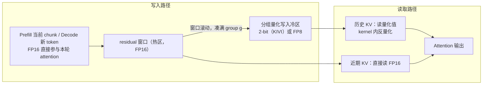
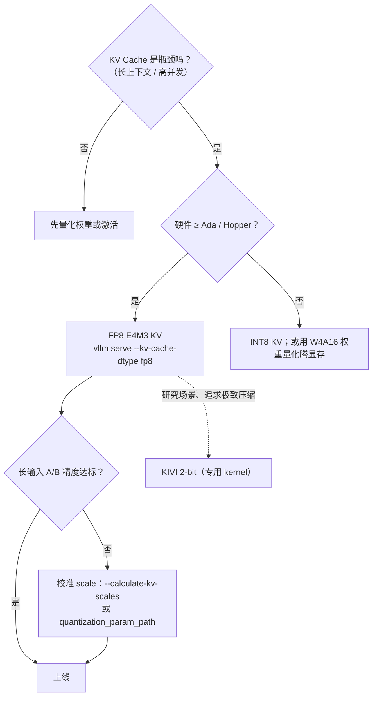

# 4.4 KV Cache 量化：KIVI 2-bit 与 FP8 KV Cache

> **系列导航｜《AIInfraGuide》模块四·第 4 章：量化**
> 1. [4.1 量化基础：从 FP32 到 INT4 的压缩艺术](../quant-41-fp32-to-int4/)
> 2. [4.2 W8A8 量化：SmoothQuant 与 Activation Outlier 问题](../quant-42-smoothquant-w8a8/)
> 3. [4.3 Weight-only INT4：GPTQ、AWQ 与 Marlin Kernel](../quant-43-gptq-awq-marlin/)
> 4. **4.4 KV Cache 量化：KIVI 2-bit 与 FP8 KV Cache（本篇）**
> 5. [4.5 FP8 与 NVFP4/MXFP4：Hopper 与 Blackwell 的低比特浮点](../quant-45-fp8-nvfp4-mxfp4/)
> 6. [4.6 量化选型与 vLLM 实战：从决策树到生产部署](../quant-46-vllm-deployment/)

## 本章简介

本篇是《AIInfraGuide》模块四"推理优化"第 4 章"量化"的第 4 篇（全章共 6 篇）。前三篇的量化对象一直是"静态"的权重或"用完即弃"的激活：第 4.1 篇《量化基础：从 FP32 到 INT4 的压缩艺术》讲量化映射、误差界与粒度谱系，第 4.2 篇《W8A8 量化：SmoothQuant 与 Activation Outlier 问题》覆盖激活量化，第 4.3 篇《Weight-only INT4：GPTQ、AWQ 与 Marlin Kernel》覆盖权重量化。本篇对准第三个、也是长上下文时代最重要的对象：KV Cache（Key-Value Cache，键值缓存）——它随上下文线性增长、被 decode 每一步反复读取，同时是显存瓶颈和带宽瓶颈。

本篇要解决四个问题：KV Cache 到底占多少显存、什么时候超越权重；2-bit 的 KIVI 为什么敢压这么狠、K 和 V 为什么必须用不同粒度；FP8 为什么比 INT8 更适合 KV Cache；生产环境怎么在 vLLM 里打开 FP8 KV Cache 并验证收益。

读完你应该能：手算任意模型的 KV Cache 显存账；说清 KIVI 非对称设计背后的分布依据；在 vLLM 中启用 FP8 KV Cache，并独立完成显存与生成质量的对比验证。

## 1. 问题背景：长上下文时代，显存大头是 KV Cache

先建立与本章前几篇一致的视角：**decode（逐 token 生成）阶段是访存 bound**。每生成一个 token，attention 都要从 HBM 读完全部历史 K/V；KV 的字节数随 `seq_len × batch` 线性增长，而权重是常量。上下文一长、并发一高，KV Cache 就从显存里的"零头"变成"大头"。

算一笔账。任意模型的 KV Cache 显存占用：

```text
KV Cache 显存（字节） = 2 × L × H_kv × d × S × B × b

  2     K 和 V 两份
  L     层数 num_layers
  H_kv  KV head 数（GQA/MQA 下小于 Q head 数）
  d     每个 head 的维度 head_dim
  S     序列长度 seq_len
  B     batch_size
  b     每元素字节数：FP16/BF16 = 2，INT8/FP8 = 1，2-bit = 0.25
```

以 Llama-3-8B（32 层、GQA 8 个 KV head、head_dim 128）在 32K 上下文、batch=1、FP16 为例：

```text
2 × 32 × 8 × 128 × 32768 × 1 × 2 B = 4,294,967,296 B = 4 GiB
```

折合每个 token 128 KiB。单看这个数不算夸张——8B 模型的 FP16 权重约 14.9 GiB，KV 只占权重的 26.8%。但公式里藏着两个放大器：

- **注意力结构（H_kv）**。GQA 把 KV head 从 32 折到 8，KV 直接除以 4；反过来看 MHA 时代没有这层折减：同样 32 层的 Llama-2-7B 有 32 个 KV head，每 token 512 KiB，32K 上下文就是 16 GiB——已经超过它 12.5 GiB 的 FP16 权重。**KV 显存超越权重不是假设，在 MHA 模型上 32K 就发生了。**
- **batch 与并发（B）**。权重不随 batch 变，KV 线性放大。Llama-3-70B（80 层、8 个 KV head）每个 32K-token 的请求槽位占 10 GiB，权重约 131.5 GiB——batch 到 13 两者持平；线上 serving 几十上百个并发请求时，KV 总量轻松达到权重的好几倍。

> **一句话总结**：权重的显存是"首付"，KV Cache 的显存是"按揭"——上下文越长、并发越高，供得越多。KV Cache 量化砍的就是这笔按揭的利率：同样的显存池，装 2 倍（FP8）甚至 5 倍（2-bit）的 token。

## 2. KIVI：K 和 V 为什么不能用同一种粒度

KIVI（Liu et al., 2024，ICML 2024）是 KV Cache 量化的分水岭工作：它第一次系统解剖了 K/V 的元素分布，据此给出"Key per-channel、Value per-token"的非对称 2-bit 方案，全程无需校准与微调（tuning-free）。

### 2.1 分布观察：K 有 outlier channel，V 没有

KIVI 论文对多个主流模型的 Key/Value Cache 做了逐元素可视化统计，核心发现两条：

- **Key Cache**：少数 channel 的幅值比其余 channel 大一个数量级以上——outlier 按 channel（特征维）组织。这与前几篇讲的 LLM 激活 outlier channel 现象同源，且在 RoPE（Rotary Position Embedding，旋转位置编码）之后依然存在。
- **Value Cache**：分布平坦得多，没有显著的 channel 级 outlier；异常值按 token 零散出现，不构成结构性模式。

### 2.2 粒度方向要对着 outlier 的方向

回忆量化误差不等式 `|x̂ - x| ≤ s/2`：scale `s` 由统计范围内的最大值决定，**outlier 落在谁的范围里，谁的全组分辨率就被拉低**。于是 K 和 V 的最优粒度方向相反：

- **Key 用 per-channel 量化**：沿 token 维对每个 channel 独立统计 scale，outlier channel 自己扛自己的大 scale，其余 channel 的分辨率不受影响。反过来若 per-token，每一行的 scale 都会被行内的 outlier channel 撑大，全行 128 个元素陪葬——前篇玩具实验里 per-token 在小值区的误差是 per-channel 的 2.5 倍，正是同一回事。
- **Value 用 per-token 量化**：V 没有 channel outlier，per-channel 本来就没有收益，反而有两个硬伤。其一，V 是逐 token 增量产生的，per-channel 统计要沿 token 维回溯全部历史，每来一个新 token 就得更新所有 channel 的 scale，流式写入无法维护；其二，attention 输出 `O = P·V` 沿 token 维做加权和，per-token 量化的随机误差会被 softmax 概率加权平均、部分抵消，而 per-channel 的系统性偏差没有这个"摊薄"机制。

### 2.3 group-wise 与 residual token：把 2-bit 做实

2-bit 意味着每个元素只剩 4 个码点，单看映射必死无疑。KIVI 靠两个结构把它救回来：

- **group-wise 分组**：每 g 个元素（论文常用 g=32）共享一组 FP16 的 scale 和 zero-point。有效位宽 = 2 + 32/g ≈ 3 bit/元素。分组把 scale 的统计范围收窄到局部，outlier 的破坏半径从"整行/整列"缩到"一个 group"。
- **residual token（残差缓冲）**：最近 R 个 token（论文用 R=32/128）的 K/V 保持 FP16 不量化，攒满一个 group 才打包量化进"冷区"。这一设计一石二鸟：per-channel 的 Key 必须沿 token 维凑齐 g 个 token 才能分组量化，residual 窗口正好提供缓冲；同时最近 token 的注意力权重通常最大、被读得最频繁，留在高精度最划算。

KIVI 论文报告（Llama-2-7B，单卡 A100 80GB）：**2-bit 下 perplexity 与下游任务精度相对 FP16 基线几乎无损；端到端峰值显存（含权重）节省 2.6×；支持 4× 的 batch size，吞吐提升 2.35×~3.47×**。注意 2.6× 是端到端数字——KV 本身的压缩比在 5× 以上，被权重的固定占用摊薄了。

## 3. FP8 KV Cache：指数位换来的 outlier 鲁棒性

### 3.1 E4M3 与 E5M2

FP8（8-bit Floating Point，8 位浮点）由 OCP（Open Compute Project，开放计算项目）规范定义，共两种格式：

| 格式 | 符号位 | 指数位 | 尾数位 | 可表示范围 | 典型用途 |
|---|---|---|---|---|---|
| E4M3 | 1 | 4 | 3 | ±448 | 推理前向：权重、激活、KV |
| E5M2 | 1 | 5 | 2 | ±57344 | 训练梯度 |

KV Cache 推理场景一律选 E4M3：±448 的值域对 K/V 元素绰绰有余，多出来的一位尾数把相对精度提高一倍。vLLM 的 `fp8` 选项在 CUDA 上默认就是 E4M3。

### 3.2 为什么 FP8 比 INT8 更适合 KV Cache

同样 8 bit，INT8 是均匀网格：范围内分辨率恒定（等效 7 位尾数），范围外直接 clamp，scale 由校准决定。KV 里混着 outlier 时，per-tensor 的 scale 被 outlier 定死，正常值全被压进低分辨率区。FP8 把 4 个 bit 给了指数：不同数量级的元素各用各的 binade（相邻 2 的幂之间的区间），outlier 只占高 binade，不再连累小值的分辨率。

写个 20 行的 numpy 实验定量验证。构造一份仿 Key Cache 的数据（重尾分布 + 10 个幅值放大 30 倍的 outlier channel），分别做 INT8 per-tensor 对称量化和 E4M3 量化：

```python
import numpy as np

rng = np.random.default_rng(0)

# 仿 Key Cache：4096 token × 512 channel，重尾 + 少量 outlier channel
x = rng.standard_t(df=4, size=(4096, 512))
outlier_ch = rng.choice(512, size=10, replace=False)
x[:, outlier_ch] *= 30.0                       # 10 个 outlier channel，幅值放大 30 倍

def quant_int8_per_tensor(x):
    s = np.abs(x).max() / 127.0                # 对称 per-tensor：scale 被全局最大值（outlier）决定
    return np.clip(np.round(x / s), -127, 127) * s

def quant_e4m3(x):
    # E4M3: 1 符号 + 4 指数(bias=7) + 3 尾数，最大值 448，最小 subnormal 2^-9
    ax = np.clip(np.abs(x), 2**-9, 448.0)
    e = np.floor(np.log2(ax))                  # 落在哪个 binade
    step = np.maximum(2.0 ** (e - 3), 2**-9)   # 该 binade 的量化步长；subnormal 区固定 2^-9
    return np.sign(x) * np.round(ax / step) * step

mask = np.ones_like(x, dtype=bool)
mask[:, outlier_ch] = False                    # 只看 95% 正常元素的误差
for name, q in [("INT8 per-tensor", quant_int8_per_tensor(x)), ("FP8 E4M3", quant_e4m3(x))]:
    err_all = np.linalg.norm(x - q) / np.linalg.norm(x)
    err_typ = np.linalg.norm((x - q)[mask]) / np.linalg.norm(x[mask])
    print(f"{name:16s}: 整体相对 L2 = {err_all:.4f} | 正常元素相对 L2 = {err_typ:.4f}")
```

本机实际运行输出：

```text
INT8 per-tensor : 整体相对 L2 = 0.2167 | 正常元素相对 L2 = 0.9043
FP8 E4M3        : 整体相对 L2 = 0.0943 | 正常元素相对 L2 = 0.0265
```

INT8 per-tensor 在 95% 的正常元素上误差高达 90%——大部分正常值被量化成 0 或 ±1 个码点，信息基本丢光；E4M3 的正常元素误差只有 2.65%。这就是"指数位对 outlier 更鲁棒"的定量含义。当然代价也要写明：E4M3 尾数只有 3 bit，任何元素的相对误差上限约 2⁻⁴ ≈ 6%；在没有 outlier 的干净数据上 INT8 精度反而更高。所以 FP8 是 KV 这种"有 outlier、但精度要求不极端"场景的甜点，不是万能替代。工程上 INT8 KV 要得到同样鲁棒性，必须上 per-token/per-channel 动态量化或离线校准 scale，复杂度更高。

### 3.3 硬件前提

FP8 要吃得舒服，需要 Ada Lovelace / Hopper 及更新的 NVIDIA GPU（或 AMD MI300+）提供的原生 FP8 转换指令；vLLM 官方文档写明 FP8 E4M3 KV Cache 支持 CUDA 11.8+ 与 ROCm。老架构（A100、RTX 3090）只能软件模拟转换：显存照省，但读写时的转换开销可能让 decode 更慢——省显存不省心。

## 4. 量化策略：在线还是离线，Prefill 还是 Decode

KV Cache 与权重量化最本质的区别是：**KV 的值是推理时才产生的，量化动作必然在线（Online Quantization）**。能选择的只是 scale 的来源和量化发生的时机。

**scale 静态 vs 动态**：

- 静态 scale：离线校准出各层的 k_scale/v_scale，写进 checkpoint 或独立 JSON（vLLM 的 `quantization_param_path`），推理时直接加载。省掉在线归约开销，但校准集与真实分布漂移时会掉精度。
- 动态 scale：像 KIVI 那样每个 group 现场归约、现场存储。永远贴合当前数据，代价是每个 group 多一次归约计算和一份元数据读写。

**量化点（Prefill vs Decode）与冷热分离**：

- Prefill 结束：当前 chunk 的 K/V 刚算出来、马上要用，直接以 FP16 参与本轮 attention；只有"成为历史"的部分才批量量化进冷区。
- Decode 每步：新 token 先落进 FP16 的 residual 窗口；窗口滚动时被挤出的 token 凑满一个 group 后量化入冷区。读侧同理：历史部分读量化值（kernel 内反量化），当前部分读原始浮点。



冷热分离避免了"刚量化又立刻读回"的双重浪费（一次无谓的量化/反量化 + 白丢的精度），也保证 per-channel 的分组永远完整。这个 raw-current / fused-prefix 结构在 vLLM、TensorRT-LLM 的 KV 量化实现里都能看到。

## 5. 精度保持技巧

工程上常用的三道保险：

1. **量化位置在归一化之后**。K/V 写在 RMSNorm（Root Mean Square Normalization，均方根归一化）与 RoPE 之后，分布天然零中心，对称量化即可，不必为非对称零点浪费码点。更激进的方案（QuaRot 一类）在量化前做逐通道归一化或 Hadamard 旋转，把 outlier channel 的能量摊平到全部 channel，从源头消灭粒度问题。
2. **Residual / attention sink 保留**。除 KIVI 的最近 R 个 token 外，序列最前几个 token（attention sink）的注意力分数极大，量化误差会被成比例放大，值得永久保留 FP16——KVQuant 正是靠这条把位宽压得更低。
3. **混合精度 KV Cache**。敏感度在全模型并不均匀：有的层、有的 head 对量化更敏感。按层/按头/按对象分配位宽（例如 K 4-bit、V 2-bit，或敏感层保 FP8、其余 2-bit），比一刀切的固定位宽更接近"显存-精度"的帕累托前沿。vLLM 新版本的 FP8 KV Cache 也已支持跳过指定层不做量化。

## 6. 实战：vLLM 启用 FP8 KV Cache

### 6.1 先算账：一个 numpy 小脚本

开工前先把收益算出来。下面这个脚本（纯 numpy，CPU 可跑）实现第 1 节的公式，顺带估算四种方案的 KV 占用（含 scale/zero-point 元数据）：

```python
"""KV Cache 显存算账：三种模型 × 四种量化方案（纯 numpy，CPU 可跑）"""
import numpy as np

GiB = 1024 ** 3

def kv_bytes(layers, kv_heads, head_dim, seq_len, batch=1, bytes_per_elem=2.0):
    # KV Cache 显存 = 2(K 和 V) × 层数 × KV head 数 × head_dim × 序列长度 × batch × 每元素字节数
    return 2 * layers * kv_heads * head_dim * seq_len * batch * bytes_per_elem

MODELS = {
    "Llama-3-8B  (GQA,  8 KV heads)": dict(L=32, H=8,  d=128, params_b=8.0),
    "Llama-2-7B  (MHA, 32 KV heads)": dict(L=32, H=32, d=128, params_b=6.7),
    "Llama-3-70B (GQA,  8 KV heads)": dict(L=80, H=8,  d=128, params_b=70.6),
}

SEQ = 32768
print("=== 32K 上下文、batch=1、FP16/BF16 ===")
for name, m in MODELS.items():
    per_tok = kv_bytes(m["L"], m["H"], m["d"], 1)
    total   = kv_bytes(m["L"], m["H"], m["d"], SEQ)
    weights = m["params_b"] * 1e9 * 2          # FP16 权重
    print(f"{name}: 每 token {per_tok/1024:5.0f} KiB | KV 合计 {total/GiB:6.2f} GiB | "
          f"权重 {weights/GiB:6.1f} GiB | KV/权重 = {total/weights:5.1%}")

# 70B 模型：batch 多大时 KV 与权重持平？
m70 = MODELS["Llama-3-70B (GQA,  8 KV heads)"]
w70 = m70["params_b"] * 1e9 * 2
print(f"\nLlama-3-70B：batch = {w70 / kv_bytes(80, 8, 128, SEQ):.0f} 时 32K KV Cache 与 FP16 权重持平")

# Llama-3-8B 32K：四种方案的 KV 占用（含元数据）
m = MODELS["Llama-3-8B  (GQA,  8 KV heads)"]
n_elem = 2 * m["L"] * m["H"] * m["d"] * SEQ    # K+V 元素总数
g, R = 32, 128                                 # KIVI: group_size=32, residual_length=128
sizes = np.array([
    n_elem * 2,                                # FP16
    n_elem * (1 + 2 / 128),                    # INT8: 1B 数据 + 每 token/head 一个 FP16 scale（摊到 128 元素）
    n_elem * 1,                                # FP8: 1B 数据 + 每 tensor 一个 FP32 scale（可忽略）
    n_elem * (SEQ - R) / SEQ * (2 + 32 / g) / 8 + R * 2 * m["L"] * m["H"] * m["d"] * 2,  # KIVI
])
print("\n=== Llama-3-8B, 32K, batch=1：四种 KV Cache 方案 ===")
for n, b in zip(["FP16", "INT8 per-token", "FP8 E4M3", "KIVI 2-bit (g=32,R=128)"], sizes):
    print(f"{n:26s}: {b/GiB:5.2f} GiB | 相对 FP16 = {b/sizes[0]:5.1%} | 压缩比 {sizes[0]/b:4.1f}x")
```

本机实际运行输出：

```text
=== 32K 上下文、batch=1、FP16/BF16 ===
Llama-3-8B  (GQA,  8 KV heads): 每 token   128 KiB | KV 合计   4.00 GiB | 权重   14.9 GiB | KV/权重 = 26.8%
Llama-2-7B  (MHA, 32 KV heads): 每 token   512 KiB | KV 合计  16.00 GiB | 权重   12.5 GiB | KV/权重 = 128.2%
Llama-3-70B (GQA,  8 KV heads): 每 token   320 KiB | KV 合计  10.00 GiB | 权重  131.5 GiB | KV/权重 =  7.6%

Llama-3-70B：batch = 13 时 32K KV Cache 与 FP16 权重持平

=== Llama-3-8B, 32K, batch=1：四种 KV Cache 方案 ===
FP16                      :  4.00 GiB | 相对 FP16 = 100.0% | 压缩比  1.0x
INT8 per-token            :  2.03 GiB | 相对 FP16 = 50.8% | 压缩比  2.0x
FP8 E4M3                  :  2.00 GiB | 相对 FP16 = 50.0% | 压缩比  2.0x
KIVI 2-bit (g=32,R=128)   :  0.76 GiB | 相对 FP16 = 19.1% | 压缩比  5.2x
```

上半部分的三行账对应第 1 节的三档局面；下半部分说明：INT8/FP8 都是约 2×，KIVI 2-bit 算上 group 元数据和 FP16 residual 后仍有 5.2×——这就是低位宽方案的诱惑所在。

### 6.2 vllm serve 启动

```bash
# 测试环境：H100 80GB, CUDA 12.4, vLLM 0.10.0, torch 2.5.1
vllm serve meta-llama/Llama-3.1-8B-Instruct \
  --kv-cache-dtype fp8 \
  --calculate-kv-scales \
  --max-model-len 32768 \
  --gpu-memory-utilization 0.90
```

关键参数：

- `--kv-cache-dtype fp8`：开启 FP8 KV Cache，CUDA 上等同 `fp8_e4m3`。合法取值：`auto`（默认，跟随模型 dtype）、`fp8`、`fp8_e4m3`、`fp8_e5m2`，新版本另有 `int8`。
- `--calculate-kv-scales`：在线动态估算 k_scale/v_scale。不开启时，vLLM 会尝试从 checkpoint 加载 scale，加载不到则默认 1.0（并打 warning）——默认值在 KV 幅值超出 E4M3 舒适区时会造成截断，生产上建议显式开启或用校准文件。

### 6.3 离线 LLM() API

```python
# 测试环境：H100 80GB, CUDA 12.4, vLLM 0.10.0, torch 2.5.1
from vllm import LLM, SamplingParams

llm = LLM(
    model="meta-llama/Llama-3.1-8B-Instruct",
    kv_cache_dtype="fp8",          # FP8 KV Cache（CUDA 上默认 E4M3）
    calculate_kv_scales=True,      # 在线估算 k_scale/v_scale
    max_model_len=32768,
    gpu_memory_utilization=0.90,
)

out = llm.generate(
    ["Summarize the following document into 5 bullet points: ..."],
    SamplingParams(temperature=0.2, max_tokens=512),
)
print(out[0].outputs[0].text)
```

追求更稳的精度时，可以用 vLLM 仓库 `examples/other/fp8/README.md` 提供的脚本离线生成 `kv_cache_scales.json`，再通过 `quantization_param_path="./kv_cache_scales.json"` 传入——来自真实校准数据的静态 scale 比默认值 1.0 可靠得多。

### 6.4 验证显存与生成质量

**生效验证看物理证据**：启动日志中 `# GPU blocks` 的数量应接近翻倍（block 数 × block_size = KV 池可缓存的 token 总数），同上下文下的最大并发槽位随之翻倍。注意 `nvidia-smi` 的总显存不会变——vLLM 按 `gpu_memory_utilization` 预分配池子，变化的是池子的"容量"而非"占地面积"。

**性能对比**用官方 benchmark 脚本：

```bash
# 测试环境：H100 80GB, CUDA 12.4, vLLM 0.10.0, torch 2.5.1
python benchmarks/benchmark_throughput.py \
  --model meta-llama/Llama-3.1-8B-Instruct \
  --input-len 32000 --output-len 128 --num-prompts 16 \
  --kv-cache-dtype fp8            # 对照组：去掉这一行
# vLLM ≥ 0.10 也可用新入口：vllm bench throughput（参数相同）
```

参考结果（**参考值，实测随硬件与版本变化**）：16 条 32K 输入的负载下，FP16 基线在单卡 80GB 上 KV 池放不下全部请求的完整历史，需要排队调度；FP8 后 KV 容量翻倍、排队消失，总吞吐提升约 1.3×~1.6×，输入越长、并发越高收益越大。

**质量对比**：用同一组长输入做 A/B 抽查（vLLM 文档的结论是 FP8 E4M3 "typically only minimally degrades inference accuracy"）。配好 scale 后输出与 FP16 基线基本一致；若发现长输入下输出退化而短输入正常，九成是 scale 没校准——先开 `--calculate-kv-scales` 再下结论。

### 6.5 四种方案横向对比与选型

| 方案 | 有效位宽（含元数据） | Llama-3-8B 32K KV 占用 | KV 压缩比 | 精度影响 | 硬件/生态 |
|---|---|---|---|---|---|
| FP16/BF16 | 16 bit | 4.00 GiB | 1× | 无损基线 | 全部 |
| INT8 per-token | ~8.1 bit | 2.03 GiB | ~2× | 动态量化下轻微；per-tensor 静态校准遇 outlier 风险大 | 广泛（TRT-LLM 等） |
| FP8 E4M3 | 8 bit | 2.00 GiB | 2× | 接近无损（vLLM 文档）；对 outlier 鲁棒 | Ada/Hopper+、MI300+ |
| KIVI 2-bit | ~3 bit | 0.76 GiB | ~5.2× | 论文报告 perplexity 几乎无损；端到端峰值显存省 2.6× | 研究实现，需专用 kernel |



## 本章小结

- KV Cache 显存 = `2 × L × H_kv × d × S × B × b`，随上下文与并发线性增长：MHA 的 7B 模型 32K 即超越权重，GQA 的 70B 在 batch≈13 时持平。
- KIVI 的非对称设计来自分布观察：Key 有 channel 级 outlier → per-channel；Value 没有 → per-token。group-wise 把 2-bit 的破坏半径收窄到一个 group，residual token 保住访问最频繁的最近窗口。
- FP8 的指数位让它对 outlier 天然鲁棒（本机实验：正常元素误差 2.65%，INT8 per-tensor 为 90.4%）；推理 KV 选 E4M3，但需要 Ada/Hopper 及更新的硬件才有原生支持。
- KV 量化必然在线；scale 可静态（校准文件）可动态（逐 group 现算）；冷热分离——当前 chunk 用原始浮点、历史部分读量化值——是所有严肃实现的共同结构。
- 生产落地路径：vLLM `--kv-cache-dtype fp8` + `--calculate-kv-scales` 起步，用 block 数验证生效、用长输入 A/B 验证精度，再考虑更激进的位宽。

## 常见问题（FAQ）

**Q1：开了 `--kv-cache-dtype fp8`，为什么 `nvidia-smi` 显存没少？**
vLLM 按 `gpu_memory_utilization` 预分配 KV 池，池子的字节数不变、能装的 token 数翻倍。看启动日志的 `# GPU blocks` 数量或最大并发能力，而不是总显存。

**Q2：FP8 KV Cache 和 FP8 权重量化（`--quantization fp8`）是一回事吗？**
不是，两个开关互相独立：`--kv-cache-dtype` 压的是 KV Cache 的存储，`--quantization fp8` 压的是权重与 GEMM 计算。可以只开任意一个，也可以同时开。

**Q3：A100 / RTX 3090 上能开 FP8 KV 吗？**
存储格式上可以，但老架构没有原生 FP8 转换指令，读写转换走软件路径，decode 可能反而更慢。老卡更现实的选择是 INT8 KV，或先做 W4A16 权重量化给 KV 腾显存。

**Q4：开了 FP8 后长输入输出胡话、短输入正常，怎么回事？**
典型的 scale 问题：默认 scale=1.0 时超出 E4M3 表示能力的大幅值被截断，上下文越长 outlier 越主导。先加 `--calculate-kv-scales`；仍不行就用官方脚本离线生成 `kv_cache_scales.json`，走 `quantization_param_path` 加载。

**Q5：能在 vLLM 里直接用 KIVI 2-bit 吗？**
不能。KIVI 官方实现是基于 HuggingFace Transformers 改造的研究代码，依赖定制的分组量化写路径与 attention kernel；vLLM 主线（截至 0.10）的 `kv_cache_dtype` 最低只到 8 bit（`fp8`/`int8`）。想要 4~8 bit 之间的生产级折中，可以关注 TensorRT-LLM、SGLang 的新格式支持，或等更低位宽方案的工程化落地。

## 延伸阅读

- **KIVI: A Tuning-Free Asymmetric 2bit Quantization for KV Cache**（Liu et al., 2024）：本篇主角，Key per-channel / Value per-token 的非对称设计，含完整的 K/V 分布分析。
- **KVQuant**（Hooper et al., 2024）：非均匀量化 + attention sink 保留 + 逐层混合精度，把 KV Cache 压到 3 bit 以下仍保精度。
- **QuaRot**（Ashkboos et al., 2024）：用 Hadamard 旋转抹平 outlier，把权重/激活/KV 统一到 4 bit 的代表性思路。
- **StreamingLLM**（Xiao et al., 2023）：attention sink 现象的提出者，理解"前几个 token 为什么要永久保高精度"。
- 本系列前置篇目：第 4.1 篇《量化基础：从 FP32 到 INT4 的压缩艺术》与第 4.2 篇《W8A8 量化：SmoothQuant 与 Activation Outlier 问题》是"粒度方向对着 outlier 方向"这一判据的来源；下一篇第 4.5 篇《FP8 与 NVFP4-MXFP4：Hopper 与 Blackwell 的低比特浮点》会把 FP8 从存储格式讲到计算格式。

## 参考文献

- KIVI: A Tuning-Free Asymmetric 2bit Quantization for KV Cache — https://arxiv.org/abs/2402.02750
- KVQuant: Towards 10 Million Context Length LLM Inference with KV Cache Quantization — https://arxiv.org/abs/2401.18079
- QuaRot: Outlier-Free 4-Bit Inference in Rotated LLMs — https://arxiv.org/abs/2404.00456
- Efficient Streaming Language Models with Attention Sinks (StreamingLLM) — https://arxiv.org/abs/2309.17453
- vLLM Documentation: Quantized KV Cache — https://docs.vllm.ai/en/latest/features/quantization/quantized_kvcache/
- vLLM Documentation: FP8 E4M3 KV Cache — https://docs.vllm.ai/en/latest/quantization/fp8_e4m3_kvcache.html
- vLLM FP8 KV scale 校准示例（examples/other/fp8） — https://github.com/vllm-project/vllm/blob/main/examples/other/fp8/README.md
- vLLM benchmark_throughput.py — https://github.com/vllm-project/vllm/blob/main/benchmarks/benchmark_throughput.py
- OCP 8-bit Floating Point Specification (OFP8) — https://www.opencompute.org/documents/ocp-8-bit-floating-point-specification-of8p-revision-1-0-2023-06-20-pdf
