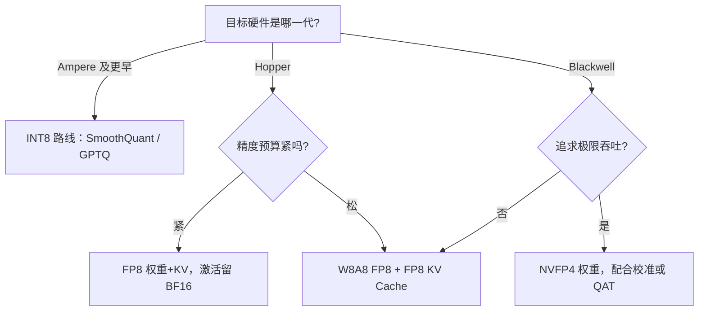

# 4.5 FP8 与 NVFP4/MXFP4：Hopper 与 Blackwell 的低比特浮点

> **系列导航｜《AIInfraGuide》模块四·第 4 章：量化**
> 1. [4.1 量化基础：从 FP32 到 INT4 的压缩艺术](../quant-41-fp32-to-int4/)
> 2. [4.2 W8A8 量化：SmoothQuant 与 Activation Outlier 问题](../quant-42-smoothquant-w8a8/)
> 3. [4.3 Weight-only INT4：GPTQ、AWQ 与 Marlin Kernel](../quant-43-gptq-awq-marlin/)
> 4. [4.4 KV Cache 量化：KIVI 2-bit 与 FP8 KV Cache](../quant-44-kv-cache-kivi-fp8/)
> 5. **4.5 FP8 与 NVFP4/MXFP4：Hopper 与 Blackwell 的低比特浮点（本篇）**
> 6. [4.6 量化选型与 vLLM 实战：从决策树到生产部署](../quant-46-vllm-deployment/)

## 本章简介

本篇是《AIInfraGuide》模块四"推理优化"第 4 章"量化"的第 5 篇（共 6 篇）。前面的篇目把 INT8 的均匀量化、PTQ（Post-Training Quantization，训练后量化）算法与 KV Cache（Key-Value Cache，键值缓存）量化讲透了，解决的是"在现有硬件上把模型压小"的问题；本篇换一个视角——**硬件厂商为深度学习专门设计的新数值类型**。要回答五个问题：

1. FP8 的 E4M3 与 E5M2 长什么样，和 IEEE 754 有何不同？
2. Hopper 的 FP8 Tensor Core 与 Transformer Engine 如何让 FP8 落地？
3. Blackwell 的 NVFP4/MXFP4 靠什么把 4-bit 浮点做到可用？
4. 为什么低比特浮点比低比特整数更适合 LLM？
5. 工程上怎么在 H100/B200 上把 FP8/NVFP4 跑起来，吞吐预期多少？

读完你应能：手算 E4M3 的任意码点、讲清 Delayed Scaling 的工作机制、在 Ampere→Hopper→Blackwell 之间做出量化选型判断，并亲手构建一个 FP8 推理引擎。

## 1. 问题的提出：INT8 的天花板在哪里

回顾 INT8 的均匀仿射量化：`s = max|x| / 127`，绝对误差上界 `s/2`。它有一个无法靠算法补救的结构性缺陷——**均匀网格没有指数**。动态范围被全 tensor 的最大值锁死：一个 outlier 落进来，所有元素的分辨率都被它拉低；想保动态范围就得牺牲精度，想保精度就得砍范围，二者不可兼得。

更麻烦的是工程后果：INT8 几乎离不开**离线校准（calibration）**——先拿代表性数据集跑出每层的 amax 分布、定死 scale 再上线。校准集和真实流量分布不一致时，就是一颗静默的精度炸弹。

浮点格式的思路完全不同：**用指数位换动态范围，让网格密度跟着数值大小走**——小数值处网格密、大数值处网格稀。而 LLM 激活恰是"绝大多数值很小、少数 outlier 很大"的重尾分布。网格形状与数据分布的匹配，就是 FP8 在 LLM 中比 INT8 更友好的第一性原因，第 2.3 节用实验数字坐实这一点。

> **一句话总结**：INT8 是均匀网格，FP8 是"按 octave 均匀"的对数网格；量化方案的好坏，本质是网格形状与数据分布形状的匹配程度。

## 2. FP8 格式详解：E4M3 与 E5M2

### 2.1 位布局

FP8 由 NVIDIA、ARM、Intel 在 2022 年联名论文《FP8 Formats for Deep Learning》中提出，随后成为 OCP（Open Compute Project）标准。它定义两个 8-bit 变体，位段划分与 FP16/BF16 对比如下：

```text
格式       位段（高位 → 低位）
FP16  (16) │ S │ E E E E E │ M M M M M M M M M M │   1+5+10
BF16  (16) │ S │ E E E E E E E E │ M M M M M M M │   1+8+7
E5M2  (8)  │ S │ E E E E E │ M M │                     1+5+2
E4M3  (8)  │ S │ E E E E │ M M M │                     1+4+3
E2M1  (4)  │ S │ E E │ M │                             1+2+1
```

*图 1：五种浮点格式的位段划分。S=符号位，E=指数位，M=尾数位。指数位决定动态范围，尾数位决定相对精度——8 bit 的总预算不变，E4M3 与 E5M2 是同一块预算在"精度"与"范围"之间的两种切法。末行 E2M1 是 Blackwell 两代 FP4 格式（NVFP4/MXFP4）共用的元素类型，见第 4 节。*

### 2.2 E4M3 vs E5M2：同预算的两种切法

| 属性 | E4M3 | E5M2 |
|---|---|---|
| 指数位 / 尾数位 | 4 / 3 | 5 / 2 |
| 指数 bias | 7 | 15 |
| 最大正规数 | ±448 | ±57344 |
| 最小正规数 | 2⁻⁶ ≈ 0.0156 | 2⁻¹⁴ ≈ 6.1×10⁻⁵ |
| 最小次正规数 | 2⁻⁹ ≈ 0.0020 | 2⁻¹⁶ |
| 无穷大 inf | **无** | 有（IEEE 惯例） |
| NaN 编码 | 仅 S.1111.111 一种 | 指数全 1 且尾数非 0 |
| 正规数区相邻码点相对间距 | 6.7% ~ 12.5% | 12.5% ~ 25% |
| 典型用途 | 权重、激活（前向） | 梯度（反向） |

与 IEEE 754 的三点关键差异都集中在 E4M3 上，值得逐个记住：

1. **没有 inf**。IEEE 754 用"指数全 1 + 尾数全 0"表示无穷大，E4M3 把这个码型让给正常数值，只保留 S.1111.111 作为 NaN（全格式唯一的 NaN 码型）。于是最大可表示值落在 S.1111.110 = 448——深度学习里溢出本来就是 bug，与其留一个 inf 码型，不如换成一档额外的动态范围。
2. **NaN 极简**。E4M3 只有 0x7F 与 0xFF 两个 NaN 码点（E5M2 遵循 IEEE 惯例，有 inf 和多个 NaN）。调试 FP8 kernel 时看到 0x7F 不用猜，就是 NaN。
3. **范围反而是短板**。±448 比 INT8 的 [-127, 127] 大不了多少。**FP8 的优势从来不在最大值，而在网格的非均匀分布**——下面用实验展示。

实践中 E4M3 负责前向的权重与激活（精度优先），E5M2 负责反向梯度（梯度分布范围更宽）；纯推理场景几乎全用 E4M3，包括 FP8 KV Cache。

### 2.3 numpy 实验：枚举 E4M3 的全部 256 个码点

纸面参数不如亲手把码点解出来看。下面这个纯 numpy 程序按 OCP 规范解码全部 256 个 E4M3 码点，统计网格分布，并和 INT8 per-tensor 量化在重尾激活上正面对比（自包含，可直接运行）：

```python
"""E4M3 grid experiment: enumerate all 256 codepoints, show non-uniform
density and dynamic range. Pure numpy, no GPU needed."""
import numpy as np

def decode_e4m3(code):
    """Decode one E4M3 codepoint (0-255), exponent bias = 7."""
    s = (code >> 7) & 1
    e = (code >> 3) & 0xF
    m = code & 0x7
    if e == 0xF and m == 0x7:            # S.1111.111 = NaN（唯一 NaN 码型）
        return np.nan
    if e == 0:                           # subnormal 次正规数
        val = (m / 8.0) * 2.0**-6
    else:                                # normal 正规数
        val = (1.0 + m / 8.0) * 2.0**(e - 7)
    return -val if s else val

grid = np.array([decode_e4m3(c) for c in range(256)])
finite = grid[~np.isnan(grid)]
pos = np.sort(np.unique(finite[finite > 0]))        # 正有限值

print(f"codepoints: finite {len(finite)} (incl +-0), NaN {np.isnan(grid).sum()}")
print(f"positive finite values: {len(pos)}")
print(f"max = {pos[-1]}, min subnormal = {pos[0]}, dynamic range = {pos[-1]/pos[0]:.0f}")

print("\ncodepoints per octave [2^k, 2^(k+1)):")
for k in range(-9, 9):
    lo, hi = 2.0**k, 2.0**(k + 1)
    sel = pos[(pos >= lo) & (pos < hi)]
    if len(sel):
        print(f"  [2^{k:>3}, 2^{k+1:>3}) : {len(sel)}  e.g. {sel[:4]}")

norm = pos[pos >= 2.0**-6]                          # 只看正规数区
rel_gap = (norm[1:] - norm[:-1]) / norm[:-1]
print(f"\nrelative gap between neighbors (normal range): "
      f"min={rel_gap.min():.4f}, max={rel_gap.max():.4f}")

# 对比实验：重尾激活上 E4M3 vs INT8(per-tensor 对称)
rng = np.random.default_rng(0)
x = rng.standard_normal(1 << 20) * 0.1
x[rng.choice(len(x), 500, replace=False)] *= 50.0   # 注入 outlier

grid_nonneg = np.concatenate(([0.0], pos))
def quant_e4m3(v):                                  # 就近取整到 E4M3 网格
    av = np.abs(v)
    i = np.clip(np.searchsorted(grid_nonneg, av), 1, len(grid_nonneg) - 1)
    pick_hi = (grid_nonneg[i] - av) < (av - grid_nonneg[i - 1])
    return np.copysign(np.where(pick_hi, grid_nonneg[i], grid_nonneg[i - 1]), v)

s_int8 = np.abs(x).max() / 127.0
q_int8 = np.clip(np.round(x / s_int8), -127, 127) * s_int8
q_fp8 = quant_e4m3(x)

rel = lambda r, q: np.linalg.norm(r - q) / np.linalg.norm(r)
small = np.abs(x) < 0.01 * np.abs(x).max()          # 幅值 < amax×1% 的元素
print(f"\nheavy-tailed activations (amax={np.abs(x).max():.1f}, n={len(x)}):")
print(f"  INT8 per-tensor : total relL2 = {rel(x, q_int8):.4f} "
      f"| small-value region = {rel(x[small], q_int8[small]):.4f}")
print(f"  FP8  E4M3       : total relL2 = {rel(x, q_fp8):.4f} "
      f"| small-value region = {rel(x[small], q_fp8[small]):.4f}")
print(f"\ncodepoints below amax*1%: E4M3 {(pos < 448*0.01).sum()} / 126, "
      f"INT8(sym,amax=448) {int(448*0.01 // (448/127))} / 127")
```

实际运行输出（Python 3.12 + numpy 2.x，结果可复现）：

```text
codepoints: finite 254 (incl +-0), NaN 2
positive finite values: 126
max = 448.0, min subnormal = 0.001953125, dynamic range = 229376

codepoints per octave [2^k, 2^(k+1)):
  [2^ -9, 2^ -8) : 1  e.g. [0.00195312]
  [2^ -8, 2^ -7) : 2  e.g. [0.00390625 0.00585938]
  [2^ -7, 2^ -6) : 4  e.g. [0.0078125  0.00976562 0.01171875 0.01367188]
  [2^ -6, 2^ -5) : 8  e.g. [0.015625   0.01757812 0.01953125 0.02148438]
  [2^ -5, 2^ -4) : 8  e.g. [0.03125    0.03515625 0.0390625  0.04296875]
  [2^ -4, 2^ -3) : 8  e.g. [0.0625    0.0703125 0.078125  0.0859375]
  [2^ -3, 2^ -2) : 8  e.g. [0.125    0.140625 0.15625  0.171875]
  [2^ -2, 2^ -1) : 8  e.g. [0.25    0.28125 0.3125  0.34375]
  [2^ -1, 2^  0) : 8  e.g. [0.5    0.5625 0.625  0.6875]
  [2^  0, 2^  1) : 8  e.g. [1.    1.125 1.25  1.375]
  [2^  1, 2^  2) : 8  e.g. [2.   2.25 2.5  2.75]
  [2^  2, 2^  3) : 8  e.g. [4.  4.5 5.  5.5]
  [2^  3, 2^  4) : 8  e.g. [ 8.  9. 10. 11.]
  [2^  4, 2^  5) : 8  e.g. [16. 18. 20. 22.]
  [2^  5, 2^  6) : 8  e.g. [32. 36. 40. 44.]
  [2^  6, 2^  7) : 8  e.g. [64. 72. 80. 88.]
  [2^  7, 2^  8) : 8  e.g. [128. 144. 160. 176.]
  [2^  8, 2^  9) : 7  e.g. [256. 288. 320. 352.]

relative gap between neighbors (normal range): min=0.0667, max=0.1250

heavy-tailed activations (amax=16.4, n=1048576):
  INT8 per-tensor : total relL2 = 0.2512 | small-value region = 0.4605
  FP8  E4M3       : total relL2 = 0.0270 | small-value region = 0.0276

codepoints below amax*1%: E4M3 72 / 126, INT8(sym,amax=448) 1 / 127
```

三组数字各说明一件事：

1. **每个 octave 恰好 8 个码点**（2³ 个，来自 3 位尾数），从 2⁻⁶ 一路均匀铺到 2⁸——这是对数网格的直接证据。浮点的"相对精度恒定"在 FP8 上体现为：正规数区任意相邻码点的相对间距恒在 6.7%~12.5% 之间，对应最大相对舍入误差约 6.25%（半间距），与数值大小无关。顶端 [256, 448] 只有 7 个码点，因为尾数 111 被 NaN 占用了。
2. **分辨率投向小数值**。126 个正有限值里 72 个落在 amax×1% 以下；同口径 INT8 只有 1/127。LLM 激活的绝大多数元素恰恰在这个区域。
3. **正面对比**：同一份重尾数据，E4M3 整体相对 L2 误差 0.027，INT8 per-tensor 是 0.251——差 9 倍；小值区 0.028 vs 0.461。注意 E4M3 这里**没有配任何 scale**，直接硬量化就赢了带 scale 的 INT8——网格形状匹配分布时，scale 都是次要的。

> **一句话总结**：E4M3 用 4 位指数换来"每个数量级 8 个码点"的对数网格，重尾分布下零校准即可压制 INT8；它的短板是 ±448 的动态范围，所以工程上仍需 scaling 机制兜底。

## 3. Hopper：FP8 的原生落地

### 3.1 第四代 Tensor Core

Hopper（H100/H200）的第四代 Tensor Core 首次加入 FP8 计算路径：输入 E4M3/E5M2，累加器 FP32（或 FP16），峰值算力恰好是同代 FP16/BF16 的两倍。以 H100 SXM 为例（NVIDIA 官方规格，稠密口径）：FP8 1979 TFLOPS，FP16/BF16 989 TFLOPS，TF32 495 TFLOPS。FP8 GEMM 的矩阵乘在 Tensor Core 内完成、累加保持高精度，不存在"读进来再转回 FP16 算"的折损——这是原生支持与软件模拟的本质区别。

### 3.2 Transformer Engine：把 scaling 做成自动巡航

FP8 动态范围小（±448），直接量化真实张量必然溢出或压死，必须配 scaling。NVIDIA Transformer Engine（TE）的方案是 **Delayed Scaling（延迟缩放）**，每个被量化的张量维护三样东西：

- **scale**：per-tensor 的 FP32 缩放因子；
- **amax history**：过去若干迭代（默认 1024 步）的最大绝对值缓冲区；
- **更新规则**：每步结束时，用历史 amax 推出下一步的 scale，而不是用当前张量现算。

```text
amax_t   = max|x_t|                        # 本步观测，写入 history
scale    = FP8_MAX / (max(amax_history) × 2^margin)   # FP8_MAX=448，margin 默认 0
x_fp8    = cast_e4m3(x × scale)            # 前向：放大到 E4M3 的高分辨率区再量化
y        = (x_fp8 · w_fp8) / (scale_x × scale_w)        # GEMM 后折回 scale（累加为 FP32）
```

为什么用历史值而不是现算：对当前张量求 amax 需要额外一次全量归约 pass，训练里每个 GEMM 输入都来一遍会显著拖慢迭代；而相邻迭代的张量分布是缓变的，用历史最大值外推当前分布，统计上足够稳、开销为零。风险是分布突变时历史值失效——amax 突增会溢出（E4M3 没有 inf，直接饱和或 NaN），所以 TE 保留 history 长度与 margin 两个旋钮：margin 调大相当于给 scale 留安全余量。

> **一句话总结**：Delayed Scaling 的本质是"用统计稳态假设换掉每步一次的全量归约"——per-tensor 粒度之所以在训练里可行，靠的不是粒度本身够细，而是分布缓变。

### 3.3 推理侧的 FP8：两条路线

推理时激活的 scale 有两种来源，对应 FP8 的两条落地路线：

- **静态（校准）**：和 INT8 PTQ 一样离线跑校准集，定死每层激活 scale。TensorRT-LLM 的 `quantize.py` 走这条路，精度上限高但依赖校准集代表性；
- **动态（免校准）**：运行时对当前激活在线算 amax、即时缩放（通常 per-token）。vLLM 的 `--quantization fp8` 默认即动态模式。得益于 FP8 的动态范围，动态模式的精度损失通常很小——这是 FP8 相对 INT8 的"calibration-free 潜力"，第 5 节展开。

## 4. Blackwell：NVFP4 与 MXFP4，4-bit 浮点如何可用

### 4.1 问题：E2M1 只有 8 个正数

Blackwell 的第五代 Tensor Core 把元素精度压到 4 bit，元素格式是 E2M1（1 符号 + 2 指数 + 1 尾数，bias 1）。把它全部码点列出来：`0, 0.5, 1, 1.5, 2, 3, 4, 6` 及其负数——**正数一共 8 个，最大值 6**。没有任何缩放时，用它直接量化任何真实张量都是灾难：动态范围 ±6，相邻码点相对间距高达 33%~50%。

结论：**FP4 必须搭配块级缩放（block scaling）才有意义**。这正是 Microscaling（微缩放）思想：不再追求单元素的表达能力，而是"粗糙的元素 + 精细的共享 scale"。

### 4.2 两种块缩放格式

OCP MX 规范与 NVIDIA 各自给出一种 FP4 微缩放格式，Blackwell Tensor Core 对两者都有原生支持（含硬件反量化逻辑）：

| 属性 | MXFP4 | NVFP4 |
|---|---|---|
| 元素格式 | E2M1 | E2M1 |
| 块大小 | 32 元素 | 16 元素 |
| 块 scale 格式 | E8M0（纯指数，2 的幂） | E4M3（FP8） |
| 二级 scale | 无 | 全 tensor 一个 FP32 |
| 平均每元素位宽 | 4.25 bit | 4.5 bit |

编码规则用公式写清楚：

```text
NVFP4：x̂ᵢ = cast_e2m1(xᵢ / (Δᵢ × α)) × Δᵢ × α
  Δᵢ：元素 i 所在 16 元素块共享的 E4M3 scale（把块内峰值归一化到 E2M1 上限 6）
  α ：全 tensor 唯一的 FP32 scale（先把整体分布搬进 E4M3 可表示的 ±448 区间）

MXFP4：x̂ᵢ = cast_e2m1(xᵢ / 2^eᵢ) × 2^eᵢ
  eᵢ：元素 i 所在 32 元素块共享的 E8M0 指数（scale 只能是 2 的幂，范围 2⁻¹²⁷~2¹²⁷）
```

NVFP4 的两级缩放各司其职：FP32 的 α 解决"整个 tensor 整体偏大/偏小"的问题，E4M3 的 Δ 解决块内对齐。MXFP4 的 E8M0 没有尾数，块峰值若不是 2 的幂，归一化后最高浪费近一档动态范围；NVFP4 的 E4M3 scale 带 3 位尾数，能把块内峰值精确顶到 6。块更小（16 vs 32）+ scale 更细，是 NVFP4 精度优于 MXFP4 的两个结构性来源——NVIDIA 的 NVFP4 训练论文（见延伸阅读）在 12B 模型、10T token 规模上报告 NVFP4 训练精度接近 FP8 基线，代价是每元素多 0.25 bit 的元数据。

### 4.3 为什么 block scaling 比 per-tensor 精度好

回忆误差界的通用逻辑：量化误差由 scale 覆盖范围内的**最大值**决定。per-tensor 下，全 tensor 任何一个 outlier 都会撑起唯一的 scale，污染所有元素；16 元素一个块时，outlier 只破坏自己所在的块，相邻块的分辨率毫发无损——**outlier 的破坏半径从整个 tensor 收缩到 16 个元素**。这和系列前篇 INT8 group-wise 的道理同构，区别只在：FP4 把"元素+块 scale"做成了硬件原生格式，scale 元数据的存取与反量化由 Tensor Core 流水线完成，不再需要软件 kernel 手工折叠。

### 4.4 代际对比：量化能力的演进

| 代际 | 代表 GPU | 新增低精度格式 | 低精度峰值（稠密） | 同代 FP16/BF16（稠密） |
|---|---|---|---|---|
| Ampere | A100 80GB | INT8（FP16/BF16 已存在） | INT8 624 TOPS | 312 TFLOPS |
| Hopper | H100 SXM | FP8（E4M3/E5M2） | FP8 1979 TFLOPS | 989 TFLOPS |
| Blackwell | B200 | NVFP4、MXFP4/6/8、FP6 | FP4 ≈ 9 PFLOPS；FP8 ≈ 4.5 PFLOPS | ≈ 2.25 PFLOPS |

*表 1：三代数据中心 GPU 的量化能力（NVIDIA 官方规格，SXM 形态、稠密口径；稀疏口径数字翻倍，如 B200 FP4 稀疏约 18 PFLOPS）。*

两个倍数值得记住：A100→H100，最好的低精度路径从 INT8 624 TOPS 跳到 FP8 1979 TFLOPS，**3.2 倍**；H100→B200，FP8 1979 → FP4 约 9000 TFLOPS，**4.5 倍**。注意 Blackwell 上 FP8 相对 Hopper 也有约 2.3 倍提升（4500/1979），即"不换新格式、只换卡"也有可观收益。

## 5. 低比特浮点 vs 低比特整数：选型逻辑

把两种路线并排看：

| 维度 | INT8 | FP8（E4M3） | FP4（NVFP4/MXFP4） |
|---|---|---|---|
| 网格形状 | 均匀 | 对数（每 octave 8 点） | 对数块缩放 |
| 动态范围 | 由 amax 锁死 | ±448（加 scale 扩展） | 块 scale 决定，极宽 |
| 抗 outlier | 差（per-tensor 时） | 好 | 好（破坏半径≤16/32 元素） |
| 校准依赖 | 强（基本必需） | 弱（可动态免校准） | 中（权重建议校准/QAT） |
| 硬件门槛 | 所有现代芯片 | Hopper 及以后 | Blackwell 及以后 |
| 生态成熟度 | 最成熟 | 快速成熟中 | 早期 |

FP8 的**免校准潜力**值得单独强调：INT8 的动态范围太小，离线定死的 scale 遇到分布漂移就失效，所以校准几乎不可省；FP8 靠在线 amax 缩放（TE 的 Delayed Scaling 是训练版，vLLM 动态 FP8 是推理版）可以在不碰校准集的情况下拿到可用精度。不是"FP8 不需要 scale"，而是"scale 可以在线、便宜地算出来"。



*图 2：低比特选型决策。先看硬件代际，再看精度预算；FP4 目前建议从"纯权重 + 校准"起步，激活 FP4 对多数模型仍需 QAT（Quantization-Aware Training，量化感知训练）兜底。*

## 6. 训练与推理的统一：FP8 的端到端闭环

FP8 更大的图景是打通训练与推理。两条标志性工作：

- **FP8-LM**（Microsoft，2023）：系统验证 FP8 训练 LLM 的可行性——前向 GEMM 用 E4M3、反向梯度用 E5M2，并在缩放因子、梯度累加等环节给出完整配方，报告在 GPT 类模型上相对 BF16 基线精度基本无损；
- **DeepSeek-V3**（DeepSeek-AI，2024）：首个公开的大规模 FP8 混合精度训练旗舰。它没有采用 TE 的 per-tensor 方案，而是**细粒度缩放**：激活按 1×128 tile 缩放、权重按 128×128 块缩放（介于 per-tensor 与 Blackwell 的 16/32 块之间）；同时把 FP8 GEMM 的低精度累加每隔 128 次 MMA 提升到 CUDA Core 上做 FP32 累加，缓解 Tensor Core 截断累加的误差。

"统一"的价值在于闭环：FP8 训出的模型，权重天然落在 FP8 可表示分布内，推理时无需再做 PTQ 重量化，训练精度就是推理精度的上界基线；推理框架（TensorRT-LLM/vLLM/SGLang）对 FP8 checkpoint 的支持也都以"直接加载"为默认路径。NVFP4 训练论文进一步把这个闭环延伸到 4-bit：训练用 NVFP4、推理也消费 NVFP4，中间没有格式转换的精度台阶。

## 7. 实战：把 FP8/NVFP4 跑起来

### 7.1 H100：用 TensorRT-LLM 构建 FP8 引擎

标准流程两步：先量化出带 scale 的 checkpoint，再编译成引擎：

```bash
# 测试环境：H100 80GB SXM, CUDA 12.8, TensorRT-LLM 0.17+, torch 2.6
# 步骤 1：离线量化（静态 per-tensor scale，需校准集）
cd TensorRT-LLM/examples/quantize
python quantize.py \
    --model_dir meta-llama/Meta-Llama-3.1-8B-Instruct \
    --qformat fp8 \
    --kv_cache_dtype fp8 \
    --output_dir ./ckpt/llama-3.1-8b-fp8 \
    --tp_size 1

# 步骤 2：编译 TensorRT 引擎
trtllm-build \
    --checkpoint_dir ./ckpt/llama-3.1-8b-fp8 \
    --output_dir ./engine/llama-3.1-8b-fp8 \
    --max_batch_size 64 \
    --max_input_len 4096 \
    --max_seq_len 8192

# 步骤 3：起服务
trtllm-serve ./engine/llama-3.1-8b-fp8 --port 8000
```

`--qformat fp8` 对权重与激活做 FP8 量化（校准则用默认数据集，生产建议换自己的代表性数据）；`--kv_cache_dtype fp8` 同时启用 FP8 KV Cache——长上下文场景下 KV 字节数减半，容量直接翻倍。验证生效的物理证据：引擎目录内 `config.json` 的 dtype 字段、加载后显存占用相对 BF16 引擎是否接近减半、以及 Nsight Systems 里实际调用的 GEMM kernel 是否为 FP8 路径。

### 7.2 H100：vLLM 一行启动（免校准路线）

```bash
# 测试环境：H100 80GB SXM, CUDA 12.4, vLLM 0.10.0, torch 2.5.1
# 动态 FP8：在线 per-token 激活缩放 + FP8 权重，无需校准集
vllm serve meta-llama/Meta-Llama-3.1-8B-Instruct \
    --quantization fp8 \
    --kv-cache-dtype fp8 \
    --max-model-len 32768

# 吞吐基准（参考值，实测随硬件与版本变化）
python benchmarks/benchmark_throughput.py \
    --model meta-llama/Meta-Llama-3.1-8B-Instruct \
    --quantization fp8 \
    --kv-cache-dtype fp8 \
    --input-len 1024 --output-len 512 --num-prompts 256
```

`--quantization fp8` 是 vLLM 的 W8A8 FP8 动态量化路径（也可直接加载预量化好的 FP8 checkpoint，此时省略该参数）；`--kv-cache-dtype fp8` 开启 FP8 KV Cache。社区常见经验值是 FP8 对 8B 级模型的精度影响在下游任务 1 个百分点以内，但**这是参考值，务必用自己的评测集回归**。

### 7.3 B100/B200：NVFP4 的吞吐预期

先看官方口径的算力天花板（NVIDIA 官方规格，稠密/稀疏）：B200 FP4 约 9/18 PFLOPS，FP8 约 4.5/9 PFLOPS；对比 H100 FP8 的 1979/3958 TFLOPS——**单卡 FP4 稠密算力约为 H100 FP8 的 4.5 倍**。系统层面，NVIDIA 官方宣称 GB200 NVL72 机架相对 HGX H100 的 LLM 推理性能最高提升约 30 倍（官方数据，含 NVLink 域扩大、机架级并行等因素，不能理解为单卡倍数）。

落到引擎侧，NVFP4 的典型路径是 TensorRT Model Optimizer 离线量化（`--qformat nvfp4`，配合校准集）再导出给 vLLM/TensorRT-LLM。NVIDIA 官方与社区报告显示，Blackwell 上 NVFP4 相对同卡 FP8 的 GEMM 吞吐有约 2 倍算力优势（FP4 9 vs FP8 4.5 PFLOPS 的官方口径），端到端推理收益受带宽、KV Cache、调度等因素折损，**具体倍数为参考值，实测随模型、batch 与版本变化**。务实的预期管理：权重读带宽敏感的大 batch decode 场景收益最接近理论值；小 batch 或长 KV 场景先看带宽账再谈算力账。

## 8. 常见问题（FAQ）

**Q1：FP8 到底要不要校准？**
两条路都通。静态校准（TensorRT-LLM `quantize.py`）精度上限高、适合固定流量；动态量化（vLLM `--quantization fp8`）免校准、上线快，代价是每步一次在线 amax 归约的少量开销。先用动态跑通验证精度，精度不够再退到校准，是成本最低的顺序。

**Q2：在 A100 上加载 FP8 模型为什么反而更慢？**
Ampere 没有 FP8 Tensor Core，FP8 权重只能反量化回 FP16 再算——省了显存，一分算力没省，还白付 dequant 开销。Ampere 上的正确低精度路径仍是 INT8（SmoothQuant/GPTQ）。FP8 模型在老卡上只建议当压缩存储用。

**Q3：E4M3 和 E5M2 怎么分工？**
经验法则：前向（权重、激活）用 E4M3 保精度，反向梯度用 E5M2 保范围（训练框架如 TE 默认如此）。纯推理场景全部 E4M3，包括 FP8 KV Cache。

**Q4：NVFP4 与 INT4（GPTQ/AWQ）比，优势在哪？**
三点：块 scale 是 FP8 而非 FP32（元数据更省且硬件原生）；E2M1 元素带指数，块内 outlier 不像均匀 INT4 那样压垮整组；反量化在 Tensor Core 流水线内完成，没有软件 kernel 的 dequant 开销。代价是只有 Blackwell 及以后的卡能跑。

**Q5：开了 FP8 KV Cache 后长上下文输出退化怎么办？**
先确认退化确实来自 KV 量化（ON/OFF A/B），再按系列前篇 KV Cache 量化的思路处理：K 按 channel、V 按 token 的粒度方向核对实现，检查框架是否对 K/V 用了同一套 scale；必要时只给 V 开 FP8、K 留 BF16。症状典型是长输入下输出胡话而短输入正常。

## 9. 本章小结

1. **FP8 的核心资产是网格形状**：E4M3 每个 octave 恰好 8 个码点，对数分布与 LLM 重尾激活天然匹配——实验中零校准的 E4M3 以 9 倍误差优势压制带 scale 的 per-tensor INT8。
2. **E4M3 与 IEEE 754 的关键差异**：无 inf、单一 NaN 码型（S.1111.111）、最大 ±448；范围是短板，所以 scaling 机制不可省。
3. **Hopper 的答案是 Delayed Scaling**：per-tensor scale + amax history，用分布缓变假设换掉每步全量归约，训练推理共用一套思想。
4. **Blackwell 的答案是 Microscaling**：E2M1 元素 + 16/32 元素块 scale，把 outlier 破坏半径从整个 tensor 收缩到一个块；NVFP4 靠更小的块（16）与更细的 scale（E4M3 + FP32 两级）在精度上压过 MXFP4。
5. **选型先看硬件代际**：Ampere 留 INT8，Hopper 上 FP8，Blackwell 上 NVFP4 起步于"权重 + 校准"。算力账本：A100 INT8 624 TOPS → H100 FP8 1979 TFLOPS → B200 FP4 约 9 PFLOPS（官方规格，稠密）。
6. **闭环正在形成**：FP8-LM、DeepSeek-V3 到 NVFP4 训练论文，训练与推理用同一数值格式，PTQ 的精度台阶正在消失。

下一篇（第 4.6 篇）将跳出单格式视角，讨论多精度混合的推理系统设计。

## 10. 延伸阅读

- **FP8 Formats for Deep Learning**（Micikevicius et al., NVIDIA/ARM/Intel, 2022）：FP8 的原始论文，E4M3/E5M2 设计动机与早期硬件实验，本篇第 2 节的一手来源；
- **FP8-LM: Training FP8 Large Language Models**（Peng et al., Microsoft, 2023）：FP8 训练的完整配方，E4M3/E5M2 分工的经典实践；
- **DeepSeek-V3 Technical Report**（DeepSeek-AI, 2024）：细粒度 FP8 scaling（1×128 tile / 128×128 block）与高精度累加策略，工程细节密度极高；
- **Pretraining Large Language Models with NVFP4**（NVIDIA, 2025）：NVFP4 两级缩放的消融与 12B/10T-token 训练验证，第 4 节的主要来源；
- **OCP Microscaling Formats (MX) Specification v1.0**（OCP, 2023）：MXFP4/MXFP6/MXFP8 的标准定义，E8M0 共享指数的设计文档；
- 站内相关：本系列前篇《INT8 量化实战指南：从数学原理到工程落地的完整思路》（粒度与误差界的基础），以及 KV Cache 量化篇（FP8 KV 的粒度方向问题）。

## 11. 参考文献

- FP8 Formats for Deep Learning (arXiv:2209.05433): https://arxiv.org/abs/2209.05433
- FP8-LM: Training FP8 Large Language Models (arXiv:2310.18313): https://arxiv.org/abs/2310.18313
- DeepSeek-V3 Technical Report (arXiv:2412.19437): https://arxiv.org/abs/2412.19437
- Pretraining Large Language Models with NVFP4 (arXiv:2509.25149): https://arxiv.org/abs/2509.25149
- OCP Microscaling Formats (MX) Specification: https://www.opencompute.org/documents/ocp-microscaling-formats-mx-v1-0-spec-final-pdf
- NVIDIA H100 Tensor Core GPU Datasheet: https://resources.nvidia.com/en-us-tensor-core/nvidia-tensor-core-gpu-datasheet
- NVIDIA DGX B200 官方规格: https://www.nvidia.com/en-us/data-center/dgx-b200/
- NVIDIA Blackwell Architecture: https://www.nvidia.com/en-us/data-center/technologies/blackwell-architecture/
- NVIDIA Transformer Engine: https://github.com/NVIDIA/TransformerEngine
- TensorRT-LLM: https://github.com/NVIDIA/TensorRT-LLM
- vLLM: https://github.com/vllm-project/vllm
