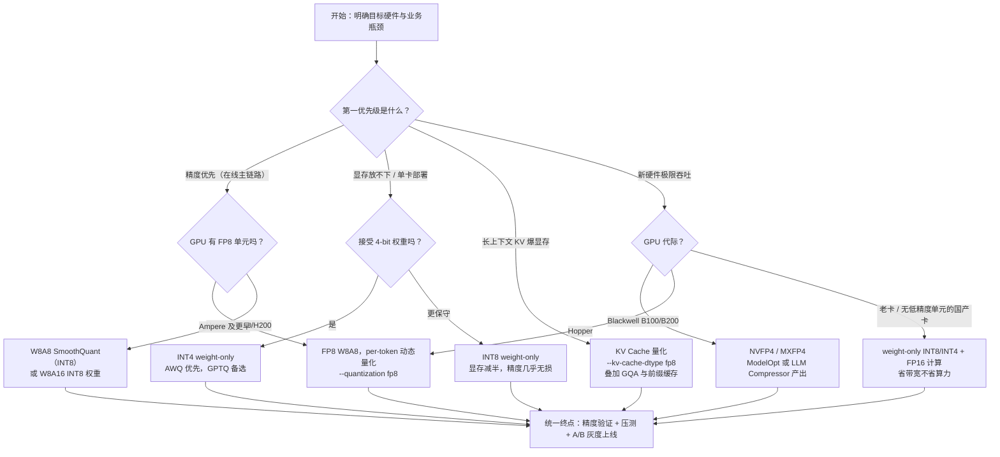

# 4.6 量化选型与 vLLM 实战：从决策树到生产部署

> **系列导航｜《AIInfraGuide》模块四·第 4 章：量化**
> 1. [4.1 量化基础：从 FP32 到 INT4 的压缩艺术](../quant-41-fp32-to-int4/)
> 2. [4.2 W8A8 量化：SmoothQuant 与 Activation Outlier 问题](../quant-42-smoothquant-w8a8/)
> 3. [4.3 Weight-only INT4：GPTQ、AWQ 与 Marlin Kernel](../quant-43-gptq-awq-marlin/)
> 4. [4.4 KV Cache 量化：KIVI 2-bit 与 FP8 KV Cache](../quant-44-kv-cache-kivi-fp8/)
> 5. [4.5 FP8 与 NVFP4/MXFP4：Hopper 与 Blackwell 的低比特浮点](../quant-45-fp8-nvfp4-mxfp4/)
> 6. **4.6 量化选型与 vLLM 实战：从决策树到生产部署（本篇）**

## 本章简介

本篇是《AIInfraGuide》模块四·第 4 章"量化"的第 6 篇（共 6 篇），也是本章收官篇。前五篇的脉络是：

- **4.1 量化基础**：量化映射、误差界 `|x̂ - x| ≤ s/2`、粒度之争——量化在数学上做了什么；
- **4.2 SmoothQuant**：激活 outlier channel 问题，把量化难度在激活与权重间迁移，W8A8 的经典方案；
- **4.3 GPTQ 与 AWQ**：INT4 权重量化的两大主流算法，二阶补偿与显著通道保护；
- **4.4 KV Cache 量化**：长上下文场景的真正瓶颈，K/V 的粒度方向与 scale 生命周期管理；
- **4.5 FP8 与 NVFP4**：新硬件上的浮点低精度路线，Hopper 与 Blackwell 的硬件红利。

前五篇解决的是"每种技术怎么工作"，本篇解决的是工程师真正被问到的问题：**给我一个模型、一批 GPU、一个业务场景，我到底该选哪个？怎么上线？** 读完你将收获：

1. 一张覆盖主流硬件代际与业务目标的量化选型决策树；
2. vLLM 量化生态的全景图与支持矩阵，包括 GGUF、MLX 等格式的兼容性事实；
3. 一个从 HuggingFace 下载 FP16 模型 → AutoAWQ 量化 → vLLM 部署 → 压测对比的端到端可复现流程；
4. 一份可直接照搬的生产部署 checklist，以及对"量化能否与其他推理优化叠加"的定量理解。

## 1. 量化选型决策树

### 1.1 决策树

选型的输入只有三个：**目标硬件**（决定了哪些格式有原生计算单元）、**业务瓶颈**（精度、显存容量、上下文长度、吞吐）、**回退要求**（出问题能不能快速退回 BF16）。把三个输入展开成决策树：



### 1.2 六条路径的决策依据

**精度优先 → W8A8**。8-bit 是精度损失与工程复杂度的甜点：SmoothQuant 论文（Xiao et al., ICML 2023）报告 W8A8 相对 FP16 最高 1.56× 加速、2× 显存节省，精度基本无损。有 FP8 单元的 Hopper 卡优先 FP8（实现成本最低、无需校准也能用 per-token 动态量化）；没有 FP8 单元就退回 SmoothQuant INT8，但需要离线校准。

**省显存 → INT4（AWQ/GPTQ）**。权重砍到 4-bit，7B 模型权重从约 14 GiB 降到约 4 GiB，是单卡部署、多实例混布的标配。AWQ 与 GPTQ 精度接近，社区实践里 AWQ 在指令微调模型上略稳、量化速度快；GPTQ 生态最老、checkpoint 存量最大。GPTQ 论文（Frantar et al., ICLR 2023）报告 175B 级模型在 A100 上约 3.25×、A6000 上约 4.5× 加速——注意这是单请求 decode 带宽瓶颈下的数字，高并发时收益会收窄（第 6 节解释）。

**长上下文 → KV Cache 量化**。上下文变长后瓶颈从权重转移到 KV：4.4 篇已论证 KV 字节数随上下文线性增长，而权重量化的收益是恒定的。vLLM 里一行 `--kv-cache-dtype fp8` 即可开启，KV 容量直接翻倍。

**Hopper → FP8**。H100/H200 有原生 FP8 Tensor Core（H100 SXM 官方规格：80GB HBM3、3.35 TB/s，FP8 算力约为 BF16 的 2 倍），FP8 W8A8 同时省带宽和省算力，是这一代的最优解。

**Blackwell → NVFP4/MXFP4**。B200 官方规格：192GB HBM3e、约 8 TB/s 带宽，FP4 Tensor Core 峰值约为 FP8 的 2 倍。NVFP4 用 16 元素微块 + E4M3 scale 把 4-bit 浮点的精度做到可用，是新集群的极限吞吐选项。注意 NVFP4 的原生计算路径依赖 SM100 数据中心型号，工作站级 Blackwell（SM120）早期支持不完整，曾出现静默回退到 Marlin INT4 的情况，落地前务必核实所用 vLLM 版本的支持状态。

**老卡/国产卡 → weight-only + FP16 计算**。没有低精度计算单元时，低精度格式只能当"压缩存储"：权重以 INT8/INT4 存储省 HBM 流量，读进来反量化成 FP16 计算。这不是妥协而是推理场景的常态——decode 瓶颈是字节数不是 FLOPs，省带宽本身就是收益。

> **一句话总结**：先看硬件支持什么格式，再看瓶颈是权重字节、KV 字节还是算力——格式选型本质上是让"省下来的字节"恰好落在瓶颈环节上。

## 2. vLLM 量化生态全景

### 2.1 两条生产线：自产 checkpoint 与现成 checkpoint

vLLM 本身不做量化算法，它是**量化 checkpoint 的消费方**。生态里有两大生产线：

- **LLM Compressor（原 neuralmagic/llm-compressor，现归 vLLM 项目）**：统一的后训练量化工具链，产出 **compressed-tensors** 格式。一个格式描述 W4A16、W8A8-INT8、W8A8-FP8、NVFP4 等各种方案，vLLM 原生加载。优点是与 vLLM 同步演进，新格式（如 NVFP4）最先在这里可用。
- **垂直工具链**：AutoAWQ（AWQ）、AutoGPTQ（GPTQ）、NVIDIA TensorRT Model Optimizer（ModelOpt，FP8/NVFP4）。产出各自格式的 safetensors checkpoint，vLLM 按 `config.json` 里的 `quantization_config` 字段自动识别。

实务上，HuggingFace 上已有大量社区预量化 checkpoint（搜 `AWQ`、`GPTQ`、`FP8` 后缀），**先找现成的，没有再自己量化**——自己量化要过一遍校准数据和验证流程，成本不低。

### 2.2 支持矩阵：格式 × GPU 架构

| 格式 | Ampere（A100/30 系） | Hopper（H100/H200） | Blackwell（B100/B200） | 推荐场景 |
|---|---|---|---|---|
| FP16/BF16 | ✅ 原生 | ✅ 原生 | ✅ 原生 | 精度基线与回退路径 |
| GPTQ-INT4 | ✅ Marlin kernel | ✅ Marlin kernel | ✅ | 通用省显存，存量最大 |
| AWQ-INT4 | ✅ Marlin kernel | ✅ Marlin kernel | ✅ | 省显存且对精度敏感 |
| FP8 W8A8 | ❌ 无 FP8 单元 | ✅ 原生 Tensor Core | ✅ 原生 | 在线低延迟、高精度要求 |
| NVFP4 | ❌ | ❌ 无 FP4 单元 | ✅ SM100 原生 | 新一代极限吞吐 |
| GGUF | ⚠️ 实验性 | ⚠️ 实验性 | ⚠️ 实验性 | 复用 llama.cpp 资产，非生产首选 |

*表 1：vLLM 量化格式支持矩阵。✅ 表示有成熟 kernel 路径；⚠️ 表示功能可用但受限；❌ 表示硬件层面无计算路径。随 vLLM 版本迭代可能变化，以所用版本文档为准。*

两点补充：

- **Marlin kernel** 是 INT4 weight-only 的事实标准实现：支持 sm80（Ampere）及以后的所有 N 卡，在大 batch 下仍能保持接近理论带宽的解码速度，解决了早期 ExLlamaV2 kernel 高并发掉速的问题。vLLM 对 GPTQ/AWQ 模型通常自动选择 Marlin（`gptq_marlin` / `awq_marlin`），无需手工指定。
- **FP8 KV Cache 与 FP8 权重量化是两回事**。`--kv-cache-dtype fp8` 只量化 KV，权重仍是 BF16，Ampere 上也能开（走的是转换路径，收益来自显存而非算力）；而 `--quantization fp8` 的 W8A8 计算路径需要 Hopper 以上才有原生加速。

### 2.3 模型格式兼容性：safetensors、GGUF、MLX

- **safetensors**：vLLM 的原生格式，所有量化方案（compressed-tensors、GPTQ、AWQ、FP8、NVFP4）都以它为载体，生产部署唯一推荐。
- **GGUF（llama.cpp 系）**：vLLM 支持有限且长期处于实验状态——只覆盖部分模型架构与量化类型，功能上缺少对部分推理特性（如张量并行、完整的 CUDA graph 优化）的支持，性能也不及原生 safetensors 路径。客观结论：**GGUF 适合在 llama.cpp 生态（CPU/边缘/个人设备）里用，不适合搬来 vLLM 上生产**。如果你的资产是 GGUF，正确做法是找回原始 FP16 权重重新按 AWQ/GPTQ 量化。
- **MLX（Apple 系）**：Apple Silicon 的独立生态，vLLM 不加载 MLX checkpoint。Mac 上跑模型用 `mlx-lm` 或社区移植的 `vllm-mlx`，与本文的服务器端 vLLM 是两条路线。
- **ONNX / SafeTensors 之外的旧格式**（pytorch `.bin`、TensorRT 引擎文件等）：均非 vLLM 原生支持，需先转换。

## 3. 容量规划：先算账，再选型

选型前最常被跳过的一步是**显存预算**。下面这个 30 行脚本（纯标准库）估算"权重 + KV Cache"两块大头，本机已实际运行验证：

```python
def gib(nbytes):
    return nbytes / (1024 ** 3)

def weight_gib(n_params, bytes_per_w):
    return gib(n_params * bytes_per_w)

def kv_mib_per_k_tokens(n_layers, n_kv_heads, head_dim, bytes_per_el):
    """MiB per 1000 tokens of KV cache (K and V)."""
    nbytes = 2 * n_layers * n_kv_heads * head_dim * 1000 * bytes_per_el
    return nbytes / (1024 ** 2)

# Qwen2.5-7B: 28 layers, GQA with 4 KV heads, head_dim = 128
N_PARAM = 7.6e9
L, H, D = 28, 4, 128

W_BF16 = weight_gib(N_PARAM, 2.0)
W_INT4 = weight_gib(N_PARAM, 4.5 / 8)   # g128 scales/zeros -> ~4.5 bit/weight
KV16 = kv_mib_per_k_tokens(L, H, D, 2)
KV8 = kv_mib_per_k_tokens(L, H, D, 1)

print("=== Per-item footprint ===")
print(f"Weights BF16           : {W_BF16:5.1f} GiB")
print(f"Weights AWQ-INT4(g128) : {W_INT4:5.1f} GiB")
print(f"KV cache FP16          : {KV16:5.1f} MiB / 1k tokens")
print(f"KV cache FP8           : {KV8:5.1f} MiB / 1k tokens")

def max_kv_mtokens(gpu_gib, weights, kv_mib, util=0.90, overhead_gib=2.0):
    """KV token capacity in millions, under gpu_memory_utilization."""
    budget_mib = (gpu_gib * util - overhead_gib - weights) * 1024
    return budget_mib / kv_mib / 1000

print("\n=== KV capacity (million tokens) ===")
print(f"{'setup':<28}{'FP16 KV':>10}{'FP8 KV':>10}")
for name, gpu, w in [("RTX 4090 24GB + INT4", 24, W_INT4),
                     ("A100 80GB + BF16", 80, W_BF16),
                     ("H100 80GB + BF16", 80, W_BF16),
                     ("H100 80GB + INT4", 80, W_INT4)]:
    print(f"{name:<28}{max_kv_mtokens(gpu, w, KV16):>8.2f}M"
          f"{max_kv_mtokens(gpu, w, KV8):>8.2f}M")

need16 = KV16 * 32 * 32 / 1024   # 32 concurrent x 32k ctx, MiB -> GiB
need8 = KV8 * 32 * 32 / 1024
print("\n=== Reverse check: 32 req x 32k ctx ===")
print(f"FP16 KV: {need16:.1f} GiB   FP8 KV: {need8:.1f} GiB")
budget4090 = 24 * 0.90 - 2.0 - W_INT4
print(f"RTX 4090 KV budget after INT4 weights: {budget4090:.1f} GiB"
      f" -> FP8 KV still caps concurrency at ~{int(32 * budget4090 / need8)}")
```

实际运行输出（已验证）：

```text
=== Per-item footprint ===
Weights BF16           :  14.2 GiB
Weights AWQ-INT4(g128) :   4.0 GiB
KV cache FP16          :  54.7 MiB / 1k tokens
KV cache FP8           :  27.3 MiB / 1k tokens

=== KV capacity (million tokens) ===
setup                          FP16 KV    FP8 KV
RTX 4090 24GB + INT4            0.29M    0.58M
A100 80GB + BF16                1.05M    2.09M
H100 80GB + BF16                1.05M    2.09M
H100 80GB + INT4                1.24M    2.47M

=== Reverse check: 32 req x 32k ctx ===
FP16 KV: 54.7 GiB   FP8 KV: 27.3 GiB
RTX 4090 KV budget after INT4 weights: 15.6 GiB -> FP8 KV still caps concurrency at ~18
```

三个结论值得记住：

1. **权重量化解决"放不放得下"，KV 量化解决"能开多少并发"**。7B 在 24GB 消费卡上，INT4 权重后只剩 15.6 GiB KV 预算——32 路 32k 上下文的业务根本撑不起来，要么开 FP8 KV 再砍并发，要么换卡。
2. **GQA 模型 KV 本来就小**。Qwen2.5-7B 是 4 个 KV head，每千 token 仅 54.7 MiB；换成同尺寸 MHA 模型（28 个 KV head）要乘以 7，KV 量化的优先级完全不同。
3. **80GB 卡上 7B 的 KV 容量以百万 token 计**——此时权重量化的意义不在"放得下"，而在给 KV 池腾空间，把并发能力再抬高约 18%。

## 4. 端到端实战：FP16 → AWQ-INT4 → vLLM → 压测

### 4.1 环境准备与模型下载

```bash
# 测试环境：H100 80GB, CUDA 12.4, Python 3.11
pip install "vllm==0.10.0" "autoawq" "transformers" "datasets"

# 从 HuggingFace 下载 FP16 原模型（约 15GB）
huggingface-cli download Qwen/Qwen2.5-7B-Instruct \
    --local-dir ./models/Qwen2.5-7B-Instruct
```

### 4.2 AWQ 量化脚本（AutoAWQ）

```python
# quantize_awq.py
# 测试环境：A100 40GB, CUDA 12.4, autoawq 0.2.x, transformers 4.4x
from awq import AutoAWQForCausalLM
from transformers import AutoTokenizer

model_path = "./models/Qwen2.5-7B-Instruct"     # FP16 原模型
quant_path = "./models/Qwen2.5-7B-Instruct-AWQ"

# group=128 是最常用的精度/体积折中；w_bit=4 即 INT4
quant_config = {
    "zero_point": True,
    "q_group_size": 128,
    "w_bit": 4,
    "version": "GEMM",
}

model = AutoAWQForCausalLM.from_pretrained(model_path)
tokenizer = AutoTokenizer.from_pretrained(model_path, trust_remote_code=True)

# 内置默认校准集（mit-han-lab 的 pile 子集），生产建议换业务真实样本
model.quantize(tokenizer, quant_config=quant_config)

model.save_quantized(quant_path)
tokenizer.save_pretrained(quant_path)
print(f"saved to {quant_path}")
```

运行约 10–20 分钟（7B、单卡 40GB 足够），产物是标准 safetensors + `config.json` 里的 `quantization_config: awq` 字段，vLLM 加载时自动识别。注意 AutoAWQ 项目更新放缓，新版本 transformers 可能有兼容性问题，卡住时按 issue 区建议锁版本；另一条更"面向未来"的路线是用 LLM Compressor 产 compressed-tensors 格式的 W4A16。

### 4.3 vLLM 启动服务

```bash
# 测试环境：H100 80GB, CUDA 12.4, vLLM 0.10.0, torch 2.5.1
vllm serve ./models/Qwen2.5-7B-Instruct-AWQ \
    --max-model-len 32768 \
    --gpu-memory-utilization 0.90 \
    --kv-cache-dtype fp8 \
    --enable-prefix-caching
```

- `--quantization` 通常**不用写**，vLLM 从 checkpoint 的 `quantization_config` 自动推断（AWQ 会落到 `awq_marlin` kernel）；显式写 `--quantization awq` 也可以，写错（模型与 flag 不匹配）才会报错。
- `--kv-cache-dtype fp8` 把 KV 池容量翻倍；启动日志里 `GPU KV cache size` 一行可直接核对容量变化，这是"量化生效"的物理证据。
- 对照组服务用同样参数启动 FP16 模型（去掉 `--kv-cache-dtype`），保持环境一致。

### 4.4 离线吞吐压测

vLLM 仓库自带 `benchmarks/benchmark_throughput.py`（新版也提供 `vllm bench throughput` CLI）：

```bash
# 测试环境：H100 80GB, CUDA 12.4, vLLM 0.10.0, torch 2.5.1
git clone https://github.com/vllm-project/vllm.git && cd vllm

python benchmarks/benchmark_throughput.py \
    --model ./models/Qwen2.5-7B-Instruct-AWQ \
    --input-len 512 --output-len 128 \
    --num-prompts 1000 \
    --kv-cache-dtype fp8

# 对照组：同参数换 FP16 模型，去掉 --kv-cache-dtype
```

### 4.5 在线服务压测与精度验证

```bash
# 在线模式：对 4.3 启动的服务发压（ShareGPT 数据集需自行下载）
# 测试环境：H100 80GB, CUDA 12.4, vLLM 0.10.0, torch 2.5.1
python benchmarks/benchmark_serving.py \
    --backend vllm \
    --model ./models/Qwen2.5-7B-Instruct-AWQ \
    --dataset-name sharegpt \
    --dataset-path ./ShareGPT_V3_unfiltered_cleaned_split.json \
    --num-prompts 500 --request-rate 8

# 精度验证：lm-evaluation-harness 跑 wikitext perplexity
pip install lm-eval
lm_eval --model vllm \
    --model_args pretrained=./models/Qwen2.5-7B-Instruct-AWQ \
    --tasks wikitext --batch_size auto
```

示例结果（**参考值，实测随硬件与版本变化**）：

| 配置 | 权重显存 | KV 容量 | 离线总吞吐 | 相对吞吐 |
|---|---:|---:|---:|---:|
| BF16 基线 | ~14.2 GiB | ~1.05M tokens | ~4,200 tok/s | 1.0× |
| AWQ-INT4 | ~4.0 GiB | ~1.24M tokens | ~5,900 tok/s | ~1.4× |
| AWQ-INT4 + FP8 KV | ~4.0 GiB | ~2.47M tokens | ~6,000 tok/s | ~1.4× |

*表 2：7B 模型在 H100 上的示例对比（参考值，实测随硬件与版本变化）。注意 INT4 的吞吐增益来自 decode 带宽节省，输入越长、batch 越大，增益越向 1 收敛；FP8 KV 的收益主要体现在容量（并发上限）而非单请求速度。*

精度侧的经验值：7B 级模型 AWQ-INT4(g128) 相对 BF16 的 wikitext perplexity 劣化通常在 1%–3% 相对量级（参考值），指令遵循类基准（MT-Bench 等）的下降通常更小。劣化超阈值时的排查顺序：group size 是否过粗 → 校准集是否偏离业务分布 → 是否误伤了 MoE 专家层或 Embedding。

## 5. 生产部署 checklist

- [ ] **加载验证**：启动日志确认量化方案被正确识别（`quantization=awq_marlin` 之类），权重显存与容量估算一致，无 kernel fallback 警告。
- [ ] **KV 容量核对**：日志中 `GPU KV cache size` 换算成 token 数，与第 3 节脚本估算值同量级；开了 `--kv-cache-dtype fp8` 的应约为 FP16 的 2 倍。
- [ ] **精度验证（离线）**：perplexity（wikitext）+ 至少一个任务型 benchmark（MMLU/GSM8K 或业务集）相对 BF16 基线的劣化在预算内。
- [ ] **精度验证（生成）**：长输入冒烟——量化失效的典型症状是长上下文下输出退化、重复、特殊 token 泄漏，短输入完全正常，必须覆盖长样本。
- [ ] **性能压测**：离线吞吐 + 在线 P50/P99 延迟，样本量足够（≥ 数百条），与基线同环境对比。
- [ ] **fallback 机制**：BF16（或上一个稳定量化版本）endpoint 常驻，配置中心可一键切流；新旧 checkpoint 并存期不做原地热替换。
- [ ] **A/B 灰度**：先内部流量 → 1% → 10% → 全量，每档观察业务指标（答案采纳率、拒答率、人工抽检），不是只看延迟。
- [ ] **监控与归因**：上线后持续对比新旧版本的输出分布（长度、token 熵）；指标劣化时用 ON/OFF A/B 归因，确认是量化本身而非同期其他改动。
- [ ] **资产归档**：量化脚本、校准数据集、版本号（vLLM / AutoAWQ / CUDA）与验证报告一起入库，保证可复现、可回滚。

## 6. 量化与其他推理优化的组合：收益为什么不是线性叠加

生产系统里量化从来不是单独存在的，它总是与 Continuous Batching（连续批处理）、PagedAttention（分页注意力）、Speculative Decoding（投机采样）共存。直觉上"每个都提速 1.5×，四个一起就是 5×"，实际上叠加收益严格小于乘积，原因是**它们攻击的是不同的瓶颈环节，而瓶颈是串联的**：

| 优化 | 攻击的瓶颈 | 收益形态 |
|---|---|---|
| 权重量化 | decode 的权重读带宽 | 单 token 耗时下降（带宽瓶颈时） |
| KV Cache 量化 | 长上下文的 KV 读带宽 + 显存容量 | 并发上限上升、长文延迟下降 |
| Continuous Batching | 调度空转（GPU 等请求） | 高并发下吞吐数倍提升 |
| PagedAttention | 显存碎片与过量预留 | 同显存容纳更多并发 |
| Speculative Decoding | decode 的串行依赖 | 低并发时延迟显著下降 |

*表 3：主流推理优化与量化的瓶颈分工。*

两个具体的非线性机制：

**其一，瓶颈迁移会吃掉后续收益。** 权重量化把 decode 从带宽瓶颈推向计算瓶颈后，Speculative Decoding 的"用空闲算力换延迟"空间就变小了——草稿模型的验证前向本身要算力，算力不再空闲时投机收益缩水。这是 Amdahl 定律在推理流水线里的直接体现：任一环节优化后，剩余瓶颈决定全局，下一个优化的天花板随之降低。

**其二，同维度收益互相重叠。** KV 量化与 PagedAttention 都省显存：PagedAttention 消灭的是碎片和预留浪费，KV 量化砍的是单 token 字节数，两者在"容量"这个维度上部分重叠——PagedAttention 已经把碎片率从 20%+ 压到近零之后，KV 量化的 2× 容量才会近似完整地兑现；反过来若调度器本就跑不满 KV 池，KV 量化的容量收益就是纸面数字。

因此正确的组合策略是**先 profile 定位当前瓶颈，再选对应优化，优化完重新 profile**——把"量化 + 连续批处理 + PagedAttention + 投机采样"当成一个需要逐环节验证的系统工程，而不是四个可以相乘的独立因子。

> **一句话总结**：优化收益按瓶颈串联兑现，不按技术个数相乘；每上一项优化，都要重新回答"现在的瓶颈是什么"。

## 7. 常见问题（FAQ）

**Q1：加载量化模型时报错或落到慢速 kernel 路径？**
先看启动日志的 kernel 选择行。常见原因：vLLM 版本太旧不认识该 `quantization_config`（升级即可）；GPU 架构不满足（Marlin 需 sm80+，FP8 计算需 sm89/sm90+，NVFP4 需 SM100）；或 checkpoint 本身是非标准变体（如某些老 GPTQ 的 `desc_act` 顺序曾长期不被支持，需换标准重排版本）。

**Q2：量化完吞吐没提升，甚至下降？**
按概率排查：①高并发大 batch 下 decode 已是计算瓶颈，weight-only 方案的反量化开销开始倒挂——此时该换的是 FP8 W8A8（有算力收益）而不是 INT4；②没走 Marlin 而是落到旧 kernel（看日志）；③KV Cache 成了新瓶颈——权重省出来的显存若没转化为更大 batch（比如 `--max-num-seqs` 没调），收益就兑现不出来。

**Q3：开了 `--kv-cache-dtype fp8` 后长上下文精度明显下降？**
FP8 E4M3 只有 3 位尾数，对长上下文检索类任务（大海捞针式问答）更敏感。先确认 vLLM 版本（历史上 fp8 KV 路径修过精度相关的 bug），再用业务长样本做 ON/OFF A/B；敏感任务改用 BF16 KV + 前缀缓存省显存，精度与容量分开解决。

**Q4：团队已有的 GGUF 资产能直接在 vLLM 上生产吗？**
不建议。GGUF 在 vLLM 中是实验性支持：架构覆盖不全、部分推理特性（张量并行、完整 CUDA graph）缺失、性能不及原生 safetensors 路径。正确路径是找回原始 FP16 权重，按第 4 节流程重新量化为 AWQ/GPTQ/compressed-tensors。

**Q5：离线 perplexity 很好，线上业务指标却掉了？**
十有八九是**校准集偏差**：用通用语料（pile/c4）校准的 scale，在你的业务分布（代码、表格、多语言、工具调用格式）上不具代表性，outlier 结构完全不同。对策：用脱敏后的真实业务流量采样做校准集；上线后按第 5 节 checklist 的归因流程确认，再决定换校准集还是退回更保守的格式（如 INT4 → INT8）。

## 本章小结

1. **选型三输入**：目标硬件（有无 FP8/FP4 单元）、业务瓶颈（权重字节 / KV 字节 / 算力 / 容量）、回退要求。决策树六条路径：精度优先 → W8A8；省显存 → INT4（AWQ/GPTQ）；长上下文 → KV 量化；Hopper → FP8；Blackwell → NVFP4/MXFP4；无低精度单元的老卡/国产卡 → weight-only + FP16 计算。
2. **vLLM 是量化 checkpoint 的消费方**：生产线是 LLM Compressor（compressed-tensors）与 AutoAWQ/AutoGPTQ/ModelOpt；Marlin 让 INT4 在 sm80+ 全代际可用；GGUF 支持有限不适合生产，MLX 属于 Apple 独立生态。
3. **先算账再选型**：权重显存、KV 字节/千 token、容量预算，30 行脚本就能算清，避免上线后才发现放不下。
4. **端到端流程可复现**：HF 下载 → AutoAWQ 量化 → `vllm serve` → `benchmark_throughput.py` / `benchmark_serving.py` 压测 → lm-eval 精度验证，每步都有"是否生效"的物理证据可查。
5. **上线靠 checklist**：加载验证、精度验证（perplexity + benchmark + 长样本生成）、fallback 常驻、A/B 灰度、归因监控、资产归档。
6. **组合收益非线性**：各项优化攻击不同瓶颈，瓶颈迁移与同维度重叠使叠加收益严格小于乘积——每上一项优化，重新 profile 一次。

至此，本章从 4.1 的量化数学出发，走完算法（SmoothQuant/GPTQ/AWQ）、对象（KV Cache）、硬件格式（FP8/NVFP4），到本篇的选型与生产落地，构成一个完整闭环。量化不是一锤子买卖，而是随硬件代际与业务负载持续演进的工程实践——愿你在下一次硬件换代时，这张决策树依然好用。

## 延伸阅读

- **本系列 4.1–4.5**：《量化基础》《SmoothQuant》《GPTQ 与 AWQ》《KV Cache 量化》《FP8 与 NVFP4》——本篇的所有技术细节都在前五篇展开；
- **SmoothQuant**（Xiao et al., 2022，ICML 2023）：W8A8 经典方案，理解精度优先路径的起点；
- **GPTQ**（Frantar et al., 2022，ICLR 2023）：基于二阶信息逐层补偿的 INT4 权重量化；
- **AWQ**（Lin et al., 2023，MLSys 2024）：activation-aware 的显著通道保护，指令微调模型上更稳；
- **vLLM / PagedAttention**（Kwon et al., 2023，SOSP 2023）：理解容量、调度与量化叠加收益的系统基础；
- **LLM Compressor 文档**（vLLM 项目）：compressed-tensors 与 NVFP4 量化的最新工作流。

## 参考文献

- vLLM 官方文档 · Quantization：https://docs.vllm.ai/en/latest/features/quantization/
- LLM Compressor 仓库（vllm-project）：https://github.com/vllm-project/llm-compressor
- AutoAWQ 仓库（casper-hansen）：https://github.com/casper-hansen/AutoAWQ
- AWQ: Activation-aware Weight Quantization（Lin et al., 2023）：https://arxiv.org/abs/2306.00978
- GPTQ: Accurate Post-Training Quantization for Generative Pre-trained Transformers（Frantar et al., 2022）：https://arxiv.org/abs/2210.17323
- SmoothQuant: Accurate and Efficient Post-Training Quantization for Large Language Models（Xiao et al., 2022）：https://arxiv.org/abs/2211.10438
- Efficient Memory Management for Large Language Model Serving with PagedAttention（Kwon et al., 2023）：https://arxiv.org/abs/2309.06180
- NVIDIA Blackwell 架构官方页：https://www.nvidia.com/en-us/data-center/technologies/blackwell-architecture/
- vLLM benchmarks 目录：https://github.com/vllm-project/vllm/tree/main/benchmarks
- lm-evaluation-harness（EleutherAI）：https://github.com/EleutherAI/lm-evaluation-harness
