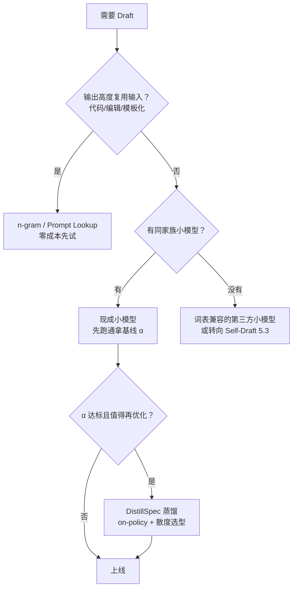

# 5.2 Draft 模型方案：独立小模型的选型、对齐与接受率

> **系列导航｜《AIInfraGuide》模块四·第 5 章：Speculative Decoding**
> 1. [5.1 Speculative Decoding 核心原理：先猜后验的无损加速](../specdec-51-speculative-sampling/)
> 2. **5.2 Draft 模型方案：独立小模型的选型、对齐与接受率（本篇）**
> 3. [5.3 Self-Draft 方案：Medusa 多头预测与 EAGLE-2 动态草稿树](../specdec-53-medusa-eagle2/)
> 4. [5.4 收益边界与限制：什么时候投机解码不划算](../specdec-54-limits/)
> 5. [5.5 动手实验：vLLM 实测代码生成 vs 开放对话的接受率](../specdec-55-vllm-lab/)

## 本章简介

本篇是《AIInfraGuide》模块四"推理优化"第 5 章"Speculative Decoding"的第 2 篇（共 5 篇）。第 5.1 篇证明了：只要 draft 分布 q 与 target 分布 p 有重叠，拒绝采样就能把输出严格校正到 p——**draft 猜错不伤正确性，只伤速度**。于是工程问题全部收敛到一个变量上：怎么把接受率 α 顶上去，同时把草稿成本 c 压下来。

要解决的问题有四个：

1. 独立 Draft 模型的硬性约束是什么？为什么词表不一致就免谈？
2. draft 选多大？参数比的甜点区间在哪，"越大越准"为什么不成立？
3. 三条 Draft 来源路线——同家族小模型、蒸馏对齐、免模型 n-gram——各自适合什么场景？
4. 接受率怎么测才不算自欺？为什么 5.1 篇的 iid 公式会系统性低估真实加速比？

读完你应该能：给一个 target 模型选出候选 draft 并估算期望加速比；用蒸馏把现成小模型的 α 再抬一截；用精确公式（而非 iid 近似）评估一套投机配置的真实收益。

## 1. 硬性约束与选型三角

### 1.1 词表一致是不可谈判的前提

回顾 5.1 篇的接受规则：以概率 min(1, p(x)/q(x)) 接受草稿 token x。这个比值要求 **p 和 q 定义在同一个词表上**——draft 的第 i 个 token 必须就是 target 的第 i 个 token，逐 id 对应。这排除了大量"随手找个小模型"的可能：

- 不同模型家族（如 Qwen target + Llama draft）词表不同，**直接出局**；
- 同词表只是底线，tokenizer 行为（BPE 合并规则、特殊 token、chat template）也要一致，否则同样的文本会被切成不同的 token 序列，草稿从一开始就接不上。

实务结论：**draft 几乎总是从 target 的同家族小尺寸成员里选**——Llama-3.1-70B 配 Llama-3.2-1B/3B，Qwen2.5-72B 配 Qwen2.5-0.5B/1.5B/3B，DeepSeek-V3 配官方 MTP 模块（严格说已属 Self-Draft，见第 5.3 篇）。这也是为什么 5.3 篇的 Self-Draft 方案（草稿头长在 target 自己身上）有根本吸引力：词表问题自动消失。

### 1.2 "越大越准"不成立：c 与 α 的联合优化

直觉上 draft 越大、分布越贴近 target，α 越高。但 5.1 篇的公式里 α 和 c 是相乘的敌人：Speedup = (1−α^(γ+1)) / [(1−α)(γc+1)]，且 memory-bound 下 **c ≈ draft 权重字节数 / target 权重字节数**（单步前向耗时比≈参数量比）。用一组代表性的 (draft 尺寸, α) 组合对 70B FP16 target 做一次联合扫描（γ 取 1~8 中的最优值，α 为示例性估计，实测随任务变化）：

```text
draft= 0.5B c=0.007 alpha=0.55  -> best speedup=2.10x at gamma*=7
draft= 1.5B c=0.021 alpha=0.65  -> best speedup=2.41x at gamma*=6
draft= 3.0B c=0.043 alpha=0.72  -> best speedup=2.56x at gamma*=6
draft= 7.0B c=0.100 alpha=0.78  -> best speedup=2.35x at gamma*=5
draft=13.0B c=0.186 alpha=0.83  -> best speedup=2.05x at gamma*=5
```

0.5B → 3B，α 涨了 0.17，加速比涨 22%；3B → 13B，α 又涨 0.11，加速比反而**跌** 20%——c 从 0.043 涨到 0.186，每轮草稿开销从 0.3 个 target 步涨到 1.1 个，把多猜出来的 token 全吃掉了。**甜点在 1/15 ~ 1/25 参数量附近**，社区常用组合（70B 配 1~3B、7B 配 68M~160M 小模型，如 Pythia/Llama-68M 系列）与此一致。两篇奠基论文的选择恰好落在甜点两侧，说明甜点是效率最优点而非可行域边界：Leviathan et al. 用 T5-XXL(11B) 配 T5-Small（约 1/143，远小于甜点，但翻译/摘要任务 α 极高，依然报告 2×~3×）；Chen et al. 用 7B 配 70B（约 1/10，大于甜点，draft 质量极高但每轮草稿更贵）。

### 1.3 第三个变量：draft 的延迟不止权重

c 的理论下限是字节数比，但实测的 c 往往更差：小模型前向也有 kernel launch、采样、框架调度的固定开销，毫秒级 target 前向下这些开销占比可观。优化手段包括：给 draft 开 CUDA Graph、draft 也用更快 kernel、把 draft 的 γ 步前向融合调度。**评估 draft 时测的是端到端单步延迟比，不是参数量比**——参数量比只是 c 的下界。

## 2. 三条 Draft 来源路线

### 2.1 路线一：同家族现成小模型（零训练成本）

最省事：模型家族发布时通常自带小尺寸成员，词表天然一致，下载即用。代价是分布 gap 没有针对 target 优化——小模型的训练数据、对齐方式与 target 并不完全相同，α 有天花板。适合：快速验证投机解码在某个业务负载上是否有效、流量以贪心解码为主的场景。**先跑通再优化，永远从这条路线开始。**

### 2.2 路线二：蒸馏对齐（把 α 再抬一截）

5.1 篇证明了 α = Σ min(p, q) = 1 − D_TV(p, q)：让 q 逼近 p 就是在直接最大化接受率。DistillSpec（Zhou et al., 2023）系统化了这条思路：用知识蒸馏把 target 的分布"灌"进 draft，要点有二：

- **散度方向很重要**：标准 KD 最小化 forward KL（p 教 q 全覆盖），会逼 draft 把概率质量摊到 target 的所有支撑集上；而投机采样更偏好 draft 集中在 target 的高概率区——DistillSpec 报告用 reverse KL 等散度训练出的 draft 接受率更高（论文报告值，具体收益随任务与模型对变化）；
- **on-policy 数据**：用 target 模型自己生成的文本做蒸馏数据，比用原始语料更贴合 decode 时的真实分布——draft 要模仿的不是"语言"，是"target 模型"。

工程成本：一次蒸馏训练（几小时到几天 GPU）换来 α 的永久提升，流量越大越值。Llama 社区的 EAGLE 头、DeepSeek 的 MTP，本质上都是"用 target 的数据对齐过的专用草稿"，只是架构上走向了 Self-Draft（第 5.3 篇）。

### 2.3 路线三：免模型草稿——n-gram / Prompt Lookup

还有一类不需要任何模型的 draft：**从上下文自身找候选**。代码补全、文档编辑、摘要复述这类任务里，即将生成的 token 经常就是输入中已经出现的片段——直接在 prompt 里做 n-gram 匹配，把匹配到的后继片段当草稿。c ≈ 0（一次字符串查找），α 在代码场景下出奇地高。vLLM 内置 `method: "ngram"`（即 Prompt Lookup Decoding 的实现），指定 `num_speculative_tokens` 与 `prompt_lookup_max/min` 即可开启，连 draft 权重都不用加载。

适用面窄但成本为零：**代码生成、文件编辑、带长重复模板（JSON/SQL/日志）的输出**优先试这个；开放文本则几乎不命中。第 5.5 篇的实验会把 n-gram 与模型 draft 放在同一负载下对照。



## 3. 接受率的正确测量

### 3.1 三个指标，别混用

- **逐 token 接受率 α**：被接受草稿 token 数 / 草稿 token 总数。引擎直接可测，是 5.1 篇公式里的输入；
- **接受长度 τ（acceptance length）**：每轮迭代平均产出的 token 数（含 bonus），τ = E[产出]。端到端加速比 ≈ τ / (γc + 1)，业务侧真正关心的数字；
- **逐位置接受率 α_k**：第 k 个草稿位置的接受率。它几乎必然随 k 衰减——第 3 个猜测建立在第 1、2 个都对的前提上，且 draft 的自回归误差逐步累积。

### 3.2 iid 公式系统性低估了什么

5.1 篇的 E[产出] = (1−α^(γ+1))/(1−α) 假设逐位置接受率恒为 α。用更真实的"首位置高、逐位衰减"模型（α_k = α₁·δ^(k−1)）对比精确期望 E = 1 + Σ_k Π_{j≤k} α_j 与"取平均 α 套 iid 公式"的估计（γ=5）：

```text
a1=0.90 decay=0.98  per-pos=[0.9, 0.882, 0.864, 0.847, 0.83]
  mean_a=0.865  exact E=4.444  iid-approx=4.302  err=-3.2%
a1=0.85 decay=0.95  per-pos=[0.85, 0.807, 0.767, 0.729, 0.692]
  mean_a=0.769  exact E=3.712  iid-approx=3.435  err=-7.5%
a1=0.80 decay=0.90  per-pos=[0.8, 0.72, 0.648, 0.583, 0.525]
  mean_a=0.655  exact E=3.081  iid-approx=2.671  err=-13.3%
a1=0.70 decay=0.85  per-pos=[0.7, 0.595, 0.506, 0.43, 0.365]
  mean_a=0.519  exact E=2.451  iid-approx=2.039  err=-16.8%
```

iid 近似**系统性低估**期望产出，衰减越陡低估越多（最高 -17%）：真正决定期望产出的是前面几个高 α 位置，平均 α 被尾部低位置拖低了。两个工程含义：其一，用引擎报的"平均接受率"套 iid 公式估加速比，得到的是**保守下界**，实际更快；其二，优化 draft 时优先抬 α₁、α₂（前两个位置），它们的边际收益远大于后面的位置。

### 3.3 测量方法论

- **离线 replay**：拿线上真实流量（prompt + target 原输出），在引擎里开投机解码重放，直接读接受率/接受长度——最贴近生产，强烈建议上线前必做；
- **在线指标**：vLLM V1 通过 Prometheus 暴露累计草稿 token 数与接受 token 数（`vllm:spec_decode_num_draft_tokens_total` / `vllm:spec_decode_num_accepted_tokens_total`，名称随版本可能调整，以所用版本文档为准），接受率 = 两者之比，日志中也有周期性 SpecDecoding 统计；
- **对照组纪律**：接受率必须**分任务、分温度**统计——混在一起的平均 α 无法指导任何决策，这是第 5.4 篇"场景决定收益"的测量基础。

## 4. 工程落地清单

| 事项 | 要点 |
|---|---|
| 显存预算 | draft 权重 + draft KV + 验证期多位置的临时 KV；70B FP16 配 1.5B draft 约多占 3~4 GB，通常可接受 |
| 引擎支持 | vLLM（`--speculative-config`）、TensorRT-LLM、SGLang 均支持独立 draft；接口与限制随版本变化，以所用版本文档为准 |
| 采样参数 | draft 与 target 的温度/penalty 需对齐，draft 通常贪心出草稿 |
| γ 设置 | 默认 4~5 起步，用第 3 节的测量闭环调优；α 高可加大，α 低要收缩甚至关闭 |
| 回退开关 | 必须保留一键关闭投机解码的能力，灰度上线 |

## 5. 常见问题（FAQ）

**Q1：draft 需要指令微调吗？** 需要与 target 的行为模式匹配：target 是指令模型，draft 也该是指令版本（Qwen2.5-72B-**Instruct** 配 Qwen2.5-0.5B-**Instruct**）。base 版 draft 接不上 chat 格式后的输出分布，α 会显著掉。

**Q2：cross-architecture（比如小模型层数不同、hidden size 不同）可以吗？** 完全可以——独立 draft 只要求词表一致，架构任意。层数、宽度、attention 实现都不受约束，这正是独立方案比 Self-Draft 自由的地方。

**Q3：draft 模型要不要也量化？** 可以但要小心：draft 量化把 c 再压低一截，代价是 q 偏移、α 受损。净收益取决于哪个效应占优，必须实测；INT8 通常安全，INT4 要打问号。与 target 量化叠加的系统性讨论见第 5.4 篇。

**Q4：MoE target 怎么配 draft？** 难点在于 c 的账本变了：MoE 每 token 只激活部分专家，单步搬的字节数远小于总参数量对应的字节数，dense 小 draft 的相对成本变高。常见做法是 dense 小模型硬配（接受较低 α），或像 DeepSeek-V3 那样在架构内预留 MTP 模块。这是活跃工程话题，选型时以目标引擎的最新支持为准。

**Q5：接受率多少才算"值得开"？** 代入公式自己算：γ=5、c=0.05 时，α=0.5 对应约 1.6×，α=0.6 约 1.9×——多数场景 α ≥ 0.5 就有正收益；α < 0.4 且 c 偏大时应考虑换 draft、加蒸馏或直接关闭。

## 本章小结

1. **词表一致是硬约束**：p/q 比值要求逐 token id 对应，draft 几乎只能从同家族选；这也是 Self-Draft 路线的根本动机。
2. **甜点在 1/15~1/25 参数量**：α 随尺寸边际递减、c 线性增长，扫描显示 70B 配 3B 优于配 13B——"越大越准"不成立；实测 c 要用端到端单步延迟比，参数量比只是下界。
3. **三条路线按场景选**：代码/模板化输出先试零成本 n-gram；通用场景先拿同家族小模型跑基线；流量值得时再上 DistillSpec 蒸馏（on-policy 数据 + 散度方向选型）。
4. **测量决定决策质量**：分清 α、τ、α_k 三个指标；iid 公式系统性低估期望产出（衰减越陡误差越大，实测组合最高 -17%）；接受率必须分任务分温度统计。
5. 独立 draft 的天花板——两个模型、两份显存、两套调度——正是下一篇 Self-Draft 要拆掉的墙。

## 延伸阅读

- **DistillSpec: Improving Speculative Decoding via Knowledge Distillation**（Zhou et al., 2023）：蒸馏对齐 draft 的系统性研究，散度方向与 on-policy 数据的消融都在此文；
- **Prompt Lookup Decoding**（Saxena, 2023）：n-gram 草稿的原始博客，代码场景零成本加速的起点；
- **SpecExec / 其他 draft 构造工作**：树状草稿的更多构造方式与第 5.3 篇的 Self-Draft 一脉相承；
- **本系列**：第 5.1 篇（接受规则与加速比公式，本篇全部推导的前提）；第 5.3 篇（Medusa/EAGLE-2，把 draft 内化进 target）；第 5.5 篇（接受率的实测实验）。

## 参考文献

- DistillSpec: Improving Speculative Decoding via Knowledge Distillation — https://arxiv.org/abs/2310.08461
- Fast Inference from Transformers via Speculative Decoding — https://arxiv.org/abs/2211.17192
- Accelerating Large Language Model Decoding with Speculative Sampling — https://arxiv.org/abs/2302.01318
- Prompt Lookup Decoding（HuggingFace 博客） — https://github.com/apoorvumang/prompt-lookup-decoding
- vLLM Speculative Decoding 文档 — https://docs.vllm.ai/en/latest/features/spec_decode.html
- DeepSeek-V3 Technical Report（MTP 模块设计） — https://arxiv.org/abs/2412.19437
